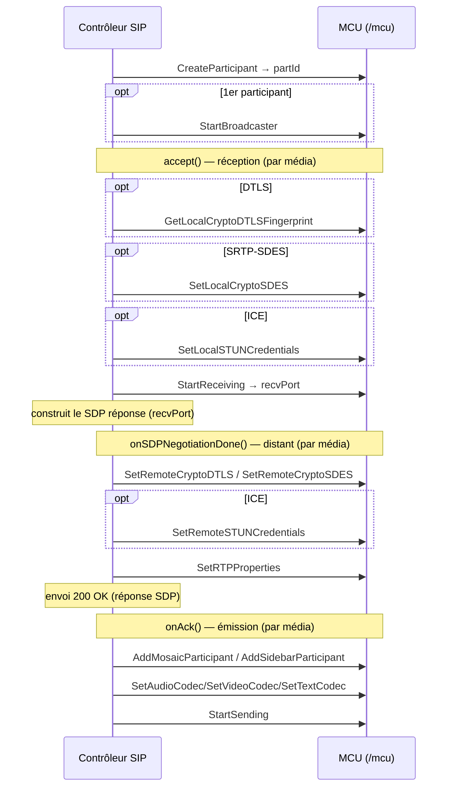

# API XML-RPC MCU du mediaserver

Documentation de l'API XML-RPC exposée par `mcu/src/xmlrpcmcu.cpp`
(table de commandes `mcuCmdList`, montée par `main.cpp` sur le gestionnaire
`MCU`).

Cette interface est l'API **spécialisée MCU** (multipoint control unit) : elle
pilote directement le moteur de conférence (`MCU` → `MultiConf` → participants /
mixers / mosaïques). Contrairement à l'[API JSR-309](xmlrpc_jsr309_api.md), plus
générique et orientée « endpoint / joinable », l'API MCU raisonne en termes de
**conférences** et de **participants** que l'on assemble dans des **mosaïques**,
**sidebars** et incrustations vidéo. C'est l'API historique du produit MCU.

> Toutes les chaînes de caractères (noms, tags, jetons) sont attendues et
> renvoyées en **UTF-8** (le serveur les repasse par un `UTF8Parser` →
> `std::wstring`).

---

## 1. Transport et points d'entrée HTTP

Le serveur HTTP interne écoute par défaut sur le port **8080**
(`--http-port`). Deux URL concernent l'API MCU :

| URL | Méthode | Rôle |
|-----|---------|------|
| `POST http://<host>:8080/mcu` | XML-RPC | Appels de commande (cette API) |
| `GET  http://<host>:8080/events/mcu/<queueId>` | HTTP *chunked* | Flux d'événements asynchrones (voir §5) |

Le média (RTP/SRTP, RTMP, WebSocket, BFCP) circule sur ses propres ports et
n'est pas décrit ici (voir le `readme.md` pour les options de ligne de commande).

Le `POST /mcu` est un XML-RPC standard :

- `Content-Type: text/xml`
- `Content-Length` obligatoire
- corps = `<methodCall>` XML-RPC classique

### Codes de type XML-RPC

Dans les signatures ci-dessous on note les types au format `xmlrpc-c` utilisé
par le serveur :

| Notation | Type XML-RPC | Sens |
|----------|--------------|------|
| `i` | `<int>` | entier 32 bits |
| `s` | `<string>` | chaîne UTF-8 |
| `b` | `<boolean>` | booléen |
| `S` | `<struct>` | structure (map clé→valeur) |
| `A` | `<array>` | tableau |

---

## 2. Format de réponse commun

**Toutes** les méthodes renvoient une structure XML-RPC avec la même enveloppe
(`xmlok()` / `xmlerror()` dans `mcu/src/xmlhandler.cpp`).

### Succès

```
{
  "returnCode": 1,          // int, toujours 1 en cas de succès
  "returnVal":  [ ... ]     // array, contenu dépendant de la méthode
}
```

- Pour les commandes « void » (delete, start, stop, set…), `returnVal` est un
  **tableau vide** `[]`.
- Pour les commandes de création / requête, `returnVal` contient les valeurs de
  retour (id créé, port, statistiques…) — détaillé méthode par méthode.

### Erreur

```
{
  "returnCode": 0,          // int, 0 = échec
  "errorMsg":   "..."       // string, message d'erreur (anglais)
}
```

> ⚠️ Piège d'implémentation : le serveur distingue le succès de l'erreur par le
> champ **`returnCode`**, et non par une *fault* XML-RPC. Une réponse HTTP 200
> avec `returnCode: 0` est un échec applicatif. Une vraie *fault* XML-RPC
> (HTTP 500) n'arrive qu'en cas d'erreur de parsing des paramètres.
>
> ⚠️ Quelques handlers de sécurité (`SetLocalCryptoSDES`, `SetRemoteCryptoSDES`,
> `SetRemoteCryptoDTLS`, `SetLocalSTUNCredentials`, `SetRemoteSTUNCredentials`,
> `SetRTPProperties`, `GetLocalCryptoDTLSFingerprint`) renvoient un **`0` brut**
> (et non l'enveloppe `xmlerror`) en cas d'échec de parsing des arguments.

---

## 3. Modèle objet et conventions

L'API est **orientée conférence**. La hiérarchie des objets et leurs
identifiants entiers :

```
MCU
 └─ Conference (confId)              ← CreateConference
     ├─ Participant (partId)         ← CreateParticipant   (type RTP ou RTMP)
     ├─ Mosaic (mosaicId)            ← CreateMosaic        (composition vidéo)
     ├─ Sidebar (sidebarId)          ← CreateSidebar       (sous-mélange dédié)
     ├─ Player (playerId)            ← CreatePlayer        (lecture de fichier)
     ├─ Broadcaster                  ← StartBroadcaster    (diffusion RTMP/FLV)
     └─ EventQueue (queueId)         ← EventQueueCreate    (file d'événements)
```

### Conventions d'appel

- Presque toutes les commandes prennent le `confId` en **premier paramètre** ;
  l'objet ciblé (participant, mosaïque, sidebar, player) est désigné par son id
  dans les paramètres suivants.
- Les identifiants sont des **entiers** attribués par le serveur à la création
  et valables pour la durée de vie de la conférence.
- Beaucoup de commandes média/sécurité acceptent un paramètre `role`
  (`MediaFrame::MediaRole`, §4) qui distingue le flux vidéo **principal** du
  flux **présentation/slides**. Ce paramètre a été ajouté après coup : les
  handlers tentent d'abord la signature **avec** `role`, puis retombent sur
  l'ancienne signature **sans** `role` (valeur par défaut `VIDEO_MAIN` = 0). Les
  deux formes sont donc acceptées.
- De même, `StartReceiving` accepte un paramètre `proto`
  (`MediaFrame::MediaProtocol`, §4) ajouté après coup (défaut `TCP` = 3).

### Cycle de vie type d'une conférence

```
EventQueueCreate                       → queueId
CreateConference(tag, vad, rate, queueId)  → confId
CreateMosaic(confId, comp, size)       → mosaicId
CreateParticipant(confId, name, type, mosaicId, sidebarId) → partId
SetAudioCodec / SetVideoCodec / SetTextCodec …
StartReceiving(confId, partId, media, rtpMap, role, proto)  → recvPort
StartSending(confId, partId, media, ip, port, rtpMap, role)
AddMosaicParticipant(confId, mosaicId, partId)
…                                      (conférence active)
DeleteParticipant(confId, partId)
DeleteConference(confId)
EventQueueDelete(queueId)
```

---

## 4. Énumérations

Valeurs entières à passer telles quelles dans les paramètres `i`.

### `MediaFrame::Type` — type de média
(`libmedikit/medkit/media.h`)

| Valeur | Nom |
|--------|-----|
| 0 | Audio |
| 1 | Video |
| 2 | Text |
| 3 | Application |

### `MediaFrame::MediaProtocol` — protocole de transport
| Valeur | Nom |
|--------|-----|
| 0 | RTP |
| 1 | RTMP |
| 2 | WS (WebSocket) |
| 3 | TCP (MSRP, BFCP…) |
| 4 | UDP |

### `MediaFrame::MediaRole` — rôle du flux vidéo
| Valeur | Nom |
|--------|-----|
| 0 | VIDEO_MAIN (défaut) |
| 1 | VIDEO_SLIDES |

### `Participant::Type` — type de transport participant
(`mcu/include/participant.h`)

| Valeur | Nom | Transport |
|--------|-----|-----------|
| 0 | RTP | RTP/SRTP (SIP, WebRTC) |
| 1 | RTMP | RTMP (Flash / web) |

### `AudioCodec::Type`
(`libmedikit/medkit/codecs.h`)

| Valeur | Nom |
|--------|-----|
| 0 | PCMU |
| 3 | GSM |
| 8 | PCMA |
| 9 | G722 |
| 97 | AAC |
| 98 | OPUS |
| 99 | SLIN |
| 100 | TELEPHONE_EVENT |
| 117 | SPEEX16 |
| 118 | AMR |
| 119 | G7221 |
| 120 | AMRWB |
| 130 | NELLY8 |
| 131 | NELLY11 |

### `VideoCodec::Type`
| Valeur | Nom |
|--------|-----|
| 34 | H263_1996 |
| 99 | H264 |
| 100 | SORENSON |
| 103 | H263_1998 |
| 104 | MPEG4 |
| 106 | VP6 |
| 107 | VP8 |
| 108 | ULPFEC |
| 109 | RED |
| 110 | AV1 |

### `TextCodec::Type`
| Valeur | Nom |
|--------|-----|
| 105 | T140RED |
| 106 | T140 |

### `AppCodec::Type`
| Valeur | Nom |
|--------|-----|
| 150 | BFCP |

### `Mosaic::Type` — type de composition vidéo
(`mcu/include/mosaic.h`)

| Valeur | Nom | Disposition |
|--------|-----|-------------|
| 0 | mosaic1x1 | plein écran |
| 1 | mosaic2x2 | 2×2 |
| 2 | mosaic3x3 | 3×3 |
| 3 | mosaic3p4 | 3+4 |
| 4 | mosaic1p7 | 1 grand + 7 |
| 5 | mosaic1p5 | 1 grand + 5 |
| 6 | mosaic1p1 | 1+1 |
| 7 | mosaicPIP1 | incrustation 1 |
| 8 | mosaicPIP3 | incrustation 3 |
| 9 | mosaic4x4 | 4×4 |
| 10 | mosaic1p4 | 1 grand + 4 |
| 11 | mosaic2p8 | 2+8 |

> Le paramètre `size` (mosaïques et `SetVideoCodec`) est un **code de
> taille/résolution** (index d'un tableau de résolutions prédéfinies), pas une
> largeur en pixels. Voir la table ci-dessous.

### Codes de résolution — paramètre `size` / `mode`
(valeurs telles qu'utilisées par le client `XmlRpcMcuClient` et le contrôleur SIP)

| Valeur | Nom | Résolution | Valeur | Nom | Résolution |
|--------|-----|------------|--------|-----|------------|
| 0 | QCIF | 176 × 144 | 9 | sd448P | 576 × 448 |
| 1 | CIF | 352 × 288 | 10 | w288P | 512 × 288 |
| 2 | VGA | 640 × 480 | 11 | w576 | 1024 × 576 |
| 3 | PAL | 768 × 576 | 12 | FOURCIF | 704 × 576 |
| 4 | HVGA | 480 × 320 | 13 | FOURSIF | 704 × 576 |
| 5 | QVGA | 320 × 240 | 14 | XGA | 1024 × 768 |
| 6 | HD720P | 1280 × 720 | 15 | WVGA | 800 × 480 |
| 7 | WQVGA | 400 × 240 | 16 | DCIF | 528 × 384 |
| 8 | w448P | 768 × 448 | 17 | w144P | 256 × 144 |

### Valeurs spéciales de slot de mosaïque
(`mcu/include/mosaic.h`, paramètre `id` de `SetMosaicSlot`)

| Valeur | Nom | Sens |
|--------|-----|------|
| > 0 | *(partId)* | affecte ce participant au slot |
| 0 | SlotFree | slot libre |
| -1 | SlotLocked | slot verrouillé (aucun participant) |
| -2 | SlotVAD | slot piloté par la détection d'activité vocale |
| -3 | SlotReset | réinitialise le slot |

---

## 5. Événements asynchrones (file d'événements)

Le serveur ne rappelle pas le client : celui-ci **récupère** les événements par
un GET HTTP long-poll / *chunked*.

### Mise en place

1. `EventQueueCreate` → `queueId`.
2. Passer ce `queueId` à `CreateConference` : les événements de la conférence y
   seront routés.
3. Ouvrir en parallèle `GET http://<host>:8080/events/mcu/<queueId>`.

### Flux d'événements

La réponse est en `Transfer-Encoding: chunked`, `Content-Type: text/xml`. Le
serveur maintient la connexion ouverte et :

- envoie, pour chaque événement, une **réponse XML-RPC sérialisée**
  (`<methodResponse>` contenant le tuple de l'événement) ;
- envoie un **keep-alive** s'il n'y a pas d'événement dans le délai ;
- ferme le flux quand la file est détruite (`EventQueueDelete`).

Chaque événement est un tuple dont le **premier entier est le type d'événement**
(`MCU::Events`).

### Types d'événements

Source unique : `mcu/include/mcu.h` (`MCU::Events`).

| Type | Nom | Tuple |
|------|-----|-------|
| 1 | ParticipantRequestFPU | `(int type, int confId, string tag, int partId)` |
| 2 | ParticipantRequestDocSharing | `(int type, int confId, string tag, int partId, string status)` |

- **ParticipantRequestFPU** (1) : un participant a demandé une image complète
  (Full Picture Update / keyframe). `tag` = nom/tag de la conférence, `partId` =
  participant demandeur. Émis par `onParticipantRequestFPU`.
- **ParticipantRequestDocSharing** (2) : un participant demande à (dé)partager
  un document (BFCP). `status` ∈ `{ACTIVE, WAITING_ACCEPT, NONE, FAILED}`. À
  traiter avec `AcceptDocSharingRequest` / `RefuseDocSharingRequest` /
  `StopDocSharing` (§6.10). Émis par `onParticipantRequestDocSharing`.

Réf. : `mcu/include/mcu.h` (`PlayerRequestFPUEvent`,
`PlayerRequestDocSharingEvent`), `mcu/src/mcu.cpp`.

---

## 6. Référence des méthodes

Chaque méthode est décrite par sa (ses) signature(s) de paramètres et sa valeur
de retour. Quand plusieurs signatures sont listées, le serveur essaie la
première puis retombe sur les suivantes (compatibilité ascendante).

### 6.1 Files d'événements

#### `EventQueueCreate`
Crée une file d'événements.
- **Params** : aucun.
- **Retour** : `(i)` = `queueId`.

#### `EventQueueDelete`
Détruit une file d'événements (ferme le flux HTTP associé).
- **Params** `(i)` : `queueId`.
- **Retour** : vide.

---

### 6.2 Conférences

#### `CreateConference`
Crée et initialise une conférence.
- **Params** `(siii)` : `tag` (nom UTF-8), `vad` (mode VAD, 0..2), `rate`
  (fréquence d'échantillonnage audio en Hz, défaut 16000), `queueId` (file
  d'événements).
- **Params** (ancienne API) `(sii)` : `tag`, `vad`, `queueId` ; `rate` = 16000.
- **Retour** : `(i)` = `confId`.

#### `UpdateConference`
Met à jour le mode VAD d'une conférence.
- **Params** `(iii)` : `confId`, `vad` (mode VAD, appliqué seulement si dans
  [0,2]), `rate` (accepté mais ignoré).
- **Retour** : vide.

#### `DeleteConference`
Détruit une conférence et libère ses ressources.
- **Params** `(i)` : `confId`.
- **Retour** : vide.

#### `GetConferences`
Liste les conférences actives.
- **Params** : aucun.
- **Retour** : tableau de `(isi)` par conférence : `id`, `name`, `numPart`
  (nombre de participants).

#### `AddConferenceToken`
Ajoute un jeton (PIN) de diffusion autorisé pour la conférence.
- **Params** `(is)` : `confId`, `token` (UTF-8).
- **Retour** : vide.

---

### 6.3 Mosaïques

#### `CreateMosaic`
Crée une mosaïque (composition vidéo) dans la conférence.
- **Params** `(iii)` : `confId`, `comp` (`Mosaic::Type`, §4), `size` (code de
  résolution, §4).
- **Retour** : `(i)` = `mosaicId`.

#### `SetCompositionType`
Change le type de composition et la taille d'une mosaïque existante.
- **Params** `(iiii)` : `confId`, `mosaicId`, `comp` (`Mosaic::Type`), `size`.
- **Retour** : vide.

#### `SetMosaicSlot`
Affecte un participant (ou une valeur spéciale) à un slot de la mosaïque.
- **Params** `(iiii)` : `confId`, `mosaicId`, `num` (numéro de slot/position),
  `id` (partId ou valeur spéciale : SlotFree/SlotLocked/SlotVAD/SlotReset, §4).
- **Retour** : vide.

#### `SetMosaicOverlayImage`
Applique une image d'incrustation (overlay) sur la mosaïque.
- **Params** `(iis)` : `confId`, `mosaicId`, `filename` (chemin de l'image).
- **Retour** : `(i)` = `mosaicId`.

#### `ResetMosaicOverlay`
Retire l'incrustation de la mosaïque.
- **Params** `(ii)` : `confId`, `mosaicId`.
- **Retour** : `(i)` = `mosaicId`.

#### `DeleteMosaic`
Détruit une mosaïque.
- **Params** `(ii)` : `confId`, `mosaicId`.
- **Retour** : `(i)` = `mosaicId`.

#### `AddMosaicParticipant`
Ajoute un participant à la mosaïque (son flux devient éligible à l'affichage).
- **Params** `(iii)` : `confId`, `mosaicId`, `partId`.
- **Retour** : vide.

#### `RemoveMosaicParticipant`
Retire un participant de la mosaïque.
- **Params** `(iii)` : `confId`, `mosaicId`, `partId`.
- **Retour** : vide.

#### `GetMosaicPositions`
Renvoie l'occupation des positions de la mosaïque.
- **Params** `(ii)` : `confId`, `mosaicId`.
- **Retour** : tableau de `i` = liste des participants (ou valeurs de slot) par
  position, dans l'ordre.

---

### 6.4 Sidebars

Un *sidebar* est un sous-mélange audio/vidéo dédié (par ex. pour un aparté ou un
groupe de participants).

#### `CreateSidebar`
- **Params** `(i)` : `confId`.
- **Retour** : `(i)` = `sidebarId`.

#### `DeleteSidebar`
- **Params** `(ii)` : `confId`, `sidebarId`.
- **Retour** : `(i)` = `sidebarId`.

#### `AddSidebarParticipant`
- **Params** `(iii)` : `confId`, `sidebarId`, `partId`.
- **Retour** : vide.

#### `RemoveSidebarParticipant`
- **Params** `(iii)` : `confId`, `sidebarId`, `partId`.
- **Retour** : vide.

---

### 6.5 Participants — cycle de vie et affectation

#### `CreateParticipant`
Crée un participant et l'affecte à une mosaïque et un sidebar.
- **Params** `(isiii)` : `confId`, `name` (UTF-8), `type` (`Participant::Type` :
  RTP=0 / RTMP=1), `mosaicId`, `sidebarId`.
- **Retour** : `(i)` = `partId`.

#### `DeleteParticipant`
- **Params** `(ii)` : `confId`, `partId`.
- **Retour** : vide.

#### `SetParticipantMosaic`
Change la mosaïque *de sortie* (celle que reçoit) du participant.
- **Params** `(iii)` : `confId`, `partId`, `mosaicId`.
- **Retour** : vide.

#### `SetParticipantSidebar`
Change le sidebar de sortie du participant.
- **Params** `(iii)` : `confId`, `partId`, `sidebarId`.
- **Retour** : vide.

#### `SetParticipantDisplayName`
Définit (ou efface) le nom affiché en surimpression pour le participant.
- **Params** `(iiisi)` : `confId`, `partId`, `mosaicId`, `name` (nom affiché ;
  vide = efface le nom), `scriptCode` (code de script/charset).
- **Retour** : `(i)` = code de résultat.

#### `SetParticipantBackground` / `SetParticipantOrMosaicImage`
*(même handler)* Définit l'image de fond d'un participant, ou une image
d'incrustation sur une mosaïque.
- **Params** `(iiisi)` : `confId`, `mosaicId`, `partId`, `filename` (chemin de
  l'image), `imageRole`.
  - `imageRole = 0` (fond) → applique l'image de fond du participant.
  - `imageRole = 1` (overlay) → applique une incrustation sur la mosaïque.
- **Params** (ancienne API) `(iis)` : `confId`, `partId`, `filename` ;
  `mosaicId` = -1, `imageRole` = 0 (fond).
- **Retour** : `(i)` = code de résultat.
- ⚠️ Dans la forme complète, l'ordre est **`mosaicId` avant `partId`**.

#### `AddParticipantInputToken`
Ajoute un jeton (PIN) d'entrée autorisé pour le participant.
- **Params** `(iis)` : `confId`, `partId`, `token` (UTF-8).
- **Retour** : vide.

#### `AddParticipantOutputToken`
Ajoute un jeton (PIN) de sortie autorisé pour le participant.
- **Params** `(iis)` : `confId`, `partId`, `token` (UTF-8).
- **Retour** : vide.

#### `SetMute`
Coupe/rétablit un média du participant.
- **Params** `(iiii)` : `confId`, `partId`, `media` (`MediaFrame::Type`, §4),
  `isMuted` (0/1).
- **Retour** : vide.

#### `SendFPU`
Demande au participant l'émission d'une image complète (keyframe).
- **Params** `(ii)` : `confId`, `partId`.
- **Retour** : vide.

#### `GetParticipantStatistics`
Renvoie les statistiques RTP par média du participant.
- **Params** `(ii)` : `confId`, `partId`.
- **Retour** : tableau de `(siiiiiii)` par média : `media` (nom), `isReceiving`,
  `isSending`, `lostRecvPackets`, `numRecvPackets`, `numSendPackets`,
  `totalRecvBytes`, `totalSendBytes`.

---

### 6.6 Codecs

#### `SetVideoCodec`
Configure le codec vidéo d'émission du participant.
- **Params** `(iiiiiiiSi)` : `confId`, `partId`, `codec` (`VideoCodec::Type`),
  `mode` (code de résolution), `fps` (images/s), `bitrate` (kbps), `intraPeriod`
  (période d'images clés), `properties` (struct string→string), `role`
  (`MediaRole`).
- **Params** (sans role) `(iiiiiiiS)` : idem sans `role` (VIDEO_MAIN).
- **Params** (ancienne API, sans properties) `(iiiiiiiii)` : `confId`, `partId`,
  `codec`, `mode`, `fps`, `bitrate`, `quality`, `fillLevel`, `intraPeriod` —
  `quality`/`fillLevel` sont parsés puis ignorés.
- **Retour** : vide.

#### `SetAudioCodec`
Configure le codec audio du participant.
- **Params** `(iiiS)` : `confId`, `partId`, `codec` (`AudioCodec::Type`),
  `properties` (struct string→string).
- **Params** (sans properties) `(iii)` : `confId`, `partId`, `codec`.
- **Retour** : vide.

#### `SetTextCodec`
- **Params** `(iii)` : `confId`, `partId`, `codec` (`TextCodec::Type`).
- **Retour** : vide.

#### `SetAppCodec`
Configure le codec applicatif (p. ex. BFCP).
- **Params** `(iii)` : `confId`, `partId`, `codec` (`AppCodec::Type`).
- **Retour** : vide.

#### `SetRTPProperties`
Positionne des propriétés RTP (extensions, options) pour un média.
- **Params** `(iiiSi)` : `confId`, `partId`, `media` (`MediaFrame::Type`),
  `properties` (struct string→string), `role` (`MediaRole`).
- **Params** (sans role) `(iiiS)` : idem sans `role` (VIDEO_MAIN).
- **Retour** : vide.

#### `GetSupportedCodecs`
Liste les codecs supportés pour un type de média.
- **Params** `(i)` : `media` (`MediaFrame::Type`).
- **Retour** : tableau de `(is)` : `codecId`, `codecName`.
- ⚠️ Seul `media = Audio` (0) est implémenté ; Video/Text → erreur *media not
  supported*.

#### `IsCodecSupported`
- **Params** `(ii)` : `media` (`MediaFrame::Type`), `codec` (id de codec).
- **Retour** : `(s)` = nom du codec (`GetNameForCodec`).

---

### 6.7 Média RTP (send / receive)

Les *rtpMap* sont des structs XML-RPC dont les **clés sont les payload types RTP
numériques** (en chaîne) et les **valeurs les identifiants de codec** (int).

#### `StartReceiving`
Ouvre la réception RTP d'un média et alloue un port local.
- **Params** `(iiiSii)` : `confId`, `partId`, `media` (`MediaFrame::Type`),
  `rtpMap` (struct PT→codec), `role` (`MediaRole`), `proto`
  (`MediaFrame::MediaProtocol`).
- **Params** (sans proto) `(iiiSi)` : idem, `proto` = TCP (3).
- **Retour** : `(i)` = `recvPort` (port RTP alloué).

#### `StopReceiving`
- **Params** `(iiii)` : `confId`, `partId`, `media`, `role`.
- **Params** (sans role) `(iii)` : idem, `role` = VIDEO_MAIN.
- **Retour** : vide.

#### `StartSending`
Ouvre l'émission RTP d'un média vers une destination.
- **Params** `(iiisiSi)` : `confId`, `partId`, `media` (`MediaFrame::Type`),
  `sendIp` (IP de destination), `sendPort` (port), `rtpMap` (struct PT→codec),
  `role` (`MediaRole`).
- **Params** (sans role) `(iiisiS)` : idem, `role` = VIDEO_MAIN.
- **Retour** : vide.

#### `StopSending`
- **Params** `(iiii)` : `confId`, `partId`, `media`, `role`.
- **Params** (sans role) `(iii)` : idem, `role` = VIDEO_MAIN.
- **Retour** : vide.

---

### 6.8 Sécurité (SRTP-SDES / DTLS / ICE-STUN)

> ⚠️ Ces handlers renvoient un `0` brut (pas l'enveloppe `xmlerror`) en cas
> d'échec de parsing.

#### `SetLocalCryptoSDES`
Définit la clé SRTP locale (SDES) d'un média.
- **Params** `(iiissi)` : `confId`, `partId`, `media` (`MediaFrame::Type`),
  `suite` (suite crypto SRTP), `key`, `role` (`MediaRole`).
- **Params** (sans role) `(iiiss)` : idem, `role` = VIDEO_MAIN.
- **Retour** : vide.

#### `SetRemoteCryptoSDES`
Définit la clé SRTP distante (SDES) d'un média.
- **Params** `(iiissii)` : `confId`, `partId`, `media`, `suite`, `key`, `role`,
  `keyRank` (rang/index de clé).
- **Params** (sans role/keyRank) `(iiiss)` : idem, `role` = VIDEO_MAIN,
  `keyRank` = 0.
- **Retour** : vide.

#### `GetLocalCryptoDTLSFingerprint`
Renvoie l'empreinte du certificat DTLS local.
- **Params** `(s)` : `hash` (`"sha-1"` ou `"sha-256"`, insensible à la casse).
- **Retour** : `(s)` = empreinte.

#### `SetRemoteCryptoDTLS`
Positionne l'empreinte DTLS distante et le rôle de setup.
- **Params** `(iiiisss)` : `confId`, `partId`, `media`, `role` (`MediaRole`),
  `setup` (rôle DTLS : active/passive), `hash` (algo d'empreinte),
  `fingerprint`.
- **Params** (sans role) `(iiisss)` : `confId`, `partId`, `media`, `setup`,
  `hash`, `fingerprint` ; `role` = VIDEO_MAIN.
- **Retour** : vide.

#### `SetLocalSTUNCredentials`
- **Params** `(iiissi)` : `confId`, `partId`, `media`, `username`, `pwd`, `role`.
- **Params** (sans role) `(iiiss)` : idem, `role` = VIDEO_MAIN.
- **Retour** : vide.

#### `SetRemoteSTUNCredentials`
- **Params** `(iiissi)` : `confId`, `partId`, `media`, `username`, `pwd`, `role`.
- **Params** (sans role) `(iiiss)` : idem, `role` = VIDEO_MAIN.
- **Retour** : vide.

---

### 6.9 Players (lecture de fichiers)

#### `CreatePlayer`
- **Params** `(iis)` : `confId`, `privateId` (id propriétaire/privé), `name`
  (nom du player, UTF-8).
- **Retour** : `(i)` = `playerId`.

#### `DeletePlayer`
- **Params** `(ii)` : `confId`, `playerId`.
- **Retour** : vide.

#### `StartPlaying`
Lance la lecture d'un fichier média par le player.
- **Params** `(iisi)` : `confId`, `playerId`, `filename`, `loop` (0/1 : rejouer
  en boucle).
- **Retour** : vide.

#### `StopPlaying`
- **Params** `(ii)` : `confId`, `playerId`.
- **Retour** : vide.

---

### 6.10 Enregistrement

#### `StartRecordingParticipant`
Enregistre le flux d'un participant dans un fichier (MP4).
- **Params** `(iis)` : `confId`, `partId`, `filename`.
- **Retour** : vide.

#### `StopRecordingParticipant`
- **Params** `(ii)` : `confId`, `partId`.
- **Retour** : vide.

#### `StartRecordingBroadcaster`
Enregistre le mélange (mosaïque/sidebar) de la conférence dans un fichier.
- **Params** `(isii)` : `confId`, `filename`, `mosaicId`, `sidebarId`.
- **Retour** : vide.

#### `StopRecordingBroadcaster`
- **Params** `(i)` : `confId`.
- **Retour** : vide.

---

### 6.11 Diffusion (broadcaster / publishing RTMP)

#### `StartBroadcaster`
Démarre la diffusion RTMP/FLV du mélange de la conférence.
- **Params** `(iii)` : `confId`, `mosaicId`, `sidebarId`.
- **Params** (simple) `(i)` : `confId` ; `mosaicId`/`sidebarId` = 0.
- **Retour** : `(i)` = `port`.

#### `StopBroadcaster`
- **Params** `(i)` : `confId`.
- **Retour** : vide.

#### `StartPublishing`
Publie le flux de la conférence vers un serveur RTMP externe.
- **Params** `(isiss)` : `confId`, `server` (hôte RTMP), `port`, `app` (nom
  d'application RTMP), `stream` (nom du flux).
- **Retour** : `(i)` = `id` (session de publication).

#### `StopPublishing`
- **Params** `(ii)` : `confId`, `id` (session de publication).
- **Retour** : vide.

---

### 6.12 Partage de document (BFCP)

Ces commandes répondent aux événements `ParticipantRequestDocSharing` (§5).

#### `AcceptDocSharingRequest`
Accepte une demande de partage de document d'un participant.
- **Params** `(ii)` : `confId`, `partId`.
- **Retour** : vide.

#### `RefuseDocSharingRequest`
Refuse une demande de partage de document.
- **Params** `(ii)` : `confId`, `partId`.
- **Retour** : vide.

#### `StopDocSharing`
Arrête le partage de document en cours.
- **Params** `(ii)` : `confId`, `partId` (défaut 0).
- **Retour** : vide.

#### `SetDocSharingMosaic`
Définit la mosaïque utilisée pour l'affichage du document partagé.
- **Params** `(ii)` : `confId`, `mosaicId` (défaut 0).
- **Retour** : vide.

---

## 7. Dynamique d'appel attendue (cycle de vie type)

Cette section décrit **l'ordre réel** dans lequel un contrôleur SIP invoque
l'API MCU. Elle est reconstruite à partir du servlet SIP de référence
(`org.murillo.mcu` : `ConferenceMngr`, `Conference`, `RTPParticipant2`) qui
pilote le MCU via le client `XmlRpcMcuClient`. L'API est **sans état de
session** au niveau transport : c'est cet enchaînement qui porte la sémantique.

> Terminologie : **UAS** = le media server reçoit l'offre SDP et renvoie la
> réponse (appel entrant) ; **UAC** = le media server génère l'offre et reçoit
> la réponse (appel sortant / `callParticipant`).

### 7.1 Principes d'ordonnancement (à retenir)

1. **`StartReceiving` précède la génération du SDP.** Le port RTP de réception
   n'est connu qu'**après** `StartReceiving` (qui l'alloue et le renvoie) ; c'est
   ce port qui alimente la ligne `m=` du SDP (offre *ou* réponse). Donc pour
   chaque média : configurer la réception **avant** de construire le SDP.
2. **Paramètres locaux avant le SDP, paramètres distants après.** On pose
   d'abord la crypto/ICE **locales** (`SetLocalCryptoSDES`,
   `GetLocalCryptoDTLSFingerprint`, `SetLocalSTUNCredentials`) puis
   `StartReceiving` ; on applique la crypto/ICE **distantes** et les propriétés
   RTP (`SetRemoteCrypto*`, `SetRemoteSTUNCredentials`, `SetRTPProperties`)
   **une fois le SDP distant connu**.
3. **L'émission (`StartSending`) démarre à la confirmation** (ACK côté UAS,
   2xx+ACK côté UAC), après le rattachement aux mixers.
4. **Le broadcaster démarre au premier participant**, pas à la création de la
   conférence.
5. **La file d'événements est partagée** (portée « mixer ») : on la crée une
   fois et on passe son `queueId` à chaque `CreateConference` ; elle **survit**
   aux conférences (pas de `EventQueueDelete` par conférence).
6. **Teardown minimal côté participant** : `DeleteParticipant` suffit — le
   serveur libère les flux ; le contrôleur n'émet pas de `StopSending` /
   `StopReceiving` / `RemoveMosaicParticipant` à la destruction.

### 7.2 Mise en service (une fois) et création de conférence

```
# Une fois, à la connexion au media server :
EventQueueCreate                         → queueId          # partagé par les conférences
GET /events/mcu/<queueId>                (flux HTTP long-poll, thread dédié)

# Par conférence :
CreateConference(tag, vad, rate, queueId) → confId
SetCompositionType(confId, 0, comp, size)                   # mosaïque 0 (défaut) implicite
# mosaïques/sidebars/tokens/recording additionnels = à la demande (voir §6)
```

> La mosaïque `0` et le sidebar `0` sont **implicites** (créés avec la
> conférence). On ne fait `CreateMosaic` / `CreateSidebar` que pour des
> dispositions supplémentaires.

### 7.3 Appel entrant (UAS) — le MCU reçoit l'offre, renvoie la réponse

Séquence complète pour un participant **audio + vidéo, sécurisé (DTLS/SDES) +
ICE**. Les lignes conditionnelles sont annotées.

```
# 1. Création du participant (à la réception de l'INVITE)
CreateParticipant(confId, name, type=RTP, mosaicId=0, sidebarId=0) → partId
StartBroadcaster(confId, 0, 0)              # UNIQUEMENT si 1er participant

# 2. accept() — réception RTP, AVANT de construire la réponse SDP
#    Pour CHAQUE média présent (audio, vidéo, [slides], texte, [application]) :
GetLocalCryptoDTLSFingerprint(hash)         # si DTLS (une fois, empreinte locale)
SetLocalCryptoSDES(confId, partId, media, suite, key, role)      # si SRTP-SDES
SetLocalSTUNCredentials(confId, partId, media, ufrag, pwd, role) # si ICE
StartReceiving(confId, partId, media, rtpInMap, role, proto)     → recvPort

#    → construction du SDP réponse (local, hors API) avec les recvPort ci-dessus

# 3. onSDPNegotiationDone() — application des paramètres DISTANTS
#    Pour CHAQUE média (DTLS et SDES sont mutuellement exclusifs) :
SetRemoteCryptoDTLS(confId, partId, media, role, setup, hash, fingerprint)  # si DTLS
SetRemoteCryptoSDES(confId, partId, media, suite, key, role, keyRank)       # sinon si SDES
SetRemoteSTUNCredentials(confId, partId, media, ufrag, pwd, role)           # si ICE
SetRTPProperties(confId, partId, media, properties, role)                   # toujours

#    → envoi du 200 OK (réponse SDP)

# 4. onAckRequest() — à la réception de l'ACK : rattachement + émission
AddMosaicParticipant(confId, 0, partId)     # si vidéo supportée
AddSidebarParticipant(confId, 0, partId)    # si audio supporté

#    startSending() — pour CHAQUE média émis :
SetAudioCodec(confId, partId, codec[, params])                 → StartSending(AUDIO)
SetVideoCodec(confId, partId, codec, size, fps, br, gop, params, role) → StartSending(VIDEO)
SetTextCodec(confId, partId, codec)                            → StartSending(TEXT)
SetAppCodec(confId, partId, codec)                             # BFCP/doc-sharing éventuel
```

**Variante audio seul** : pas de `StartReceiving`/`SetVideoCodec`/`StartSending`
vidéo ; `AddMosaicParticipant` est sauté (conditionné à la vidéo), mais
`AddSidebarParticipant` a bien lieu.

Diagramme condensé :



### 7.4 Appel sortant (UAC) — le MCU génère l'offre, reçoit la réponse

Même sous-programmes, ordre décalé autour du SDP :

```
CreateParticipant(confId, name, type=RTP, 0, 0) → partId
StartBroadcaster(confId, 0, 0)              # si 1er participant

# doInvite() — réception AVANT de construire l'offre (comme en UAS)
[ (GetLocalCryptoDTLSFingerprint) / SetLocalCryptoSDES / SetLocalSTUNCredentials / StartReceiving ]  # par média
#   → construction et envoi de l'INVITE (offre SDP, avec les recvPort)

# onInviteResponse() (2xx) — à la réception de la réponse SDP
[ SetRemoteCryptoDTLS|SetRemoteCryptoSDES / SetRemoteSTUNCredentials / SetRTPProperties ]  # par média
#   → envoi de l'ACK

# puis, comme en UAS :
AddMosaicParticipant / AddSidebarParticipant
[ SetAudioCodec/SetVideoCodec/SetTextCodec → StartSending ]      # par média
```

Les défis d'authentification (401/407) et le 422 (Session-Timer trop court)
provoquent une réémission de l'INVITE **sans** aucun appel MCU.

### 7.5 Renégociation (re-INVITE / UPDATE, mise en attente)

Déclenché seulement si la version de session SDP (`o=`) change. Ordre :

```
StopSending(confId, partId, media, role)         # pour chaque média actif
#   → re-parse du SDP distant
[ startReceiving() ]                             # re-pose crypto/STUN + StartReceiving
                                                #   (médias inchangés sautés ; StopReceiving si média retiré)
#   → construction du nouveau SDP
[ startSending() ]                              # Set<Media>Codec → StartSending
#   → envoi du 200 OK / ACK
```

**Changement de profil vidéo seul** (sans aller-retour SDP), p. ex. adaptation
de débit :

```
StopSending(confId, partId, VIDEO, VIDEO_MAIN)
SetVideoCodec(confId, partId, codec, size, fps, bitrate, gop, params, VIDEO_MAIN)
StartSending(confId, partId, VIDEO, ip, port, rtpOutMap, VIDEO_MAIN)
```

### 7.6 Fin d'appel (BYE / CANCEL) et destruction de conférence

```
# Fin d'un participant (destroy()) :
GetParticipantStatistics(confId, partId)         # relevé pour CDR
DeleteParticipant(confId, partId)                # le serveur libère les flux

# Destruction de la conférence :
#   (pour chaque participant : BYE/CANCEL SIP → GetParticipantStatistics → DeleteParticipant)
StopBroadcaster(confId)                          # si broadcasting actif
DeleteConference(confId)

# Arrêt du media server / reconnexion mixer uniquement :
EventQueueDelete(queueId)                        # la file survit aux conférences
```

### 7.7 Consommation des événements asynchrones

Le flux `GET /events/mcu/<queueId>` (§5) est lu par un thread dédié. Le premier
entier du tuple d'événement est le type (`MCU::Events`) :

- **Type 1 — `ParticipantRequestFPU`** : le contrôleur relaie la demande vers
  l'endpoint (SIP INFO `media_control`) et/ou appelle **`SendFPU(confId, partId)`**
  vers le MCU pour régénérer une image clé.
- **Type 2 — `ParticipantRequestDocSharing`** : selon `status`, le contrôleur
  répond par **`AcceptDocSharingRequest`** / **`RefuseDocSharingRequest`** /
  **`StopDocSharing`** (+ éventuellement `SetDocSharingMosaic`), voir §6.12.

> À noter : `SendFPU` est aussi émis spontanément par le contrôleur quand la
> vidéo est déjà en émission (au lieu de relancer tout `startSending`).

---

## 8. Notes d'intégration

- **Ordre des appels** : créer la file d'événements avant la conférence, la
  conférence avant les mosaïques/sidebars, les mosaïques/sidebars avant les
  participants (le `CreateParticipant` référence `mosaicId`/`sidebarId`).
- **Compatibilité ascendante** : préférez toujours les signatures **complètes**
  (avec `role`, `proto`, `properties`) — les formes courtes ne sont conservées
  que pour les clients anciens.
- **Chaînes UTF-8** : tous les noms, tags et jetons transitent en UTF-8.
- **`size` ≠ pixels** : le paramètre `size`/`mode` des mosaïques et codecs vidéo
  est un **index de résolution** prédéfinie, pas une dimension en pixels.
- **Source de vérité (signatures)** : la table `mcuCmdList` et les handlers de
  `mcu/src/xmlrpcmcu.cpp` font foi. En cas de doute sur une signature, s'y
  reporter (les formats de parsing `xmlrpc_parse_value(...)` y sont explicites).
- **Source de vérité (dynamique d'appel, §7)** : le servlet SIP de référence
  `org.murillo.mcu` (`ConferenceMngr`, `Conference`, `RTPParticipant2`) et le
  client `XmlRpcMcuClient` (`XmlRpcMcuClient/src/org/murillo/MediaServer/`).
  C'est l'implémentation historique du contrôleur ; l'ordre des appels y est
  celui décrit au §7. Attention : la classe participant réellement instanciée
  est `RTPParticipant2` (et non `RTPParticipant`, l'ancienne variante).

Voir aussi l'[API JSR-309](xmlrpc_jsr309_api.md) pour le pilotage bas niveau
générique (endpoints, joinables, transcoders).
