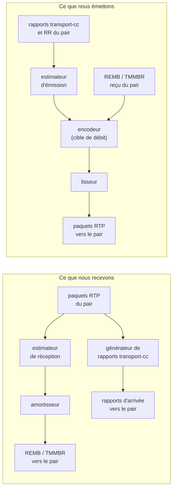
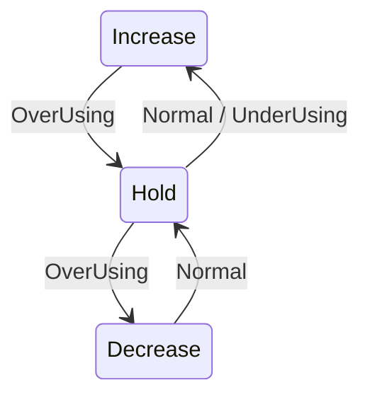
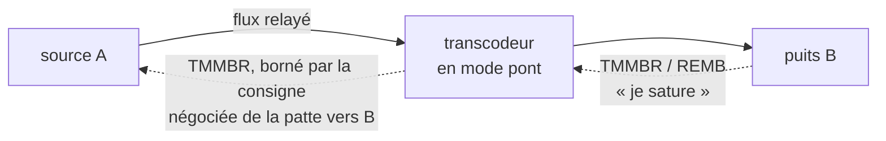

# Contrôle de débit

Ce document décrit les mécanismes de contrôle de débit du mediaserver : ce
qu'ils mesurent, ce qu'ils décident, et avec quelles valeurs.

Il ne couvre que la **vidéo**. L'audio et le texte ne sont ni mesurés, ni
lissés, ni limités par ces mécanismes.

Documents voisins :

- [`MCU-API.md`](MCU-API.md) et [`JSR-309-API.md`](JSR-309-API.md) — les
  paramètres `bitrate`, `fps` et `intraPeriod` que le contrôleur pose.
- [`CODECS.md`](CODECS.md) — les propriétés de codec négociées.
- [`reference/kalman-vs-webrtc.md`](reference/kalman-vs-webrtc.md) — la
  comparaison, écart par écart, avec la pile WebRTC de référence.

---

## 1. Le problème

Un lien réseau ne dit jamais combien il peut porter. Il faut le deviner, et
recommencer sans cesse, parce que la réponse change.

Le serveur est des deux côtés à la fois :

- il **reçoit** de la vidéo d'un pair. Il peut mesurer ce qui arrive, et
  demander au pair de ralentir ;
- il **émet** de la vidéo vers un pair. Il peut mesurer ce que le pair
  acquitte, et ralentir lui-même.

Une troisième question décide de tout le reste : **qui peut agir ?**

| chemin | qui possède l'encodeur | levier disponible |
|---|---|---|
| **transcodé** | le serveur | baisser le débit de notre encodeur |
| **relayé** (mode pont) | personne, les paquets sont ceux de la source | faire ralentir la **source**, en amont |

Quand le contrôleur autorise le mode pont, le mode est décidé **paquet par
paquet**, sur le codec réellement reçu — jamais par le plan de contrôle. En 1:1,
dès que les deux pattes s'accordent sur un codec, le chemin est relayé. Le cas
« aucun levier local » est donc courant, pas exceptionnel.

---

## 2. Vue d'ensemble

Chaque patte vidéo porte **deux estimateurs indépendants**.

| estimateur | ce qu'il mesure | ce qu'il produit |
|---|---|---|
| **réception** | ce qui **arrive** sur cette patte | un REMB ou un TMMBR **vers le pair** |
| **émission** | ce que le pair **acquitte** de nos paquets | une consigne **locale** pour notre encodeur |



Sur un chemin relayé, la case « encodeur » n'existe pas : la contrainte
traverse le serveur et ressort vers la source (§10).

---

## 3. Les dialectes négociés

Le serveur **n'émet jamais de feedback spontané à un pair qui n'en a pas
demandé**. C'est le contrôleur SIP qui lit le SDP et pose une propriété RTP sur
la patte.

| dialecte | ce que le pair annonce en SDP | propriété RTP posée | ce que le serveur émet |
|---|---|---|---|
| **TMMBR** | `a=rtcp-fb:… ccm tmmbr` (RFC 5104) | `tmmbr=1` | TMMBR **et** REMB |
| **REMB** | `a=rtcp-fb:… goog-remb` | `remb=1` | REMB seul |
| **aucun** | ni l'un ni l'autre | — | rien |
| **transport-cc** | `a=extmap:… draft-holmer-rmcat-transport-wide-cc-extensions-01` | l'URI de l'extension | des rapports d'arrivée (§6) |

Règles :

- **TMMBR l'emporte** quand les deux propriétés sont posées. C'est le format
  normalisé.
- L'ordre d'arrivée des propriétés n'a pas d'importance : le dialecte est
  résolu après lecture de toutes.
- Une renégociation muette ne retire pas le dialecte déjà acquis.
- transport-cc est **indépendant** du dialecte : c'est une extension d'en-tête
  RTP (RFC 8285), pas un message RTCP de retour.

En pratique : les navigateurs (Chrome, Firefox) annoncent `goog-remb` et
`transport-cc`, mais pas `ccm tmmbr`. Linphone annonce `ccm tmmbr`. Relever le
dialecte réellement négocié au journal est le premier geste de tout diagnostic
(§14) : il ne se suppose pas.

Une contrainte venue de l'aval (§10) **échappe** à ce verrou : elle part même
sans dialecte négocié, en TMMBR par défaut. Ce n'est pas une initiative de
l'estimateur, c'est une limite que le serveur doit faire respecter.

---

## 4. Estimer ce qui arrive (estimateur de réception)

Un détecteur par SSRC, un estimateur par patte vidéo.

### 4.1 Trois signaux, la règle du pire

Le détecteur produit une hypothèse : `UnderUsing`, `Normal` ou `OverUsing`.
Trois signaux indépendants y concourent, et **le pire l'emporte**.

| signal | ce qu'il observe | condition de congestion |
|---|---|---|
| **délai** | l'écart entre le temps d'arrivée et l'horodatage, image par image | 4 images consécutives au-dessus d'un seuil fixe, la dernière avec un délai qui ne décroît pas |
| **RTT** | le temps d'aller-retour | RTT précédent > 40 ms **et** nouveau RTT > 1,5 × le précédent |
| **pertes** | la fraction perdue sur 1 s | > 2,5 %, sur 4 rapports consécutifs |

Le signal de délai passe par un filtre de Kalman à deux états (pente et
décalage), qui sépare ce qui vient de la **taille** des images de ce qui vient
du **réseau**. Le bruit n'est mesuré que quand l'hypothèse est `Normal` :
mesurer le bruit pendant une saturation reviendrait à prendre la congestion
pour du bruit.

Les conclusions du RTT et des pertes sont **épisodiques** : elles expirent au
bout de **2 s** si rien ne les confirme. Celle du délai, non : elle est
réévaluée à chaque image.

Si le pair porte l'extension `abs-send-time`, c'est cet horodatage qui sert de
référence de départ, plus fidèle que l'horodatage RTP.

### 4.2 La machine de débit

L'hypothèse pilote une machine à trois états.



| ce qui se passe | effet sur le débit annoncé |
|---|---|
| **Increase** | × un facteur de 1,005 à 1,3 par seconde, + 8 000 bit/s |
| **Hold** | rien ; le débit atteint est mémorisé |
| **Decrease** | 0,85 à 0,95 × le **débit entrant réellement mesuré** |

La descente porte sur ce qui est **passé**, pas sur ce qu'on croyait pouvoir
passer. Le facteur exact (0,85 / 0,90 / 0,95) et l'agressivité de la montée
dépendent de la position du débit courant par rapport à la moyenne glissante du
maximum observé.

Trois garde-fous encadrent la boucle :

- **initialisation** : aucune estimation pendant les **5 premières secondes**,
  et rien n'est annoncé tant que la fenêtre de mesure de 1 s n'est pas pleine ;
- **frein de descente** : une descente répétée n'est rejouée qu'après un
  aller-retour réseau (borné entre **10 et 200 ms**). Le frein saute si le débit
  entrant tombe sous **50 %** de l'estimation — un effondrement n'attend pas ;
- **plafond glissant** : l'estimation ne dépasse pas **1,5 × le maximum entrant
  observé sur 5 s, + 10 kbit/s**. Annoncer beaucoup plus que ce que la source
  envoie n'apprend rien au pair.

La réévaluation a lieu **une fois par seconde**, ou immédiatement quand un flux
bascule en surutilisation.

Bornes finales : **16 kbit/s** à **30 Mbit/s**.

---

## 5. L'annoncer au pair

Un estimateur change d'avis souvent. Un pair n'a pas besoin d'un paquet RTCP à
chaque soubresaut — et en TMMBR, l'apprendre lui coûte cher.

L'amortisseur tranche une seule question : **faut-il redire au pair combien il
peut envoyer ?** Sa réponse dépend du dialecte.

| | baisse émise tout de suite | hausse émise tout de suite | émission périodique |
|---|---|---|---|
| **REMB** | dès **3 %** | non | toutes les **200 ms** |
| **TMMBR** | dès **10 %** | dès **+20 %** | **jamais** |

La différence n'est pas cosmétique. Un REMB est une opinion que le pair lisse
lui-même, et Chrome l'attend périodique. Un TMMBR est une **limite collante**
(RFC 5104) : elle reste en vigueur jusqu'à la suivante. Redire une valeur
voisine n'apprend rien, et le VP8 de mediastreamer2 (Linphone) **détruit et
recrée son encodeur** à chaque TMMBR de valeur différente — donc produit une
trame clé. En TMMBR, seul un pas franc part.

Un plafond venu d'ailleurs (l'autre patte d'un relais) se compose par `min()`
avec la mesure locale : on annonce le plus contraint des deux.

### Sur le fil

- Le feedback part dans un **paquet composé**, derrière le Sender Report.
- En dialecte TMMBR, le serveur émet **TMMBR + REMB** dans le même paquet ; en
  dialecte REMB, un REMB seul.
- La valeur courante est **redite** dans chaque rapport périodique, sans
  rouvrir la décision de l'amortisseur. Les rapports partent toutes les 2 s à
  4 s selon le chemin qui les déclenche.
- Un TMMBR émis est **retransmis** à chaque rapport tant que le pair n'a pas
  répondu son TMMBN.
- Symétriquement, un TMMBR **reçu** est **toujours** acquitté par un TMMBN,
  même si personne n'écoute derrière.

---

## 6. transport-cc : les temps d'arrivée, dans les deux sens

Le REMB fait circuler une **opinion** en bit/s. transport-cc fait circuler des
**faits** : les temps d'arrivée, paquet par paquet. C'est alors l'émetteur qui
estime, et il estime sur ses propres paquets.

Le serveur joue les deux rôles, dès que l'extension est négociée sur la patte.

**En réception — nous rapportons.** Chaque paquet portant l'extension est
horodaté. Un rapport (RTCP RTPFB fmt 15) part avec les arrivées en attente :

| | valeur |
|---|---|
| intervalle entre deux rapports | **50 ms** minimum, **250 ms** maximum, 100 ms par défaut |
| cadence visée | **5 %** du débit d'émission connu |
| mémoire d'une arrivée | **500 ms** — un paquet réordonné reste rapportable |
| taille maximale d'un rapport | **400** statuts ; au-delà, il se scinde |
| résolution des écarts | **250 µs** |

Le serveur ne se contente pas d'attendre le paquet entrant suivant pour
émettre : sa boucle de réception se réveille tant qu'il reste des arrivées à
rapporter. Sinon le dernier rapport d'une rafale attendrait indéfiniment — et
après un gel vidéo, il n'y a plus de paquet suivant.

**En émission — nous numérotons et nous apparions.** Chaque paquet sortant
porte un numéro de séquence transport, et son instant d'émission est retenu
**60 s**. À l'arrivée d'un rapport du pair, chaque numéro acquitté est apparié
avec son instant de départ. Un numéro déjà acquitté est ignoré : une
retransmission repart avec le même numéro, et c'est la première arrivée qui
compte.

---

## 7. Estimer ce que nous émettons (estimateur d'émission)

Deux étages travaillent en parallèle : un sur le **délai**, un sur la **perte**.
La cible publiée est le **minimum des deux**, borné entre 16 kbit/s et
30 Mbit/s.

### 7.1 L'étage de délai

Les paquets acquittés sont groupés par **5 ms d'émission** — une rafale reste
soudée. Sur les **20** derniers groupes, une **régression linéaire** du délai
accumulé lissé donne une pente. Une pente positive veut dire qu'une file se
remplit quelque part.

Le seuil de décision est **adaptatif** : il part de **12,5 ms**, reste borné
entre 6 et 600 ms, monte lentement et redescend 4,5 fois plus vite. Il cesse de
s'adapter au-delà de 15 ms d'excursion, pour ne pas se caler sur une chute
brutale de capacité.

La surutilisation n'est déclarée qu'après **10 ms** cumulés au-dessus du seuil,
**au moins 2 échantillons**, et une tendance qui ne redescend pas.

La machine de débit qui en découle :

| état | effet |
|---|---|
| **Increase**, capacité du lien connue | montée **additive** : un paquet moyen par temps de réponse `2 × (RTT + 100 ms)`, au moins 4 000 bit/s |
| **Increase**, capacité inconnue | montée **multiplicative** : × 1,08 par seconde |
| **Decrease** | `0,85 × le débit acquitté − 5 kbit/s`, puis retour en `Hold` |

Pendant la montée, un plafond limite la cible à **1,5 × le débit acquitté +
10 kbit/s**. Comme en réception, une descente n'est rejouée qu'après un
aller-retour (borné 10–200 ms), sauf effondrement sous 50 %.

Deux secondes sans le moindre rapport remettent le détecteur à zéro.

**Le régime auto-limité.** Quand l'encodeur n'a tout simplement rien à envoyer,
le lien paraît lent alors qu'il ne l'est pas. Le serveur compare donc ce qu'il
émet à ce qu'il visait : sous **65 %**, il se déclare limité par l'application ;
au-dessus de **80 %**, il en sort. Dans ce régime, le plafond de montée est
**levé** — sinon la cible resterait prisonnière d'un débit qu'on n'a pas
cherché à atteindre.

### 7.2 L'étage de perte

Il lit la fraction perdue rapportée dans les Receiver Reports et les Sender
Reports du pair — des messages RTCP que **tout** pair envoie.

> Il ne s'amorce pourtant que sur une valeur venue de l'étage de délai. Sans
> transport-cc, cet étage n'a donc **aucune sortie** : l'estimateur d'émission
> reste muet, quels que soient les rapports de perte reçus (§15).

| perte rapportée | effet |
|---|---|
| **≤ 2 %** | montée : × 1,08 + 1 kbit/s, à partir du minimum glissant sur 1 s |
| **2 % à 10 %** | rien — la zone où la perte ne prouve rien |
| **> 10 %** | descente : × (512 − fraction perdue)/512, au plus une fois par `300 ms + RTT` |

Au démarrage, l'étage laisse **2 s** de confiance au délai tant qu'aucune perte
n'est rapportée. Un silence de **6 s** dans les rapports de perte le neutralise.

---

## 8. De la consigne à l'encodeur

Trois contraintes arrivent par des chemins différents. Elles ne se remplacent
pas : elles se **composent par `min()`**, à chaque image.

| contrainte | origine |
|---|---|
| **consigne négociée** | le `bitrate` posé par le contrôleur (`b=AS` de la patte) |
| **limite du pair** | le dernier REMB ou TMMBR reçu |
| **cible du BWE émetteur** | notre propre estimation (§7) |

À quoi s'ajoute une **reprise** : tant que le débit mesuré reste sous la
consigne négociée, la cible remonte de **+8 % par seconde**.

Deux propriétés importent en exploitation :

- **aucune marge**. La consigne du pair est appliquée telle quelle. Un
  dépassement de 20 % serait jeté par un pair ou un SBC qui police sa bande
  passante ;
- **persistance**. Une limite reçue reste en vigueur jusqu'à la suivante
  (RFC 5104). Zéro la lève. Il n'y a **ni quarantaine, ni expiration** : un pair
  qui cesse de répéter son TMMBR — ce qu'il fait dès qu'on lui répond TMMBN —
  ne voit pas le débit remonter tout seul.

Le chemin conférence et le chemin JSR-309 appliquent la **même cascade**. Seul
le démarrage diffère : en conférence, l'encodeur part à 80 % de la consigne, et
la toute première image est encodée à cinq fois la cible pour amorcer l'image.

---

## 9. Le lissage à l'émission

Une image encodée sort d'un bloc. L'envoyer d'un bloc, c'est mesurer sa propre
file d'émission au lieu du réseau — et faire croire au pair à une congestion.

Le lisseur est un **pacer à budget** : chaque paquet porte son temps de passage
sur le fil, et un curseur les enchaîne.

| | valeur |
|---|---|
| budget d'une image | sa taille divisée par **1,1 × la cible de débit** |
| étalement maximal d'**une** image | **200 ms** |
| avance maximale du curseur | **100 ms** |

La dette se **reporte** d'une image à l'autre : une trame clé, plus grosse
qu'une trame inter, s'étale sur plus que sa propre période au lieu de partir en
rafale. Après un silence, le curseur ne rattrape pas son retard en rafale.

Quand la source produit durablement plus que le débit de pacing, l'avance est
écrêtée — la rafale part quand même — et une trace le signale, au plus une par
seconde :

```
-RTPSmoother: avance ecretee a 137 ms, la source depasse le debit de pacing [enfiles:42]
```

Il n'y a **pas de file bornée** : aucun paquet n'est jeté par le lisseur.

Chaque lisseur a son propre thread. C'est le seul thread restant dans un
transcodeur vidéo. L'audio n'est pas lissé : il part directement.

---

## 10. Le relais : faire ralentir la source

En mode pont, le serveur ne produit rien. Le seul levier est de propager la
contrainte **à contre-courant**.



La chaîne, étape par étape :

1. le puits B envoie un TMMBR ou un REMB ;
2. le serveur le remonte au producteur du flux ;
3. **si un encodeur est dans le chemin**, il absorbe la limite (§8) ;
4. **si le chemin est un pont**, la demande repart vers la source A —
   **bornée par la consigne négociée de la patte émettrice**. Un puits ne peut
   pas autoriser plus que ce que sa propre négociation prévoit ;
5. côté source, la limite fait deux choses : elle **borne l'estimateur local**
   de cette patte, et elle **part sur le fil**, amortie par l'amortisseur (§5).

Deux détails d'exploitation :

- au basculement en mode pont, la consigne négociée est **poussée
  immédiatement** vers la source en TMMBR, sans attendre une congestion ;
- une limite inférieure ou égale à **16 kbit/s** est ignorée : c'est le plancher
  de l'estimateur.

---

## 11. La cadence

Deux mécanismes touchent à la cadence. **Aucun des deux ne répond au réseau** :
ils répondent au CPU et à la source.

### 11.1 Décimation quand l'encodeur ne suit pas

Le transcodeur chronomètre le temps réel d'encodage de chaque image et le
compare au budget disponible.

| | valeur |
|---|---|
| budget | écart moyen entre images de la source, mesuré sur les horodatages RTP 90 kHz (au moins 5 écarts) |
| part utilisable du budget | **4/5** |
| lissage du coût mesuré | moyenne exponentielle de constante **1/8**, échantillon écrêté à 3 × la moyenne |
| avant la première décision | **8** échantillons |
| pas de décimation `k` | `ceil(coût / part utilisable)`, plafonné à **15** |

Une image sur `k` est encodée, les autres sont jetées avant l'encodeur, et la
cadence recalée est poussée à l'encodeur tout de suite.

L'hystérésis est **asymétrique** : le pas **monte immédiatement**, mais il ne
redescend que si le coût tient dans **7/10** de la part utilisable, **et**
pendant **3 s** continues. Sans ce second seuil, le pas battrait entre 1 et 2.

Une trace signale le régime :

```
-VideoTranscoder: encodeur trop lent [<patte>] : 41 ms par image pour un budget de 33 ms (source 30 im/s) -> 1 image sur 2 encodee, encodeur recale a 15 im/s
```

### 11.2 Suivi de la cadence de la source

L'encodeur ne doit pas encoder 30 images par seconde quand la source en produit
15 : il encoderait deux fois la même.

La cadence de la source est mesurée sur une fenêtre de **30** écarts
d'horodatage. Un écart de plus d'**1 s** est une pause : la fenêtre est vidée et
l'encodeur **garde** sa cadence.

La mesure ne peut que **baisser** la consigne, jamais la dépasser. Elle n'est
appliquée que si elle s'écarte de plus de **25 %** de la valeur en vigueur, et
au plus une fois toutes les **5 s** — parce que chaque changement de cadence
coûte une image clé.

Quand la cadence change, la **période intra est remise à l'échelle** pour
rester constante **en secondes** (§12.4). Ce recalage n'existe que sur le
chemin JSR-309.

**Il n'y a aucune baisse de résolution pilotée par le débit.** La géométrie ne
change que pour suivre la taille native de la source, ou pour respecter le
niveau AV1 déclaré par le pair.

---

## 12. Le coût des images clés

Une image clé est ce qu'il y a de plus gros à envoyer. En demander une pendant
une congestion aggrave la congestion. Plusieurs mécanismes règlent leur
fréquence — y compris le contrôle de débit lui-même (§12.5).

### 12.1 Les demandes que le serveur émet

Le serveur demande une image clé par **FIR + PLI** (RFC 5104 et RFC 4585),
toujours les deux ensemble dans le même paquet.

Ce qui déclenche une demande, et à quelle cadence maximale :

| déclencheur | chemin conférence | chemin JSR-309 |
|---|---|---|
| paquet perdu, ou attente de la première image clé | **1 demande / 10 s** | **1 demande / 1 s** |
| échec de décodage d'un paquet | **1 demande / 1 s** | **1 demande / 1 s** |
| demande relayée vers la source (mode pont) | — | **1 demande / 1 s** |

D'autres déclencheurs ne sont **pas limités** : un PLI, un FIR ou un SLI reçu du
pair, l'ouverture de la session chiffrée, une bascule d'adresse (latching NAT),
un échec de retransmission NACK, et les appels explicites du contrôleur
(`SendFPU`, `VideoTranscoderFPU`, `EndpointRequestUpdate`).

Selon les propriétés de la patte, la demande part en RTCP (`useRtcpFIR`, actif
par défaut) et/ou remonte au contrôleur pour un SIP INFO (`useExtFIR`). Les deux
sont indépendants.

### 12.2 Les demandes que le serveur reçoit

Un PLI, un FIR ou un SLI reçu déclenche une image clé.

Sur un chemin **transcodé**, l'encodeur l'absorbe : la demande arme un drapeau,
consommé à l'image suivante. N demandes rapprochées donnent donc **une seule**
intra. C'est ce que le transcodage apporte face au pont.

Sur un chemin **en pont**, l'encodeur n'est pas dans le chemin : la demande est
relayée à la source, qui seule peut produire l'image — d'où la limitation à une
demande par seconde, sans laquelle une rafale de PLI en aval deviendrait une
tempête de FIR en amont.

Sur le chemin conférence, une garde de **10 ms** sépare deux intra. Une demande
qui tombe dans cet intervalle est perdue, pas différée.

### 12.3 RPSI — acquitter les trames de référence VP8

C'est le mécanisme qui évite le plus d'images clés, et il ne coûte presque rien.

Un encodeur VP8 entretient des références long-terme : la *golden frame* et
l'*altref frame*. Tant qu'il ne sait pas si le récepteur les possède, un
encodeur prudent régénère périodiquement une image clé. Celui de mediastreamer2
le fait toutes les trois secondes environ.

Le RPSI (RFC 4585 §6.3.3, profil VP8 dans RFC 7741 §5.1) est la réponse : il dit
« j'ai bien cette image de référence ».

Le serveur acquitte une trame quand **les trois conditions** sont réunies :

1. la trame s'est **décodée** — on n'acquitte jamais une référence qu'on ne
   possède pas ;
2. son en-tête VP8 (RFC 6386) a pu être lu, et il indique qu'elle **met à jour**
   golden ou altref, par remplacement ou par copie ;
3. elle porte un **PictureID** dans son descripteur RTP.

Ce ne sont donc pas seulement les images clés qui sont acquittées : toute image
intermédiaire qui rafraîchit une référence l'est aussi.

L'en-tête est lu octet à octet, avant le décodage : ffmpeg ne publie pas
l'équivalent du `VP8D_GET_LAST_REF_UPDATES` de libvpx.

Un RPSI part alors dans un paquet RTCP complet, hors du rythme des rapports
périodiques. Sur un flux VP8 où chaque image rafraîchit une référence, cela fait
**un paquet RTCP par image** en sens retour. Il n'y a pas de limitation de
cadence sur ce chemin.

Le mécanisme est **unidirectionnel** :

- un RPSI **reçu** du pair est journalisé, puis ignoré ;
- notre propre flux VP8 sortant ne porte **pas de PictureID** : un pair ne peut
  donc pas nous acquitter. Et notre encodeur VP8 ne sait pas se rétablir par
  rafraîchissement golden : sa seule reprise est l'image clé.

### 12.4 La période intra

Elle est posée par le contrôleur en **nombre d'images** (`intraPeriod`, voir
[`MCU-API.md`](MCU-API.md) et [`JSR-309-API.md`](JSR-309-API.md)) et n'est
appliquée qu'à **l'ouverture du codec**.

> **Un contrôleur qui ne la renseigne pas laisse la valeur par défaut de
> l'encodeur : 20 images.** À 30 images par seconde, cela fait une image clé
> toutes les 0,67 s — un coût de débit permanent et élevé. Une valeur nulle ou
> négative n'efface jamais la précédente.

Sur le chemin JSR-309, la période est **remise à l'échelle** quand la cadence
mesurée baisse, pour que l'intervalle entre deux images clés reste constant
**en secondes**. Sans ce recalage, une source qui passe de 30 à 15 images par
seconde verrait cet intervalle doubler.

### 12.5 Les images clés que le contrôle de débit produit lui-même

Changer la configuration de l'encodeur impose de le rouvrir, et une réouverture
coûte une image clé. Les seuils de réouverture sont donc, en pratique, un budget
d'images clés :

| ce qui change | réouverture si |
|---|---|
| **débit** | il baisse d'au moins **10 %**, ou il monte d'au moins **1,5 ×** |
| **cadence** | elle s'écarte d'au moins **20 %** de la valeur en vigueur |

Les deux sont évalués ensemble : un changement des deux ne coûte qu'une
réouverture. C'est ce qui permet à la cible de débit de bouger en permanence
(§8) sans produire une image clé à chaque ajustement.

---

## 13. Paramètres

Il n'y a **aucune option de ligne de commande** pour le contrôle de débit. Tout
se règle par la négociation SDP, traduite par le contrôleur en propriétés RTP,
et par les paramètres de codec des deux API de contrôle.

### Propriétés RTP (`SetRTPProperties` / `EndpointSetRTPProperties`)

| propriété | valeur | effet |
|---|---|---|
| `tmmbr` | `0` / `1` | active le dialecte TMMBR sortant (prioritaire) |
| `remb` | `0` / `1` | active le dialecte REMB sortant |
| `http://www.ietf.org/id/draft-holmer-rmcat-transport-wide-cc-extensions-01` | l'`extmap` id | active transport-cc dans les deux sens |
| `http://www.webrtc.org/experiments/rtp-hdrext/abs-send-time` | l'`extmap` id | référence de départ pour l'estimateur de réception |
| `useNACK` | `0` / `1`, défaut `0` | retransmission sur demande |
| `useFEC` | `0` / `1`, défaut `0` | décodage ULPFEC |
| `useRtcpFIR` | `0` / `1`, **défaut `1`** | demandes d'image clé en RTCP |
| `useExtFIR` | `0` / `1`, défaut `0` | demandes d'image clé remontées au contrôleur (SIP INFO) |

Sans `tmmbr` ni `remb`, la patte est en **boucle ouverte sortante** :
l'estimation tourne, rien n'est annoncé.

### Paramètres de codec

`bitrate`, `fps` et `intraPeriod`, posés par `SetVideoCodec`,
`VideoTranscoderSetCodec` ou `VideoMixerPortSetCodec`.

- `bitrate` est la consigne négociée : le plafond que rien ne dépasse (§8) ;
- `intraPeriod` est un **nombre d'images**, et vaut **20 par défaut** si le
  contrôleur ne le renseigne pas (§12.4).

Aucune propriété de codec ne pilote le RPSI ni les trames de référence.

### Valeurs internes

| | valeur |
|---|---|
| plancher d'estimation | 16 kbit/s |
| plafond d'estimation | 30 Mbit/s |
| NACK actif | seulement si le RTT reste sous **240 ms** |

---

## 14. Observer et diagnostiquer

Les traces de contrôle de débit sont des `Debug()` : **le binaire doit tourner
avec `-d`**.

| préfixe | ce qu'il trace |
|---|---|
| `BWE:` | l'estimateur de **réception** — état, hypothèse, débit entrant, estimation |
| `BWE-TX:` | l'estimateur d'**émission** — au changement, et au moins une fois par seconde |
| `Activated … bitrate feedback` | le dialecte retenu à la négociation, patte par patte |
| `Activated transport-cc` | transport-cc négocié, avec l'id d'extension |
| `-Got Intra` | une image clé décodée — en compter la fréquence est le premier diagnostic utile |

La ligne de synthèse de l'estimateur de réception :

```
BWE: estimation stream=<patte> state=<Hold|Increase|Decrease> region=<…> usage=<Normal|OverUsing|UnderUsing> currentBitRate=… incoming=… min=… max=…
```

**Une annonce qui n'apprend rien ne part pas.** Un TMMBR est une LIMITE. Quand
le pair produit déjà plus que la limite annoncée, c'est sa propre négociation
qui le borne : monter notre plafond ne changera rien à ce qu'il émet. Or Linphone
repioche taille et cadence à chaque TMMBR de valeur différente — mesure du
2026-09-02, appel sans dégradation : sur 6 annonces, 4 dépassaient le débit
réellement reçu, et chacune a fait basculer la définition de la source entre VGA
et 720p, de 0,03 à 0,94 s après l'envoi. Ces hausses-là sont retenues
(`RembThrottler::RaiseIsInformative`). Deux garde-fous : sans mesure du débit du
pair, rien n'est filtré ; et une hausse que le pair RESPECTE part toujours,
puisque la lever est précisément ce qui le libère.

**Outillage de mesure** — `mcu/tests/tools/` : `netem_scenario.sh` applique une
dégradation reproductible et journalise ses marqueurs ; `bwe_report.py` lit
`mcu.log` avec ces marqueurs et sort un CSV, un graphe SVG et un verdict par
critère. Protocole complet dans `mcu/tests/tools/README.md`. Attention au sens
du trafic : `netem` ne façonne que l'émission d'une interface.

**Tests** — depuis `mcu/` :

```sh
make check-ratecontrol   # estimateur de réception, amortisseur, gigue, pertes
make check-senderbwe     # transport-cc, historique d'émission, estimateur d'émission
make check               # tout, y compris RPSI et pacer
```

---

## 15. Ce que le serveur ne fait pas

À savoir avant de diagnostiquer, ou de promettre un comportement.

- **Pas de RFC 8888 (CCFB).** Les rapports d'arrivée sont au format
  transport-cc, c'est-à-dire un brouillon jamais publié en RFC.
- **Sans transport-cc, l'estimateur d'émission n'a que son étage de perte.**
  L'étage de délai n'a aucune entrée : pas de plafonnement fin, pas de détection
  avant la perte. L'étage de perte s'amorce sur le débit réellement émis (mesuré
  dans `SendPacket`) et suit les Receiver Reports du pair : < 2 % de perte →
  +8 %/s ; 2-10 % → cible tenue ; > 10 % → réduction ×(512−perte)/512. La cible
  vidéo est bornée en dessous à 128 kb/s — sous ce plancher une consigne vidéo
  n'est plus une régulation.
- **La cible de l'estimateur d'émission atteint l'encodeur partout où il y en a
  un** : chemin conférence (`VideoStream`), port de mixeur
  (`VideoEncoderMultiplexerWorker`) et transcodeur 1:1
  (`VideoTranscoder::SetSenderEstimate`), toujours composée par `min()` avec la
  limite annoncée par le pair. En mode **pont** il n'y a pas d'encodeur : la
  cible remonte à la source en TMMBR/REMB, bornée par la consigne négociée,
  comme la limite du pair.
- **L'audio et le texte sont hors périmètre** : ni estimation, ni lissage, ni
  limite de débit.
- **Pas de FEC émise, pas de budget de protection.** Le serveur décode ULPFEC
  (RFC 5109) mais n'en produit pas, et le coût de la protection n'est soustrait
  d'aucun budget. Il n'y a pas d'arbitrage NACK/FEC fondé sur le RTT.
- **La retransmission se fait sur le flux d'origine**, pas sur un flux RTX
  séparé (RFC 4588).
- **Pas de simulcast, pas de SVC**, donc pas d'abandon de couche quand le lien
  se dégrade.
- **Aucune dégradation de résolution ni de cadence pilotée par la bande
  passante.** La décimation (§11.1) répond au temps d'encodage, pas au réseau.
- **La file du lisseur n'est pas bornée** : en cas de dépassement durable,
  l'avance est écrêtée et la rafale part ; aucun paquet n'est jeté à ce niveau.
- **L'acquittement RPSI ne fonctionne que dans un sens.** Un RPSI reçu est
  ignoré, et notre flux VP8 sortant ne porte pas de PictureID — un pair ne peut
  pas nous acquitter. Notre encodeur VP8 ne pilote pas ses trames de référence :
  sa seule reprise est l'image clé.
- **Le recalage de la période intra sur la cadence n'existe que sur le chemin
  JSR-309.**
- **La limite de débit reçue n'expire jamais** : elle ne se lève que par une
  nouvelle valeur, ou par zéro.
- Sur un port RTMP, aucun de ces mécanismes ne s'applique.

---

## 16. À faire

Défauts relevés en relisant le code, et vérifiés un par un. Ils ne sont pas
corrigés à ce jour. Classés par ce qu'ils coûtent.

### Chemins de consigne qui ne vont pas au bout

| ce qui se passe | conséquence |
|---|---|
| `VideoTranscoder` et `RTPEndpoint` n'implémentent pas `SetSenderEstimate` : ils héritent d'un corps vide | la cible de l'estimateur d'émission **n'atteint jamais** l'encodeur d'un transcodeur 1:1, ni la source sur un chemin relayé. Elle n'agit que sur le chemin conférence et sur un port de mixeur |
| `SetREMB` a un corps **vide** sur `RTPMultiplexer` et `WSEndpoint`, et **commenté** sur `AudioTranscoder` | une limite reçue qui arrive sur l'un de ces objets est perdue sans trace |
| `SenderBWE::SetStartBitrate` et `SetMinMaxBitrate` n'ont **aucun appelant en production** | l'estimateur d'émission ignore la consigne négociée de la patte : il subit toujours ses 5 s d'initialisation, et ses bornes restent 16 kbit/s – 30 Mbit/s quoi qu'ait négocié le contrôleur |
| l'étage de perte ne s'amorce que sur une valeur de l'étage de délai | **sans transport-cc, l'estimateur d'émission ne produit rien** (§7.2). Vers un pair qui n'offre que `ccm tmmbr`, le serveur n'a aucun contrôle d'émission propre |

Les deux derniers points se combinent : les corriger ensemble — amorcer
l'estimateur sur la consigne négociée, et rendre l'étage de perte autonome —
donnerait un contrôle d'émission aux pattes sans transport-cc.

### Cadences

| ce qui se passe | conséquence |
|---|---|
| `RembThrottler::SetMaxBitrate` utilise la constante de 200 ms au lieu de la période de sa politique | en dialecte TMMBR, un plafond venu de l'autre patte peut repartir toutes les 200 ms, alors que la politique TMMBR n'a **pas** de période (§5) |
| l'acquittement RPSI n'a aucune limitation de cadence, et chaque RPSI part dans un paquet composé complet avec un Sender Report | jusqu'à **un paquet RTCP par image** en sens retour, contre un toutes les 2 à 4 s en régime normal (§12.3) |
| la demande d'image clé sur perte est limitée à 1 / 10 s en conférence, mais à 1 / 1 s en JSR-309 | deux chemins, deux comportements, sans raison lisible (§12.1) |

### Sûreté d'exécution

| ce qui se passe | conséquence |
|---|---|
| `SendSenderReport` lit le dialecte et interroge l'amortisseur **sans prendre** le mutex qui les protège partout ailleurs | lecture concurrente depuis le thread d'émission média pendant qu'un autre thread les écrit |
| `pendingTMBR` et `pendingTMBBitrate` ne sont protégés par aucun verrou | écrits depuis le thread de réception ou le thread XML-RPC, lus depuis le thread d'émission |
| `SetRemoteRateEstimator` déréférence son argument **avant** de tester sa nullité | la garde `if (estimator)` qui suit est inatteignable |

### Code mort

- La branche « différer le FIR jusqu'au TMMBN » est inatteignable : le seul
  endroit qui armait le drapeau est en commentaire.
- `RemoteRateEstimator::SetTemporalMinLimit` et `UpdateChangePeriod` n'ont aucun
  appelant.
- `RTPStream::SendReceiverReport()` est déclaré, jamais défini ni appelé — le
  serveur n'émet de rapport de réception qu'agrégé dans le Sender Report.
- Le paramètre `ssrc` de `RemoteRateEstimator::Update(ssrc, packet)` est ignoré :
  le corps relit le SSRC du paquet.

### Robustesse mineure

- `VP8Decoder::GetReferencePictureId` ne désarme pas l'acquittement après
  l'avoir rendu ; il n'est recalculé qu'à la trame complète suivante.
- Le chemin d'erreur de dépassement de tampon du décodeur VP8 vide le tampon
  mais laisse le PictureID armé.

### Documentation

- [`reference/kalman-vs-webrtc.md`](reference/kalman-vs-webrtc.md) affirme que la
  machine de débit de réception n'a **aucun frein** entre deux réactions. Ce
  frein existe (§4.2) et il est couvert par les tests. Ce document a pris du
  retard sur le code et demande une relecture.

---

## 17. Où c'est implémenté

| fichier | rôle |
|---|---|
| `mcu/src/remoteratecontrol.cpp` | le détecteur de surutilisation en réception (délai, RTT, pertes) |
| `mcu/src/remoterateestimator.cpp` | la machine de débit en réception, une par patte vidéo |
| `mcu/include/rembthrottler.h` | l'amortisseur d'annonce et ses deux dialectes |
| `mcu/src/rtpsession.cpp` | la négociation du dialecte, l'émission et la réception de tous les messages RTCP de retour |
| `mcu/include/transportfeedback.h`, `mcu/src/transportfeedback.cpp` | le format transport-cc et le générateur de rapports d'arrivée |
| `mcu/include/sentpackethistory.h`, `mcu/src/sentpackethistory.cpp` | l'historique d'émission et l'appariement des rapports |
| `mcu/src/trendlinedetector.cpp` | le détecteur de surutilisation côté émetteur |
| `mcu/src/senderbwe.cpp` | l'estimateur d'émission : étage délai, étage perte, régime auto-limité |
| `mcu/src/RTPSmoother.cpp` | le lisseur du chemin conférence |
| `mcu/src/jsr309/RTPMultiplexerSmoother.cpp` | le lisseur du chemin JSR-309 |
| `mcu/src/videostream.cpp` | la cascade de contraintes et les demandes d'image clé, chemin conférence |
| `mcu/src/jsr309/VideoEncoderWorker.cpp` | la même cascade, chemin JSR-309 |
| `mcu/src/jsr309/VideoTranscoder.cpp` | les modes pont et transcodage, la décimation, le suivi de cadence |
| `mcu/src/jsr309/FrameDecimator.h` | le pas de décimation et son hystérésis |
| `mcu/src/jsr309/RTPEndpoint.cpp` | la propagation entre pattes |
| `mcu/src/jsr309/VideoDecoderWorker.cpp` | les demandes d'image clé et l'acquittement RPSI, chemin JSR-309 |
| `mcu/src/fecdecoder.cpp` | le décodage ULPFEC |
| `third_party/fontventa/libmedikit/ffvideocodec.cpp` | les seuils de réouverture de l'encodeur, la période intra, le forçage d'image clé |
| `third_party/fontventa/libmedikit/vp8/vp8frameheader.cpp` | la lecture des drapeaux de référence VP8 |
| `third_party/fontventa/libmedikit/vp8/vp8decoder.cpp` | l'armement de l'acquittement RPSI |

Tests : `mcu/tests/test_rate_control.cpp`, `test_sender_bwe.cpp`,
`test_rtp_pacer.cpp`, `test_rpsi.cpp`,
`third_party/fontventa/libmedikit/tests/test_vp8_frameheader.cpp` (parseur
d'en-tête VP8 et conditions d'acquittement) et `test_video_encoder_reconfig.cpp`
(seuils de réouverture, comptés en trames clés produites).

---

## 18. Références

### Standards

| référence | objet |
|---|---|
| [RFC 3550](https://www.rfc-editor.org/rfc/rfc3550) | RTP et RTCP, Sender Report et Receiver Report |
| [RFC 4585](https://www.rfc-editor.org/rfc/rfc4585) | AVPF — le profil de retour : PLI, SLI, **RPSI**, NACK |
| [RFC 5104](https://www.rfc-editor.org/rfc/rfc5104) | messages `ccm` — **FIR**, **TMMBR**, **TMMBN** |
| [RFC 8285](https://www.rfc-editor.org/rfc/rfc8285) | extensions d'en-tête RTP (transport-cc, abs-send-time) |
| [RFC 6386](https://www.rfc-editor.org/rfc/rfc6386) | VP8 — l'en-tête de trame et les références golden/altref |
| [RFC 7741](https://www.rfc-editor.org/rfc/rfc7741) | VP8 sur RTP — descripteur, PictureID, usage du RPSI |
| [RFC 5109](https://www.rfc-editor.org/rfc/rfc5109) | ULPFEC — décodée par le serveur |
| [RFC 4588](https://www.rfc-editor.org/rfc/rfc4588) | retransmission RTP (RTX) — non implémentée |
| [RFC 8888](https://www.rfc-editor.org/rfc/rfc8888) | RTCP Congestion Control Feedback — la cible normalisée, non implémentée |
| [RFC 8836](https://www.rfc-editor.org/rfc/rfc8836) | exigences RMCAT pour le média interactif |
| [RFC 8698](https://www.rfc-editor.org/rfc/rfc8698) | SCReAM — l'autre algorithme RMCAT publié |
| `draft-alvestrand-rmcat-remb-03` | REMB — jamais publié en RFC, et pourtant le format que parlent les navigateurs |
| `draft-holmer-rmcat-transport-wide-cc-extensions-01` | transport-cc — même statut |
| `draft-ietf-rmcat-gcc-02` | Google Congestion Control — l'algorithme dont dérivent les deux estimateurs |

### Implémentations

- **libwebrtc** — la pile de Chrome et de Firefox. Les modules qui correspondent
  aux mécanismes décrits ici :
  `modules/remote_bitrate_estimator/` (l'estimateur de réception et son
  détecteur), `modules/congestion_controller/goog_cc/` (l'estimateur d'émission,
  le détecteur de tendance, l'étage de perte, le sondage, la détection de régime
  auto-limité), `modules/congestion_controller/remb_throttler.cc`
  (l'amortisseur). Comparaison détaillée dans
  [`reference/kalman-vs-webrtc.md`](reference/kalman-vs-webrtc.md).
- **mediastreamer2 / Linphone** — pair TMMBR de référence. Son contrôleur de
  qualité vidéo reconfigure l'encodeur VP8 à chaque nouvelle valeur de TMMBR, ce
  qui produit une image clé ; c'est ce qui justifie la politique TMMBR de
  l'amortisseur (§5) et l'acquittement RPSI (§12.3).
- **libvpx** — l'encodeur et le décodeur VP8 de référence. Son
  `VP8D_GET_LAST_REF_UPDATES` publie les drapeaux de référence que ffmpeg
  n'expose pas, et que le serveur relit lui-même.
- **ffmpeg** — le décodage et l'encodage passent par lui (voir `CODECS.md`).
