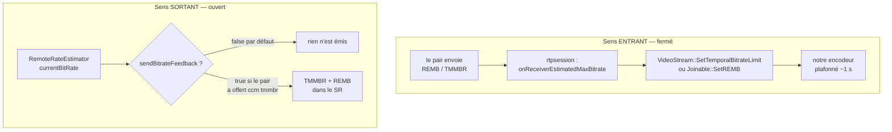
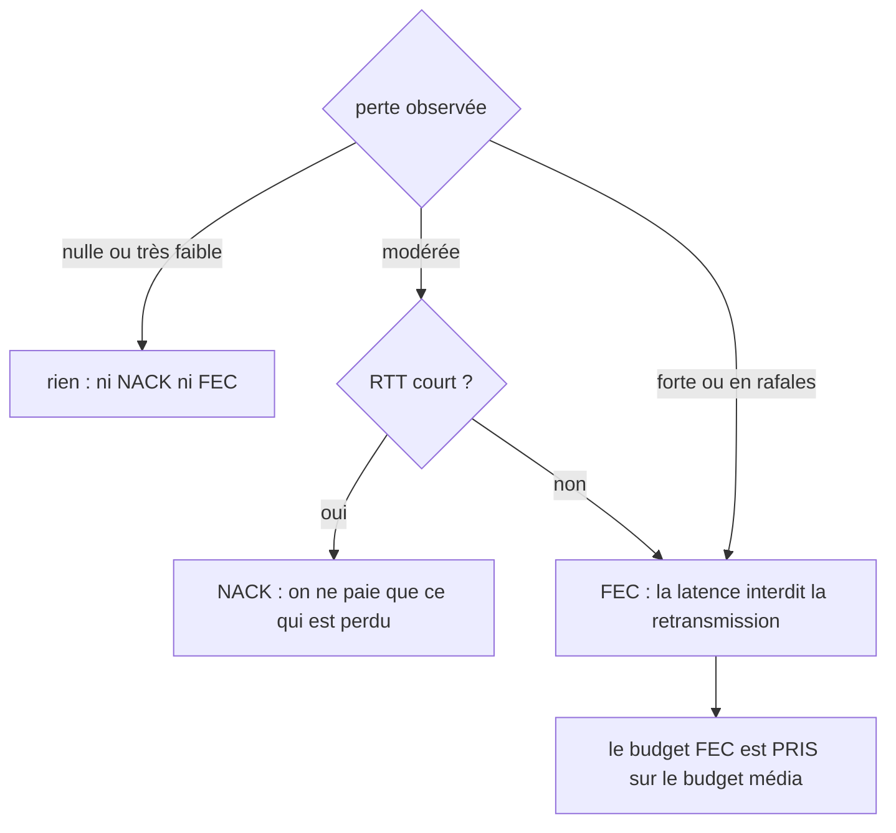
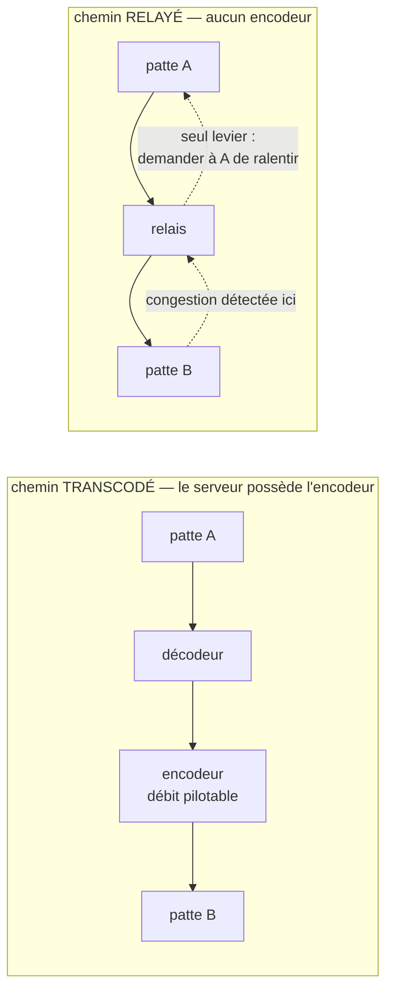

# Contrôle de débit — un algorithme qui n'a jamais tourné, et ce qu'il faudrait à la place

> Statut : **diagnostic dont les lots 0 et 1 du plan sont réalisés**
> (2026-08-15, cf. [`rate_control_plan.md`](rate_control_plan.md)). La §3 décrit
> l'état de 2013 tel qu'il a été trouvé — c'est l'HISTORIQUE qui justifie le
> plan ; les défauts qu'elle détaille sont **corrigés** depuis le lot 1, chacun
> gardé par un test de `mcu/tests/test_rate_control.cpp` (`make
> check-ratecontrol`). Les §2 (boucle sortante ouverte), §5 et §6 restent
> d'actualité : ce sont les lots 2 et suivants.
>
> **Seconde passe, 2026-08-15.** Un arbre libwebrtc réel a été mis à disposition
> dans `../webrtc` (commit `9f30e83`, *WebRTC source stamp 2026-08-14*). Toute la
> §5 et l'annexe A, écrites de mémoire, ont été **relues sur la source** : ce qui
> était juste est maintenant cité avec fichier et ligne, ce qui était faux est
> corrigé et signalé comme tel. La comparaison ligne à ligne avec l'**ancêtre
> direct** de notre code — `modules/remote_bitrate_estimator/overuse_estimator.cc`,
> toujours vivant en 2026 — a par ailleurs révélé **quatre défauts de plus** dans
> notre copie, décrits en [§3.4](#34-quatre-divergences-de-plus-relevées-contre-lancêtre).

**Le principe d'abord.** Un contrôle de congestion se juge sur une seule question :
l'information circule-t-elle en boucle ? Une estimation qui n'est pas émise, ou
émise mais pas appliquée, ne vaut pas mieux que pas d'estimation — et coûte
davantage, parce qu'on croit l'avoir. Ce document commence donc par la boucle
(§2, §3) avant de parler d'algorithme (§5), et ce n'est pas de la pédagogie : les
mesures faites ici montrent que l'estimation actuelle est constante, donc que
treize ans de raffinement algorithmique se sont appliqués à une valeur morte.

Sommaire : [les deux classes](#1-les-deux-classes-et-ce-quelles-font) ·
[la boucle](#2-la-boucle--une-moitié-fermée-lautre-ouverte) ·
[ce que vaut l'estimation](#3-ce-que-lestimation-vaut-aujourdhui) ·
[l'ordre des travaux](#4-lordre-des-travaux-est-la-décision-la-plus-importante) ·
[prospective](#5-prospective--ce-que-font-les-piles-récentes) ·
[relais contre transcodage](#6-le-cas-que-les-piles-webrtc-nont-pas--relais-contre-transcodage) ·
[annexes](#annexe-a--réponses-lues-sur-larbre-réel)

---

## 1. Les deux classes, et ce qu'elles font

Le code est le trio historique de la libwebrtc de 2013 — estimateur de débit côté
**réception**, produisant un REMB — porté par Medooze puis maintenu ici. Les
en-têtes le disent : `Created on 26 de diciembre de 2012` et `8 de marzo de 2013`.

Fait utile, établi à la seconde passe : **l'original est toujours vivant en
amont**. `modules/remote_bitrate_estimator/{overuse_estimator,overuse_detector,
aimd_rate_control}.cc` sont encore compilés dans l'arbre 2026, comme repli pour
les pairs qui n'annoncent pas transport-cc. Notre code n'est donc pas orphelin :
il a un **témoin de référence** avec lequel on peut comparer ligne à ligne — ce
que fait la [§3.4](#34-quatre-divergences-de-plus-relevées-contre-lancêtre).

### `RemoteRateControl` — un détecteur de surutilisation par flux

Une instance **par SSRC**. Elle observe le délai inter-images et décide si le
réseau est en train de saturer.

```
paquets d'une image (jusqu'au bit marqueur)
        │
        ├─ curDelta += (Δtemps d'arrivée) − (Δhorodatage)   ← le délai inter-groupes
        │
        ▼ (sur le bit marqueur)
   filtre de Kalman sur (Δtaille, offset)  →  slope, offset, varNoise
        │
        ▼
   |T| > seuil ?  →  hypothèse : UnderUsing | Normal | OverUsing
```

Deux critères s'ajoutent au délai, et ils ne viennent pas de la spécification :
`UpdateRTT` déclare `OverUsing` si le RTT dépasse 1,5 fois le précédent, et
`UpdateLost` fait de même au-delà d'un ratio de pertes. Ajouts locaux, délibérés.

### `RemoteRateEstimator` — la machine AIMD, une par session

Elle possède la map `ssrc → RemoteRateControl` (`new`/`delete`), agrège les
hypothèses selon la règle **« le pire état gagne »**, et fait tourner
l'augmentation-diminution :

```
        ┌──────────── OverUsing ───────────┐
        │                                  ▼
   Increase ◄── Normal ──► Hold ──────► Decrease
        ▲                                  │
        └────────── UnderUsing ◄───────────┘

   Increase : currentBitRate × RateIncreaseFactor(…)  +  8000 bit/s
   Decrease : currentBitRate × beta (0,85 / 0,9 / 0,95 selon la région)
   Hold     : rien, et mémorise maxHoldRate
```

Les **régions** (`MaxUnknown`, `AboveMax`, `NearMax`, `BelowMax`) situent le débit
courant par rapport à une moyenne glissante du maximum observé
(`avgMaxBitRate` ± quelques σ) et pilotent à la fois le seuil du détecteur et
l'agressivité de la descente.

Le résultat sort par un unique point : `Listener::onTargetBitrateRequested(bitrate)`.

### Qui possède quoi

| propriétaire | membre | portée |
|---|---|---|
| `RTPParticipant` | `estimator` (par valeur) | **un seul pour toutes les sessions vidéo du participant** |
| `Endpoint` (JSR-309) | `estimator`, `estimator2` | par patte |
| `RTPSession` | pointeur brut | ne possède pas |

Le partage d'un estimateur entre plusieurs sessions a une conséquence directe :
`SetListener(this)` est appelé par chaque session, donc **la dernière enregistrée
gagne** et les autres ne reçoivent jamais de retour.

---

## 2. La boucle : une moitié fermée, l'autre ouverte

C'est la question qui décide de la valeur de tout le reste.



**Sens entrant : fermé, et il fonctionne.** Un REMB ou un TMMBR reçu est décodé,
remonté au participant ou à la patte JSR-309, et appliqué comme plafond à
l'encodeur pendant environ une seconde. Quelques trous connus : `SetREMB` est vide
sur `RTPMultiplexer` et `WSEndpoint`, et commenté sur `AudioTranscoder`.

**Sens sortant : ouvert en pratique.** Une seule porte, `sendBitrateFeedback`,
initialisée à `false` avec le commentaire `// test` (`rtpsession.cpp:303`) et
positionnée nulle part dans ce dépôt — seulement par la propriété RTP `tmmbr`,
que le contrôleur elixip pose quand l'offre contient `a=rtcp-fb:… ccm tmmbr`.
Donc :

- **patte Chrome ou Firefox** — qui annoncent `goog-remb` et `transport-cc`, pas
  `ccm tmmbr` : rien n'est émis, tout le calcul est perdu ;
- **patte SIP classique** qui offre `ccm tmmbr` : un TMMBR et un REMB partent dans
  chaque SR, mais figés après le premier retour (voir §3).

C'est ce demi-circuit ouvert qui explique le reste : **une valeur qu'on n'émet
pas, personne ne vient dire qu'elle est fausse.**

> **Fermé au lot 2 (2026-08-15).** La porte unique est devenue un **mode**
> `{None, REMB, TMMBR}` (`bitrateFeedbackMode`), posé par la propriété `tmmbr`
> **ou** par la nouvelle propriété `remb`, que les deux contrôleurs elixip
> posent désormais sur `a=rtcp-fb:… goog-remb`. La patte Chrome/Firefox reçoit
> donc du REMB, amorti par le `RembThrottler` (baisse immédiate, hausse retenue
> 200 ms). Le sens sortant reste **piloté par la négociation** (arbitrage A2) :
> un pair qui n'a rien demandé ne reçoit toujours rien. Restent ouverts, comme
> annoncé : `transport-cc` (lot 4), et la mesure elle-même (lot 3).

---

## 3. Ce que l'estimation vaut aujourd'hui

Trois défauts suffisent, et ils sont vérifiés ligne à ligne dans ce dépôt.

### 3.1 Un horodatage passé comme une taille de paquet

```cpp
// rtpsession.cpp:3792
s->GetRemoteRateEstimator()->Update(recSSRC, packet, getTimeMS());

// remoterateestimator.h:55 — le troisième paramètre est une TAILLE
void Update(DWORD ssrc, RTPTimedPacket* packet, DWORD size);
```

Chaque paquet reçu déclare donc une taille d'environ 2,6 milliards d'octets. Le
débit entrant mesuré part à ~10¹³ bit/s, et `currentBitRate` est écrêté au maximum
configuré **à chaque paquet**. En clair : `GetEstimatedBitrate()` rend
`maxConfiguredBitRate`, soit 1 280 000 000, en permanence et quoi qu'il arrive sur
le réseau.

Le même échange existe une seconde fois :

```cpp
// rtpsession.cpp:3823
s->GetRemoteRateEstimator()->UpdateLost(recSSRC, lost, size);

// remoterateestimator.h:54 — le troisième paramètre est un INSTANT
void UpdateLost(DWORD ssrc, DWORD lost, QWORD now);
```

Une taille (~1100) arrive là où l'on attend un `now` en millisecondes. La
soustraction non signée `now - lastChange` produit alors ~1,8·10¹⁹, et de là
`avgChangePeriod` astronomique et une conversion `double → DWORD` hors plage
(`responseTime`). Déclencheur : une perte rapportée pendant une congestion déjà
déclarée (`UpdateLost` ne propage que si le flux est déjà `OverUsing`).

> **Mesuré (lot 0, `UnRapportDePerteNeDesarmePasLeThrottle`).** La première
> rédaction déduisait de là un throttle « définitivement désarmé » et un
> `pow(alpha, 10⁶)` infini : le test dit NON aux deux. Le throttle se **réarme
> seul** au tick suivant (`lastChange = now`) — l'échange d'arguments coûte un
> tick supplémentaire immédiat, pas une réestimation par paquet — et la
> pow-bombe n'est pas atteignable par ce chemin (chaque transition d'état
> réécrit `lastBitRateChange`). Les dégâts durables sont `avgChangePeriod`
> (~100 ticks à décroître en 0,9ⁿ, donc un `responseTime` faux pendant ~100 s)
> et la conversion hors plage, qui est de l'UB. L'échange reste à corriger —
> mais pour ce qu'il fait vraiment.

### 3.2 Un facteur d'oubli exponentié par une différence de tailles

```cpp
// remoteratecontrol.cpp:131
// beta is a function of alpha and the time delta since the previous update.
const double beta = pow(1-alpha, deltaSize*30/1000.0);
```

Le commentaire dit *time delta*. Le code passe `deltaSize`, qui vaut
`curSize - prevSize` (`remoteratecontrol.cpp:74`) : une différence **signée** de
tailles d'image en octets. Elle est négative dès qu'une image est plus petite que
la précédente — donc pour toute image P suivant une I.

`pow(0,99, −20000)` vaut environ 4·10⁸⁶. Alors `1-beta` devient très négatif,
`varNoise` passe négatif, `sqrt(varNoise)` rend NaN, et le NaN contamine `slope`,
`offset` et la matrice `E`. À partir de là `fabs(T) > threshold` est faux pour
toujours : **le détecteur par délai est mort au bout de quelques images**, figé sur
`Normal`.

### 3.3 Ce qu'il reste quand ces deux-là sont tombés

Ni le délai (§3.2) ni le débit (§3.1) ne portent plus d'information. Restent les
deux critères ajoutés localement — RTT et pertes — qui deviennent les **seuls**
producteurs d'`OverUsing`. Et le critère de pertes compare deux fenêtres
d'accumulateurs exprimées dans des unités différentes (microsecondes contre
millisecondes), ce qui le rend sensible à deux ou trois pertes consécutives.

Autrement dit, le système n'a jamais fait du Google Congestion Control : il fait
« si le RTT monte ou si je perds quelques paquets, décide `OverUsing` », sur une
estimation de débit constante, et n'émet le résultat que si le pair a offert
`ccm tmmbr`.

> **Ce que cela implique pour la lecture de ce code.** Les constantes, les seuils,
> les régions, le réglage du Kalman : rien de tout cela n'a jamais été exercé en
> production. Ce ne sont pas des valeurs éprouvées par treize ans de trafic, ce
> sont des valeurs jamais atteintes. Les traiter comme un héritage à respecter
> serait une erreur de méthode.

### 3.4 Quatre divergences de plus, relevées contre l'ancêtre

Le §3.2 avait identifié le `pow(1-alpha, deltaSize*…)` en lisant le commentaire
qui le contredisait. L'arbre réel permet mieux : `OveruseEstimator::Update`
(`../webrtc/modules/remote_bitrate_estimator/overuse_estimator.cc`) **est** la
fonction dont `RemoteRateControl::UpdateKalman` est la copie, et elle est toujours
compilée en 2026. La lire en regard en fait ressortir quatre autres, dont aucune
n'avait été vue.

**a) Le filtre de résidu est inversé.** Le but est d'écrêter les résidus
aberrants — une image clé périodique ne suit pas le modèle gaussien :

```cpp
// upstream, overuse_estimator.cc:64-72
const double max_residual = 3.0 * sqrt(var_noise_);
if (fabs(residual) < max_residual)
    UpdateNoiseEstimate(residual, …);                       // cas normal : on garde
else
    UpdateNoiseEstimate(residual < 0 ? -max_residual : max_residual, …);  // aberrant : on écrête

// ici, remoteratecontrol.cpp:118-121
double residualFiltered = residual;
if (std::fabs(residual)<3*sqrt(varNoise))
    residualFiltered = 3*sqrt(varNoise);                    // ← les deux branches échangées
```

Notre version **remplace le cas normal par la borne** et **laisse passer
l'aberrant intact** — exactement l'inverse de l'intention. Elle perd de plus le
signe : tout résidu ordinaire, positif ou négatif, est réécrit en `+3σ`. Comme
`avgNoise` est ensuite une moyenne glissante de `residualFiltered`, l'estimateur
de bruit ne mesure plus le bruit : il converge vers sa propre borne.

**b) Il manque le plancher sur `varNoise`.** Upstream le pose explicitement, et
c'est ce qui rend `sqrt(varNoise)` toujours défini :

```cpp
// upstream, overuse_estimator.cc:136-138
if (var_noise_ < 1) var_noise_ = 1;
```

Il n'existe pas ici (`remoteratecontrol.cpp:133`, aucun garde après le calcul).
C'est la moitié manquante du §3.2 : le `beta` mal alimenté produit la valeur
négative, l'absence de plancher la laisse arriver jusqu'à `sqrt`. Corriger l'un
sans l'autre laisse la classe de panne ouverte.

**c) La mise à jour de la matrice de covariance s'écrase elle-même.** Upstream
sauvegarde les deux valeurs de la première ligne avant de les écraser — et ces
temporaires ne sont pas décoratives, c'est la seule raison pour laquelle elles
existent :

```cpp
// upstream, overuse_estimator.cc:80-87
const double e00 = E_[0][0];
const double e01 = E_[0][1];
E_[0][0] = e00*IKh[0][0] + E_[1][0]*IKh[0][1];
E_[0][1] = e01*IKh[0][0] + E_[1][1]*IKh[0][1];
E_[1][0] = e00*IKh[1][0] + E_[1][0]*IKh[1][1];   // e00, pas E_[0][0]
E_[1][1] = e01*IKh[1][0] + E_[1][1]*IKh[1][1];   // e01, pas E_[0][1]

// ici, remoteratecontrol.cpp:146-149 — pas de temporaire
E[0][0] = E[0][0]*IKh[0][0] + E[1][0]*IKh[0][1];
E[0][1] = E[0][1]*IKh[0][0] + E[1][1]*IKh[0][1];
E[1][0] = E[0][0]*IKh[1][0] + E[1][0]*IKh[1][1];  // ← E[0][0] déjà réécrit
E[1][1] = E[0][1]*IKh[1][0] + E[1][1]*IKh[1][1];  // ← E[0][1] déjà réécrit
```

Les deux dernières lignes lisent la valeur **neuve** au lieu de l'ancienne. La
covariance calculée n'est celle d'aucun filtre ; upstream, qui fait le calcul
juste, garde d'ailleurs un `RTC_DCHECK(positive_semi_definite)` sur le résultat —
contrôle que nous n'avons pas, et qui sauterait.

**d) L'estimation de bruit n'est plus conditionnée à l'état stable.** Upstream ne
met le bruit à jour que si l'hypothèse courante est `Normal`
(`in_stable_state`, overuse_estimator.cc:62-68) : mesurer le bruit pendant qu'on
sature revient à prendre la congestion pour du bruit. Ici la condition existe
encore — mais **en commentaire** (`remoteratecontrol.cpp:114`), et le bloc
s'exécute toujours.

**Et la mesure elle-même n'est pas la même.** Upstream mesure, par groupe,
`t_delta - ts_delta` (overuse_estimator.cc:37). Ici, `curDelta` accumule déjà
`(Δarrivée − Δhorodatage)` sur les paquets de l'image — il **est** ce
`t_ts_delta` — et c'est pourtant `curDelta - prevDelta` qui est passé au filtre
(`remoteratecontrol.cpp:74`). Le filtre travaille donc sur une **dérivée seconde**
du délai là où l'algorithme en attend la première.

> **Mesuré (lot 0, `UneDeriveDeDelaiConstanteEstDetectee`).** La conséquence
> n'est plus une hypothèse : une file qui se remplit **linéairement** — chaque
> image arrivant 2 ms plus tard que sa cadence, le cas nominal d'un lien
> saturé — a une dérivée seconde **nulle** dès la troisième image, et le
> détecteur ne passe **jamais** en `OverUsing` (400 images de dérive continue,
> hypothesis reste `Normal`). Seule une *accélération* du remplissage est
> visible. Autrement dit ce détecteur ne détecte pas la congestion établie,
> seulement son aggravation — c'est le plus grave des cinq défauts de cette
> section, et il était invisible à la relecture seule.

**Et le réglage n'est pas le même non plus.** `processNoise` vaut ici
`[1e-10 ; 1e-2]` contre `[1e-13 ; 1e-3]` amont (`overuse_estimator.h:59`) — mille
fois et dix fois plus —, et il est de surcroît multiplié par `30/fps`
(`remoteratecontrol.cpp:94-98`), mise à l'échelle que l'amont ne fait pas. Un
filtre de Kalman dont le bruit de processus est mille fois trop grand ne lisse
plus : il suit le dernier échantillon. Ce n'est pas un bug, c'est un réglage — mais
un réglage qu'aucune mesure n'a jamais validé (§3.3), et qui ferme la porte à
l'argument « ces valeurs sont éprouvées ».

> Portée. (a), (c) et (d) sont indépendants du §3.1 et du §3.2 : ils resteraient
> après correction des deux échanges d'arguments. Ils confirment surtout le
> pronostic de la §4 — cette copie n'est pas un GCC dégradé qu'on réglerait, c'est
> une réécriture qui a divergé de son modèle sur presque chaque ligne où le modèle
> était subtil.

La revue de code complète (défauts d'arithmétique, sûreté d'exécution — trois
threads pour un verrou qui ne couvre ni `GetSSRCs` ni `GetEstimatedBitrate` —,
constantes) est le compagnon de ce document ; elle n'est pas reproduite ici.

---

## 4. L'ordre des travaux est la décision la plus importante

> **Plan d'exécution** : cet ordre est découpé en lots livrables, avec fichiers,
> tests et critères de sortie, dans [`rate_control_plan.md`](rate_control_plan.md).

De ce qui précède découle un ordre, et s'en écarter ferait perdre le bénéfice de
tout le reste :

1. **Fermer la boucle et la rendre observable.** Corriger les deux échanges
   d'arguments, faire en sorte que le feedback sortant existe par défaut plutôt
   que sur une propriété que personne ne pose, et rendre l'estimation lisible
   (les traces actuelles ont des formats `printf` faux, donc affichent des valeurs
   fausses — elles ne peuvent servir à rien diagnostiquer).
2. **Mesurer.** Un appel réel, l'estimation en regard du débit effectif, et une
   dégradation provoquée (`tc netem`) pour voir la réaction. Sans cette étape,
   aucune des propositions de la §5 n'est évaluable.
3. **Alors** choisir l'algorithme, en sachant qu'à ce stade la question n'est plus
   « comment améliorer celui-ci » mais « lequel ». Voir §5.1 : la réponse moderne
   déplace l'estimation de côté, ce qui rend une bonne partie de ce code sans
   objet plutôt qu'à corriger.

> **Ce que la seconde passe change à cet ordre : rien, mais elle en durcit les
> raisons.** L'étape 1 gagne quatre correctifs de plus ([§3.4](#34-quatre-divergences-de-plus-relevées-contre-lancêtre)),
> tous mécaniques et tous vérifiables contre une source de référence — c'est du
> travail sûr. L'étape 3, elle, se précise : le premier livrable n'est pas un
> algorithme mais **un générateur de rapports d'arrivée en réception**
> ([§5.1](#51-le-déplacement-darchitecture--lestimation-change-de-côté)), qui est
> le plus petit morceau utile, le mieux spécifié (RFC 8888), le moins couplé au
> reste, et celui dont l'implémentation de référence est la plus courte. Et la
> §3.4 tranche une question que la première rédaction laissait ouverte : réparer
> le Kalman existant reviendrait à réécrire chaque ligne où il diverge de son
> modèle. Ce n'est pas moins de travail que de le remplacer, c'est seulement moins
> visible.

---

## 5. Prospective — ce que font les piles récentes

> **Sources.** Cette section a d'abord été écrite de mémoire, faute d'arbre
> libwebrtc sur la machine. Elle a été **relue et corrigée sur la source** le
> 2026-08-15 contre `../webrtc` (commit `9f30e83`, source stamp 2026-08-14). Les
> chemins et numéros de ligne ci-dessous sont relatifs à cet arbre et sont
> vérifiés. Deux affirmations de la première rédaction ne survivent pas à la
> lecture et sont signalées comme telles : le sort de FlexFEC (§5.3, franchement
> fausse) et la façon dont perte et délai se combinent (§5.2 point 3, ce n'est
> pas un minimum symétrique). L'[annexe A](#annexe-a--réponses-lues-sur-larbre-réel)
> porte désormais les réponses, plus les questions.

### 5.1 Le déplacement d'architecture : l'estimation change de côté

C'est le changement structurant, et il est antérieur à tout réglage.

| | REMB (ce code, ~2013) | transport-wide CC (piles actuelles) |
|---|---|---|
| qui mesure | le **récepteur** | le récepteur horodate, l'**émetteur** estime |
| ce qui circule | une bande passante en bit/s | les **temps d'arrivée par paquet** |
| granularité | par flux (SSRC) | **tout le transport**, audio et vidéo ensemble |
| standardisation | `draft-alvestrand-rmcat-remb`, jamais publié en RFC | de facto `transport-wide-cc-extensions`, et désormais **[RFC 8888](https://www.rfc-editor.org/rfc/rfc8888)** |

Pourquoi cela compte pour un serveur média : la décision d'allocation appartient à
celui qui **possède l'encodeur**. Un récepteur qui annonce « je peux recevoir
X bit/s » émet une opinion ; un émetteur qui voit les temps d'arrivée de ses
propres paquets mesure un fait, et peut répartir un budget unique entre plusieurs
flux — ce qu'un REMB par SSRC ne permet pas d'exprimer.

**Ce que l'arbre réel confirme, et qui vaut mieux qu'un raisonnement.** Le point
d'entrée réception d'une pile 2026 est
`modules/congestion_controller/receive_side_congestion_controller.cc` — l'exact
homologue de ce que fait notre `RTPSession` à l'arrivée d'un paquet. Il n'y a pas
un mécanisme mais une **échelle à trois barreaux**, choisie paquet par paquet
(`OnReceivedPacket`, l.123-148) :

```
RFC 8888 CCFB          si activé          → congestion_control_feedback_generator_
   sinon transport-cc  si le paquet porte l'extension transport sequence number
   sinon REMB          (et pour l'audio sans cette extension : RIEN du tout, l.134-137)
```

Trois enseignements directs :

1. **Le REMB n'est pas mort, il est le dernier barreau.**
   `RemoteBitrateEstimatorSingleStream` — celui dont notre code descend — est
   encore instancié par défaut (l.98) et reste le repli pour un pair sans
   extension transport-cc. La §5.1 avait raison sur ce point : à conserver, pas à
   raffiner.
2. **La bascule ne coûte rien à l'appelant.** Le choix se fait sur la présence
   d'une extension d'en-tête, pas sur une renégociation. Un serveur peut donc
   servir les trois mondes en parallèle, patte par patte.
3. **L'audio sans transport-cc n'alimente aucune estimation** (`// For audio, we
   only support send side BWE`). Rien ne sert d'espérer du REMB par flux qu'il
   rende compte d'un transport partagé — l'unification audio+vidéo est
   précisément ce que le REMB ne sait pas exprimer.

Conséquences concrètes ici :

- **En réception**, ce que le serveur devrait produire est un rapport d'arrivée
  ([RFC 8888](https://www.rfc-editor.org/rfc/rfc8888) `CCFB`, ou transport-cc pour
  l'interopérabilité avec les navigateurs actuels), pas un REMB. C'est
  *moins* de code qu'aujourd'hui : horodater et rapporter, sans filtre ni machine
  à états. L'implémentation de référence tient en deux fichiers courts —
  `congestion_control_feedback_generator.{h,cc}` (168 lignes) et son `tracker` —
  et son contenu est littéralement, par SSRC et par numéro de séquence, un
  **décalage d'arrivée relatif à l'horodatage du rapport** plus deux bits ECN
  (`rtcp_packet/congestion_control_feedback.h:37-46`). La cadence, elle, mérite
  d'être copiée telle quelle : un rapport **par image** (on attend le bit
  marqueur, au plus 25 ms), jamais plus vite que 25 ms, jamais plus lent que
  250 ms, et le tout **plafonné à 500 kbit/s de feedback** par un compteur de
  dette (`congestion_control_feedback_generator.cc:37-49, 126-150`). C'est le
  genre de détail qu'on ne devine pas et qui décide si le retour aide ou aggrave.
- **En émission**, il faudrait un estimateur côté émetteur, qui n'existe pas dans
  ce dépôt. C'est un développement, pas une correction.
- Les deux classes documentées ici deviennent alors **le mauvais côté du
  problème** : à conserver pour les pairs qui ne parlent que REMB, à ne pas
  raffiner.

### 5.2 Modulation de la bande passante : ce qui a remplacé le Kalman

Quatre évolutions, dans l'ordre où elles ont compté :

1. **Estimateur de tendance à la place du filtre de Kalman.** Confirmé, et le
   remplacement est total : `DelayBasedBwe` n'instancie plus que des
   `TrendlineEstimator` (`delay_based_bwe.cc:80-84`), un pour la vidéo, un pour
   l'audio. La régression linéaire porte sur une **fenêtre de 20 paquets**
   (`trendline_estimator.h:29`) de délai accumulé lissé (`smoothing_coef_ = 0.9`,
   `trendline_estimator.cc:37, 205-208`), et la pente s'interprète comme
   `(débit_émis − capacité)/capacité` (commentaire l.229-232). Plus d'états à mal
   initialiser, et surtout la classe de panne du §3.2 disparaît par construction :
   il n'y a plus de facteur d'oubli exponentié.
   Le Kalman survit néanmoins **au seul endroit où nous l'utilisons** : le chemin
   REMB côté réception (`overuse_estimator.cc`, cf. §3.4). C'est ce qui rend la
   comparaison ligne à ligne possible — et légitime.
2. **Seuil de surutilisation adaptatif.** Confirmé, avec la loi exacte
   (`trendline_estimator.cc:306-324`, identique dans `overuse_detector.cc:79-96`) :

   ```cpp
   k = |m| < threshold ? k_down : k_up;          // k_up = 0,0087 ; k_down = 0,039
   threshold += k * (|m| - threshold) * Δt;      // Δt plafonné à 100 ms
   threshold = clamp(threshold, 6, 600);         // ms
   ```

   Les gains sont bien asymétriques, et dans le sens qui compte : le seuil
   **monte lentement** (`k_up`) et **redescend 4,5 fois plus vite** (`k_down`), et
   toute excursion de plus de `threshold + 15 ms` est **ignorée** pour ne pas
   adapter le seuil à une chute brutale de capacité (l.311-316). Départ à 12,5 ms
   (l.176). À comparer aux trois constantes 35/25/12 figées par région ici.
   L'hypothèse elle-même n'est plus un simple `|T| > seuil` : il faut que la
   condition dure plus de 10 ms **et** deux échantillons **et** que la tendance ne
   redescende pas (`trend >= prev_trend_`, l.286-292) — trois verrous là où nous
   avons `overUseCount > 2`.
3. **Contrôleur basé sur la perte, à côté du contrôleur de délai.** Confirmé, mais
   la combinaison n'est pas un minimum symétrique et vaut la peine d'être décrite
   exactement. `LossBasedBweV2` est **activé par défaut** (`loss_based_bwe_v2.cc`,
   `FieldTrialParameter<bool> enabled("Enabled", true)`) et, dès qu'il est prêt
   — estimation valide et ≥ 3 observations d'au moins 250 ms —, **son résultat
   remplace purement et simplement** l'ancienne logique par seuils de perte
   (`send_side_bandwidth_estimation.cc`, `UpdateEstimate` : `if
   (LossBasedBandwidthEstimatorV2ReadyForUse()) { … return; }`). Le délai
   n'intervient plus qu'en **plafond** : `UpdateTargetBitrate` applique
   `min(candidat, delay_based_limit_, max_configuré)`. Autrement dit le
   contrôleur de perte propose, le contrôleur de délai borne.
   Ce n'est plus non plus un seuil de ratio : c'est une **recherche de maximum de
   vraisemblance** sur des candidats `{1,02 ; 1,00 ; 0,95} × estimation courante`,
   avec une « perte inhérente » estimée par une itération de Newton, une fenêtre
   de 15 observations et un taux de perte compté **en octets** (`use_byte_loss_rate
   = true`). L'ancien étage 2 %/10 % subsiste comme repli avant que V2 soit prêt
   (`send_side_bandwidth_estimation.cc:50-51`).
4. **Sondage actif et détection de région limitée par l'application.** Confirmé,
   et chiffré. Le sondage initial part à **3× puis 6× le débit de départ**
   (`probe_controller.cc`, `first/second_exponential_probe_scale` = 3,0 et 6,0), et
   un sondage de reprise est déclenché après une **grosse chute** si l'on est en
   ALR ou qu'on en sort depuis moins de 3 s, à 85 % du débit d'avant la chute
   (`RequestProbe`, l.377-410). L'ALR, justement, est un simple **seau à jetons** :
   le budget se remplit à 65 % de l'estimation, et si l'on n'a pas su le dépenser
   au-delà de 80 % on est déclaré « limité par l'application »
   (`alr_detector.cc:62-88`, seuils dans `alr_detector.h:60-62`). Une dizaine de
   lignes pour la distinction que notre code ne sait pas faire — « le lien est
   saturé » contre « l'encodeur n'avait rien à envoyer » — et dont dépendent le
   sondage, la non-augmentation du délai en ALR
   (`aimd_rate_control.cc:240-247`) et le rythme de FEC.

**Ce qui a disparu, et qui n'avait pas été anticipé : les régions.** L'AIMD amont
(`aimd_rate_control.cc`) ne connaît plus `MaxUnknown`/`AboveMax`/`NearMax`/
`BelowMax` — l'énumération n'existe nulle part dans l'arbre. Elle est remplacée
par un `LinkCapacityEstimator` : une moyenne glissante de la capacité (α = 0,05
sur surutilisation, 0,5 sur résultat de sondage) avec un écart-type normalisé, qui
rend des bornes à ±3σ (`link_capacity_estimator.cc:21-33, 39-62`). Le choix
montée additive / multiplicative suit non plus une région mais une question
factuelle : **a-t-on une estimation de capacité ?** Si oui, additif ; sinon,
multiplicatif ×1,08/s pour aller la trouver (`aimd_rate_control.cc:249-267,
342-362`).

Deux différences de plus, courtes et lourdes de conséquences :

- **La descente ne porte pas sur le même nombre.** Amont :
  `decreased_bitrate = estimated_throughput * beta` — le débit **acquitté**,
  mesuré (`aimd_rate_control.cc:277`). Ici : `currentBitRate * beta`, notre propre
  estimation. Reculer d'un pourcentage par rapport à ce qu'on croyait plutôt que
  par rapport à ce qui est passé, c'est ce qui fait qu'un contrôleur ne converge
  pas quand son estimation est fausse — et la nôtre est constante (§3.1).
- **`beta` est unique** amont : 0,85 (`kDefaultBackoffFactor`,
  `aimd_rate_control.cc:35`). Les trois valeurs 0,85/0,9/0,95 sont l'accessoire
  des régions disparues.

### 5.3 FEC et retransmissions : un choix, pas un cumul

La FEC ne se « active » pas, elle **s'achète** : la redondance est prélevée sur le
même budget que le média. Un serveur qui ajoute 20 % de FEC sans retirer 20 % au
codeur aggrave la congestion qu'il prétend corriger. Le raisonnement des piles
matures :



- **NACK d'abord** quand le RTT le permet : une retransmission ne coûte que le
  paquet perdu, une FEC coûte en permanence. Le seuil réel est **20 ms**
  (`modules/video_coding/media_opt_util.h:46`, `kLowRttNackMs`) : en dessous, le
  taux de FEC des images delta est **forcé à zéro** et l'on ne compte que sur le
  NACK (`media_opt_util.cc:107-125`).
- **FEC** quand le RTT est trop long pour qu'une retransmission arrive à temps, ou
  quand la perte est en rafales. Nuance apportée par la source : le seuil haut est
  câblé à `-1` (`media_opt_util.cc:535`), ce qui signifie « autoriser toujours le
  NACK ». Il n'y a donc pas, en pratique, de mode « FEC seule » : au-delà de
  20 ms de RTT on est en **hybride**, FEC sur les images delta et NACK sur le
  résidu.
- **L'allocation** est un modèle de protection alimenté par la perte et le RTT,
  pas un pourcentage fixe. Et elle est **soustraite** du débit annoncé à
  l'encodeur — la ligne est explicite et tient en une expression
  (`fec_controller_default.cc:163-167`) :

  ```cpp
  protection_overhead_rate = min(protection_overhead_rate, overhead_threshold_);  // 50 %
  return estimated_bitrate_bps * (1.0 - protection_overhead_rate);                // débit SOURCE
  ```

  Le taux soustrait n'est pas celui qu'on a *demandé* mais celui qu'on a
  *réellement émis* la seconde précédente, NACK compris
  (`sent_nack_rate + sent_fec_rate` sur le total, l.154-162). La perte qui
  alimente le modèle est filtrée par un **maximum glissant**, pas une moyenne
  (`kMaxFilter`, l.109-112) — on se protège du pire récent, pas du moyen.

> **Correction.** La première rédaction recommandait « viser `flexfec` plutôt
> qu'`ulpfec` ». C'est faux comme description de l'état de l'art déployé.
> Dans l'arbre 2026, RED et ULPFEC sont **toujours annoncés inconditionnellement**
> (`media/engine/webrtc_video_engine.cc:155-157`), tandis que FlexFEC-03 n'est
> annoncé qu'en **réception** et n'est **émis que derrière un field trial désactivé
> par défaut** (`WebRTC-FlexFEC-03`, `pc/media_session.cc:171`,
> `webrtc_video_engine.cc:1106`). Treize ans après, la FEC réellement envoyée par
> Chrome reste ULPFEC. Conséquence pour nous : notre décodeur ULPFEC n'est pas un
> retard à rattraper, et FlexFEC est un choix d'avenir, pas une mise à niveau.

Ce serveur a un NACK (`IsNACKEnabled`) et un décodeur ULPFEC. Ce qu'il n'a pas :
un arbitrage entre les deux fondé sur RTT et profil de perte, et une comptabilité
du coût de la FEC dans le budget. C'est un chantier de taille moyenne, et il n'a
de sens qu'après la §4 — sans mesure de perte fiable, l'arbitrage se fait à
l'aveugle.

### 5.4 Ce que les piles font vraiment quand ça se dégrade : pas du changement de codec

Sur ce point la prospective doit corriger une intuition répandue. Face à une chute
de bande passante, les piles WebRTC **ne changent pas de codec**. Elles font, dans
cet ordre :

1. **baisser le débit cible de l'encodeur** — la réaction immédiate, sans
   signalisation ;
2. **baisser la résolution et/ou la cadence**, selon une préférence de dégradation
   déclarée (privilégier la netteté ou la fluidité) ;
3. **abandonner une couche** quand le flux est en simulcast ou en SVC : on cesse
   d'envoyer la couche haute, ce qui est instantané et sans renégociation.

Les trois sont confirmés, et le vocabulaire est normalisé : `DegradationPreference`
(`api/rtp_parameters.h:165-179`) offre `MAINTAIN_FRAMERATE` (on baisse la
résolution), `MAINTAIN_RESOLUTION` (on baisse la cadence), `BALANCED`, et
`MAINTAIN_FRAMERATE_AND_RESOLUTION` (on ne dégrade rien, on laisse tomber des
images). Le signal qui déclenche n'est d'ailleurs **pas la bande passante** mais le
QP de sortie de l'encodeur et le taux d'images abandonnées — `QualityScaler`
échantillonne sur 2 s et réagit au-delà de **60 %** d'images tombées
(`modules/video_coding/utility/quality_scaler.cc:34-37`), avec un minimum de
60 images avant toute décision. Un serveur qui possède l'encodeur peut copier ce
raisonnement sans rien changer à sa signalisation.

L'abandon de couche, lui, est mécanique et non pas décidé : l'allocateur remplit
les couches par ordre de débit minimal croissant et **s'arrête à la première
qu'il ne peut pas alimenter** — les suivantes, qui exigent plus, sont
inatteignables (`simulcast_rate_allocator.cc`,
`DistributeAllocationToSimulcastLayers`). Un facteur d'hystérésis empêche une
couche de clignoter au seuil (l.167-171) ; en SVC, une couche spatiale n'est
activée que si le budget dépasse 0,55 fois le cumul des couches inférieures
(`svc_rate_allocator.cc:37-38`).

Le changement de codec en cours d'appel est rare et coûteux : il demande une
renégociation, une image clé, et il casse la continuité. Ce que le serveur possède
déjà et qui va dans le bon sens : le mode pont par paquet du transcodeur, qui
**suit** un pair changeant de codec sans renégocier (voir
[CODEC-NEGOTIATION.md](https://github.com/neutrino38/elixip/blob/master/CODEC-NEGOTIATION.md)
côté elixip). La direction à explorer n'est donc pas « basculer de codec » mais
**l'échelle spatiale et temporelle** : savoir réduire résolution et cadence à
l'encodeur du transcodeur, et à terme savoir ne pas relayer une couche haute.

Une note sur le mixage : dans une conférence, le serveur encode pour chaque
participant. Le budget est alors **par patte sortante**, et une patte lente ne doit
pas dégrader les autres — ce qui suppose une allocation par patte, à ne pas
confondre avec l'estimation par flux entrant que font les classes documentées ici.

---

## 6. Le cas que les piles WebRTC n'ont pas : relais contre transcodage

C'est la particularité de ce serveur, et elle n'a pas d'équivalent dans un client
WebRTC — qui possède toujours son encodeur.



- **Chemin transcodé** : le serveur agit seul. Une congestion mesurée vers B se
  traduit en baisse du débit de l'encodeur qui alimente B. A n'en sait rien et n'a
  pas à le savoir. C'est le cas facile, et c'est celui que la §5 couvre.
- **Chemin relayé** : le serveur n'a **rien** à moduler. Les paquets qu'il émet
  vers B sont ceux de A. Le seul levier est de **propager la contrainte à
  contre-courant** : traduire la congestion observée vers B en un REMB ou un TMMBR
  émis vers A, pour que A réduise à la source.

Ce second cas est important en pratique parce que la politique `:avoid` — celle
par défaut côté elixip — **relaie le plus souvent** : dès que les deux pattes
s'accordent sur un codec, il n'y a pas d'encodeur dans le chemin. Donc le cas
« aucun levier local » est le cas courant, pas l'exception.

Deux questions ouvertes, et ce sont les plus intéressantes du document :

1. **Faut-il propager la contrainte entre pattes, et avec quelle prudence ?** Une
   propagation naïve fait osciller : la mesure vers B module A, ce qui change ce
   que B reçoit, ce qui remesure. Il faut au minimum un amortissement et une
   asymétrie (descendre vite, remonter lentement). Le code contient déjà une
   amorce de ce raisonnement — `RTPEndpoint::SetREMB` relaie vers
   `SetTemporalMaxLimit` de l'estimateur de la patte opposée — mais elle rejette
   silencieusement toute valeur inférieure ou égale à 128 000, ce qui interdit
   précisément d'annoncer un réseau lent.

   **L'arbre réel donne la moitié de la réponse, et elle est courte.**
   `modules/congestion_controller/remb_throttler.cc` est exactement le module
   d'amortissement qui manque ici, en une trentaine de lignes, et son asymétrie
   est celle qu'on avait pressentie :

   ```cpp
   // remb_throttler.cc:43-49 — une BAISSE part tout de suite ; une HAUSSE attend 200 ms
   const int64_t kSendThresholdPercent = 103;
   if (receive_bitrate * kSendThresholdPercent / 100 > last_send_remb_bitrate_ &&
       now < last_remb_time_ + kRembSendInterval)   // kRembSendInterval = 200 ms
     return;
   ```

   Et surtout, il porte **deux entrées distinctes** qu'il compose par un minimum :
   l'estimation mesurée d'un côté, un plafond externe de l'autre
   (`SetMaxDesiredReceiveBitrate`, l.57-69), ce dernier pouvant lui aussi forcer
   une émission immédiate s'il abaisse la valeur. C'est très précisément la forme
   d'API dont notre `SetREMB` inter-pattes a besoin : **un plafond qui compose par
   `min()` avec la mesure locale**, et non un `SetTemporalMaxLimit` qui écrase la
   mesure et refuse par ailleurs les petites valeurs. Il n'y a donc rien à
   inventer sur l'amortissement ; ce qui reste ouvert est le seul point que
   libwebrtc ne peut pas nous apprendre — de quelle patte à quelle patte, et avec
   quelle politique en conférence (§5.4).
2. **Que faire d'un pair qui ne comprend ni REMB ni TMMBR ?** Il reste FIR/PLI,
   qui demandent une image clé sans dire de ralentir — et une image clé est ce
   qu'il faut de plus gros quand le lien est saturé. Sur un chemin relayé vers un
   tel pair, il n'y a peut-être aucune réponse correcte, et le dire est plus utile
   que de prétendre le contraire.

---

## Annexe A — réponses, lues sur l'arbre réel

Arbre de référence : `../webrtc`, commit `9f30e83`, *WebRTC source stamp
2026-08-14*. Les chemins sont relatifs à cette racine.

| question de la première passe | réponse lue dans la source |
|---|---|
| **`GoogCcNetworkController`** — quels sous-contrôleurs, et qui arbitre ? | `goog_cc/goog_cc_network_control.cc`, `OnTransportPacketsFeedback`. L'ordre est fixe : débit acquitté → sondage → **délai** (`DelayBasedBwe`) → **perte** (`UpdateLossBasedEstimator`) → fenêtre de congestion. L'arbitre unique est `SendSideBandwidthEstimation`, qui **ne mélange pas** : le contrôleur de perte fournit la valeur, le délai fournit un plafond (`UpdateTargetBitrate` = `min(candidat, delay_based_limit_, max)`). |
| **`delay_based_bwe`** — encore un état à la Kalman ? | Non. `delay_based_bwe.cc:80-84` n'instancie que des `TrendlineEstimator` (un vidéo, un audio, avec bascule sur le flux actif). Le Kalman ne subsiste que sur le chemin REMB réception (`remote_bitrate_estimator/overuse_estimator.cc`). |
| **`trendline_estimator`** — fenêtre, seuil de départ, conversion en hypothèse ? | Fenêtre **20 paquets** (`trendline_estimator.h:29`), lissage 0,9, gain de seuil 4,0, seuil initial **12,5** (`.cc:37-38, 176`). Conversion : `modified_trend = min(n_deltas, 60) × pente × 4,0`, puis comparaison au seuil avec triple verrou — durée > 10 ms, compteur > 1, tendance non décroissante (`.cc:267-304`). |
| **`overuse_detector`** — loi d'adaptation, gains asymétriques ? | `threshold += k·(|m| − threshold)·Δt`, `k_up = 0,0087`, `k_down = 0,039`, `Δt` plafonné à 100 ms, résultat borné à **[6, 600] ms**, et adaptation **suspendue** si `|m| > threshold + 15 ms` (`overuse_detector.cc:79-96`, identique dans `trendline_estimator.cc:306-324`). Oui, asymétriques : monte lentement, redescend 4,5× plus vite. |
| **`loss_based_bwe_v2`** — entrée exacte, combiné comment ? | Entrée : les résultats de paquets d'un rapport de feedback, agrégés en observations de ≥ 250 ms, taux de perte **en octets** (`use_byte_loss_rate = true`), fenêtre de 15 observations, minimum 3 pour être prêt. Ce n'est pas un seuil mais un **maximum de vraisemblance** sur candidats `{1,02 ; 1,00 ; 0,95}` avec Newton (1 itération, pas 0,75) sur la perte inhérente. Combinaison : **pas un minimum symétrique** — quand V2 est prêt, il *remplace* la logique de perte historique et le délai ne joue plus qu'en plafond. |
| **`probe_controller`** — quand, à quel débit, intégré comment ? | Démarrage : **3× puis 6×** le débit de départ (`probe_controller.cc`, `p1`/`p2`). Périodique en ALR : toutes les 5 s, ×2. Sur reprise après grosse chute : une session unique à **85 %** du débit d'avant la chute, si la chute date de moins de 5 s (`RequestProbe`, l.377-410). Intégration : le résultat entre par `probe_bitrate` dans `DelayBasedBwe::MaybeUpdateEstimate`, qui fait `SetEstimate` direct — un sondage **court-circuite** l'AIMD. |
| **`alr_detector`** — comment distingue-t-on « rien à envoyer » de « saturé » ? | Seau à jetons rempli à **65 %** de l'estimation ; au-dessus de **80 %** de budget non dépensé on entre en ALR, en dessous de **50 %** on en sort (`alr_detector.cc:62-88`, `alr_detector.h:60-62`). Une trentaine de lignes au total. |
| **`paced_sender`** — prérequis ou amélioration ? Nos rafales faussent-elles nos mesures ? | **Prérequis, et la source le dit par ses constantes** : le facteur de pacing passe de **2,5×** à **1,1×** dès que le feedback côté émetteur arrive (`goog_cc_network_control.cc:55-58, 663-664`). Autrement dit, plus l'estimation dépend des temps d'arrivée, plus on interdit à l'émetteur de faire des rafales. Réponse directe pour nous : oui — envoyer une image en rafale, c'est mesurer sa propre file d'émission. |
| **`fec_controller_default`** — formule, et budget soustrait ? | Oui, explicitement : `return estimated_bitrate_bps * (1.0 - protection_overhead_rate)` avec un plafond à **50 %** (`fec_controller_default.cc:163-167`). Le taux soustrait est celui **réellement émis** la seconde précédente (FEC + NACK / total), et la perte d'entrée est filtrée par **maximum glissant**, pas par moyenne. |
| **`media_opt_util`** — critère NACK vs FEC, seuil de RTT ? | RTT < **20 ms** (`media_opt_util.h:46`) → FEC delta forcée à 0, NACK seul. Au-delà → **hybride** : le seuil haut vaut `-1` (`media_opt_util.cc:535`), donc le NACK reste toujours autorisé et il n'y a pas de mode « FEC seule ». |
| **feedback réception** — cadence et contenu ? | RFC 8888 : un rapport **par image** (attente du bit marqueur, plafonnée à 25 ms), jamais moins de 25 ms ni plus de 250 ms entre deux, débit de feedback plafonné à **500 kbit/s** via un compteur de dette (`congestion_control_feedback_generator.cc:37-49, 126-150`). Contenu : par SSRC et par numéro de séquence, décalage d'arrivée relatif à l'horodatage NTP compact du rapport, plus ECN (`rtcp_packet/congestion_control_feedback.h:22-46`). |
| **`simulcast_rate_allocator`, `svc_rate_allocator`** — répartition, abandon de couche ? | Remplissage par ordre de débit minimal croissant ; on **s'arrête à la première couche non finançable** — l'abandon n'est pas une décision mais une conséquence. Hystérésis pour éviter le clignotement au seuil (`simulcast_rate_allocator.cc:167-171`) ; en SVC, facteur **0,55** par couche spatiale et temporelle (`svc_rate_allocator.cc:37-38`). |
| **`video_stream_encoder`, `quality_scaler`** — logique de dégradation, sur quel signal ? | Pas sur la bande passante : sur le **QP de sortie** et le taux d'images abandonnées, échantillonnés sur 2 s, seuil à **60 %** d'images tombées, minimum 60 images avant décision (`modules/video_coding/utility/quality_scaler.cc:34-37`). L'axe dégradé est choisi par `DegradationPreference` (`api/rtp_parameters.h:165-179`). |

**Découverte non prévue par la liste : les régions ont disparu.** L'énumération
`MaxUnknown`/`AboveMax`/`NearMax`/`BelowMax`, structurante dans notre
`RemoteRateEstimator`, n'existe **nulle part** dans l'arbre 2026. Elle est
remplacée par `LinkCapacityEstimator` (moyenne glissante ± 3σ,
`goog_cc/link_capacity_estimator.cc`), et le choix montée additive/multiplicative
répond désormais à une question factuelle — « a-t-on une estimation de
capacité ? » — et non à un classement. Tout réglage de nos trois seuils et de nos
trois `beta` porterait donc sur une structure que l'amont a supprimée.

Restent à trancher, et ce ne sont pas des questions de code : la **version** de
l'arbre qui sert de référence pour un éventuel emprunt (celle-ci fait l'affaire),
et la compatibilité de la **licence BSD** de libwebrtc avec ce projet sous GPL —
l'emprunt d'algorithme ne pose pas de difficulté, la recopie de fichiers en pose
une, à instruire avant tout copier-coller.

## Annexe B — constantes en dur, avec leur valeur

À lire en gardant la §3 en tête : aucune n'a été exercée en production. La colonne
« amont » est la valeur lue dans `../webrtc` (commit `9f30e83`) quand la constante
y a un homologue ; elle sert d'ordre de grandeur, pas de cible à recopier.

| constante | valeur ici | amont | remarque |
|---|---|---|---|
| `maxConfiguredBitRate` | 1 280 000 000 bit/s | **30 000 000** (`aimd_rate_control.cc:67`) | la coquille est confirmée par comparaison : deux ordres de grandeur au-dessus de l'amont. En l'état, **pas de plafond réel**. |
| `minConfiguredBitRate` | 128 000 bit/s | **5 000** (`kCongestionControllerMinBitrate`, `bwe_defines.h:24`) | 25× trop haut : impossible d'annoncer un réseau plus lent. `SetTemporalMaxLimit` rejette de plus tout maximum ≤ 128 000. |
| retard initial | 500 + 60 000 ms | 5 s d'initialisation (`kInitializationTime`, `aimd_rate_control.cc:155`) | une minute sans réestimation périodique, justifiée par un seul commentaire. |
| seuils du détecteur | 35 / 25 / 12 (par région) | **adaptatif**, départ 12,5, borné [6, 600] | l'amont n'a plus de seuil fixe du tout, ni de région (cf. annexe A). |
| hystérésis | `overUseCount > 2` | durée > 10 ms **et** compteur > 1 **et** tendance non décroissante | seulement vers `OverUsing` ici ; les retours vers `Normal`/`UnderUsing` sont immédiats des deux côtés. |
| Kalman | `E = [100 ; 0,1]`, `varNoise₀ = 50`, `slope₀ = 8/512` | **identiques** (`overuse_estimator.h:55-61`) — mais l'amont ajoute le plancher `varNoise ≥ 1` qui manque ici (§3.4 b) | `alpha` 0,01 puis 0,002 au-delà de 60 images (amont : au-delà de **300**). |
| `processNoise` | `[1e-10 ; 1e-2]`, **multiplié par `30/fps`** | `[1e-13 ; 1e-3]`, non mis à l'échelle (`overuse_estimator.h:59`) | 1000× et 10× l'amont, avant même la mise à l'échelle : le filtre est réglé pour faire beaucoup moins confiance à son état. Divergence non documentée jusqu'ici. |
| incrément additif | + 8 000 bit/s | plancher **4 000 bit/s·s**, sinon dérivé de la taille de paquet et du RTT (`GetNearMaxIncreaseRateBpsPerSecond`) | l'amont calcule, il ne constante pas. |
| montée multiplicative | `RateIncreaseFactor(…)` | **×1,08 par seconde**, plancher +1 000 bit/s | |
| `beta` (descente) | 0,85 / 0,9 / 0,95 selon la région | **0,85, unique** (`kDefaultBackoffFactor`) | et appliqué au débit **acquitté**, pas à l'estimation courante (§5.2). |
| temps de réponse | `avgChangePeriod + rtt + 300` ms | `rtt + 100 ms`, doublé | `rtt` initial 200 ms des deux côtés. |
| fenêtres d'accumulateurs | 100 ms (débit, paquets, pertes), 1 000 ms (fps), 200 ms (débit global) | `kBitrateWindow` = **1 s** | à comparer aux ~500 ms–1 s usuels. |
| quarantaine côté encodeur | `videoFPS` images ≈ 1 s | REMB : baisse immédiate, hausse retenue **200 ms** (`remb_throttler.cc:27`) | durée d'application d'un plafond reçu. |

## Annexe C — références

**Contrôle de congestion**

- [RFC 8888](https://www.rfc-editor.org/rfc/rfc8888) — *RTCP Congestion Control
  Feedback*. La cible normalisée pour le sens réception.
- [RFC 8836](https://www.rfc-editor.org/rfc/rfc8836) — exigences de contrôle de
  congestion pour le média interactif (RMCAT).
- [RFC 8698](https://www.rfc-editor.org/rfc/rfc8698) — SCReAM, l'autre algorithme
  RMCAT publié ; utile comme point de comparaison.
- `draft-ietf-rmcat-gcc-02` — le Google Congestion Control tel que spécifié
  (expiré, jamais publié en RFC) : c'est de cet algorithme que dérive le code
  documenté ici.
- `draft-alvestrand-rmcat-remb` — REMB. Jamais publié en RFC, et c'est le format
  que ce code émet.

**Retour RTCP et protection**

- [RFC 4585](https://www.rfc-editor.org/rfc/rfc4585) — AVPF, le profil de retour.
- [RFC 5104](https://www.rfc-editor.org/rfc/rfc5104) — messages `ccm`, dont
  **TMMBR/TMMBN** et FIR.
- [RFC 8627](https://www.rfc-editor.org/rfc/rfc8627) — FlexFEC.
- [RFC 5109](https://www.rfc-editor.org/rfc/rfc5109) — ULPFEC (ce que le serveur
  décode aujourd'hui).
- [RFC 4588](https://www.rfc-editor.org/rfc/rfc4588) — retransmission RTP (RTX).

**Arbre libwebrtc de référence** (`../webrtc`, commit `9f30e83`, stamp 2026-08-14)

- `modules/congestion_controller/receive_side_congestion_controller.cc` — l'échelle
  CCFB / transport-cc / REMB en réception ; le fichier à lire en premier.
- `modules/remote_bitrate_estimator/{overuse_estimator,overuse_detector,aimd_rate_control}.cc`
  — l'ancêtre direct de nos deux classes, toujours compilé.
- `modules/congestion_controller/goog_cc/` — `goog_cc_network_control`,
  `trendline_estimator`, `delay_based_bwe`, `loss_based_bwe_v2`,
  `send_side_bandwidth_estimation`, `probe_controller`, `alr_detector`,
  `link_capacity_estimator`.
- `modules/remote_bitrate_estimator/congestion_control_feedback_{generator,tracker}.cc`
  et `modules/rtp_rtcp/source/rtcp_packet/congestion_control_feedback.h` — RFC 8888.
- `modules/congestion_controller/remb_throttler.cc` — l'amortissement du REMB (§6).
- `modules/video_coding/{fec_controller_default,media_opt_util}.cc` — budget FEC et
  arbitrage NACK/FEC.

**Dans ce dépôt**

- `mcu/src/remoteratecontrol.cpp`, `mcu/include/remoteratecontrol.h`
- `mcu/src/remoterateestimator.cpp`, `mcu/include/remoterateestimator.h`
- `mcu/src/rtpsession.cpp` — décodage RTCP entrant, émission du SR, et les deux
  appels de la §3.1
- `mcu/src/videostream.cpp` — application du plafond à l'encodeur
- `mcu/src/jsr309/RTPEndpoint.cpp` — propagation entre pattes (§6)
- [`CODEC-NEGOTIATION.md`](https://github.com/neutrino38/elixip/blob/master/CODEC-NEGOTIATION.md)
  (dépôt elixip) — pourquoi un chemin est relayé ou transcodé, ce qui décide du
  §6

## Annexe D — mesures du lot 3 (portillon) — *à remplir*

> **Statut : outillage prêt, séance non tenue.** Cette annexe est le livrable du
> lot 3 de [`rate_control_plan.md`](rate_control_plan.md) : elle porte les
> mesures et la **décision GO/NO-GO du lot 6**. Tant qu'elle n'est pas remplie,
> le lot 6 ne se conçoit pas — c'est le sens du portillon.

### D.0 Comment ces mesures se produisent

Protocole, montage et seuils : [`mcu/tests/tools/README.md`](mcu/tests/tools/README.md).
En deux commandes, une fois l'appel établi et le mediaserver lancé avec `-d` :

```sh
sudo mcu/tests/tools/netem_scenario.sh -i eth0 -s escalier -m escalier.tsv
mcu/tests/tools/bwe_report.py /var/log/mcu.log --markers escalier.tsv \
                              --stream '<patte>' --out escalier --markdown
```

Le bloc produit par `--markdown` se colle tel quel dans les sections ci-dessous.
Tout seuil ajusté par rapport aux valeurs par défaut de l'outil **doit être dit
ici**, avec sa raison.

### D.1 Conditions de la séance

| élément | valeur |
|---|---|
| date | *(à remplir)* |
| version du mediaserver / commit | |
| montage (coupure ou `--ingress`) | |
| pair A (client, codec, résolution) | |
| chemin (relayé ou transcodé) | |
| dialecte de feedback négocié (`remb` / `tmmbr` / aucun) | |
| durée cumulée de la capture | |

### D.2 Marche d'escalier

*(graphe `bwe.svg` + bloc `--markdown`)*

### D.3 Pertes

*(idem)*

### D.4 Gigue

*(idem)*

### D.5 Stabilité sur la durée

Dépouillement du journal entier, sans `--markers` : NaN, gel d'hypothèse,
écrêtage au plafond, avertissements de covariance.

### D.6 Décision

| question | réponse |
|---|---|
| le chemin réparé tient-il ses critères ? | *(à remplir)* |
| alignements « lot 1bis » réclamés par la mesure (arbitrage A3) | |
| **GO / NO-GO du lot 6** | |
| marge A6 (×1,25) confirmée ou corrigée | |
