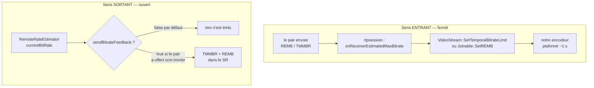
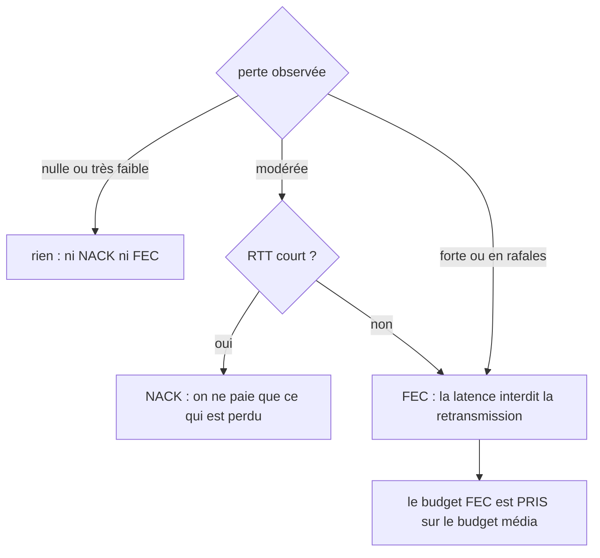
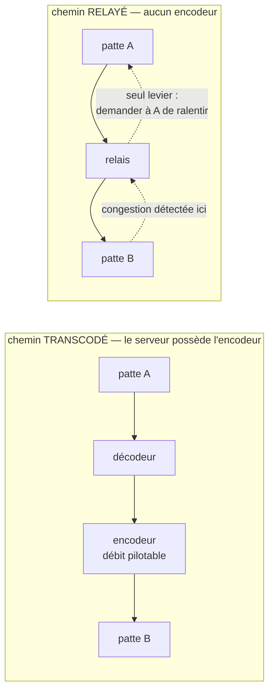

# Contrôle de débit — un algorithme qui n'a jamais tourné, et ce qu'il faudrait à la place

> Statut : **documentation + prospective**. Rien n'est implémenté ici. Le document
> décrit `RemoteRateControl` et `RemoteRateEstimator` tels qu'ils sont, établit
> l'état réel de la boucle de contrôle, puis propose des directions. La §4 dit
> dans quel ORDRE, et c'est le seul point sur lequel il insiste.

**Le principe d'abord.** Un contrôle de congestion se juge sur une seule question :
l'information circule-t-elle en boucle ? Une estimation qui n'est pas émise, ou
émise mais pas appliquée, ne vaut pas mieux que pas d'estimation — et coûte
davantage, parce qu'on croit l'avoir. Ce document commence donc par la boucle
(§2, §3) avant de parler d'algorithme (§5), et ce n'est pas de la pédagogie : les
mesures faites ici montrent que l'estimation actuelle est constante, donc que
treize ans de raffinement algorithmique se sont appliqués à une valeur morte.

Sommaire : [les deux classes](#1-les-deux-classes-et-ce-quelles-font) ·
[la boucle](#2-la-boucle--une-moitié-fermée-lautre-ouverte) ·
[ce que vaut l'estimation](#3-ce-que-lestimation-vaut-aujourdhui) ·
[l'ordre des travaux](#4-lordre-des-travaux-est-la-décision-la-plus-importante) ·
[prospective](#5-prospective--ce-que-font-les-piles-récentes) ·
[relais contre transcodage](#6-le-cas-que-les-piles-webrtc-nont-pas--relais-contre-transcodage) ·
[annexes](#annexe-a--à-vérifier-sur-un-arbre-webrtc-réel)

---

## 1. Les deux classes, et ce qu'elles font

Le code est le trio historique de la libwebrtc de 2013 — estimateur de débit côté
**réception**, produisant un REMB — porté par Medooze puis maintenu ici. Les
en-têtes le disent : `Created on 26 de diciembre de 2012` et `8 de marzo de 2013`.

### `RemoteRateControl` — un détecteur de surutilisation par flux

Une instance **par SSRC**. Elle observe le délai inter-images et décide si le
réseau est en train de saturer.

```
paquets d'une image (jusqu'au bit marqueur)
        │
        ├─ curDelta += (Δtemps d'arrivée) − (Δhorodatage)   ← le délai inter-groupes
        │
        ▼ (sur le bit marqueur)
   filtre de Kalman sur (Δtaille, offset)  →  slope, offset, varNoise
        │
        ▼
   |T| > seuil ?  →  hypothèse : UnderUsing | Normal | OverUsing
```

Deux critères s'ajoutent au délai, et ils ne viennent pas de la spécification :
`UpdateRTT` déclare `OverUsing` si le RTT dépasse 1,5 fois le précédent, et
`UpdateLost` fait de même au-delà d'un ratio de pertes. Ajouts locaux, délibérés.

### `RemoteRateEstimator` — la machine AIMD, une par session

Elle possède la map `ssrc → RemoteRateControl` (`new`/`delete`), agrège les
hypothèses selon la règle **« le pire état gagne »**, et fait tourner
l'augmentation-diminution :

```
        ┌──────────── OverUsing ───────────┐
        │                                  ▼
   Increase ◄── Normal ──► Hold ──────► Decrease
        ▲                                  │
        └────────── UnderUsing ◄───────────┘

   Increase : currentBitRate × RateIncreaseFactor(…)  +  8000 bit/s
   Decrease : currentBitRate × beta (0,85 / 0,9 / 0,95 selon la région)
   Hold     : rien, et mémorise maxHoldRate
```

Les **régions** (`MaxUnknown`, `AboveMax`, `NearMax`, `BelowMax`) situent le débit
courant par rapport à une moyenne glissante du maximum observé
(`avgMaxBitRate` ± quelques σ) et pilotent à la fois le seuil du détecteur et
l'agressivité de la descente.

Le résultat sort par un unique point : `Listener::onTargetBitrateRequested(bitrate)`.

### Qui possède quoi

| propriétaire | membre | portée |
|---|---|---|
| `RTPParticipant` | `estimator` (par valeur) | **un seul pour toutes les sessions vidéo du participant** |
| `Endpoint` (JSR-309) | `estimator`, `estimator2` | par patte |
| `RTPSession` | pointeur brut | ne possède pas |

Le partage d'un estimateur entre plusieurs sessions a une conséquence directe :
`SetListener(this)` est appelé par chaque session, donc **la dernière enregistrée
gagne** et les autres ne reçoivent jamais de retour.

---

## 2. La boucle : une moitié fermée, l'autre ouverte

C'est la question qui décide de la valeur de tout le reste.



**Sens entrant : fermé, et il fonctionne.** Un REMB ou un TMMBR reçu est décodé,
remonté au participant ou à la patte JSR-309, et appliqué comme plafond à
l'encodeur pendant environ une seconde. Quelques trous connus : `SetREMB` est vide
sur `RTPMultiplexer` et `WSEndpoint`, et commenté sur `AudioTranscoder`.

**Sens sortant : ouvert en pratique.** Une seule porte, `sendBitrateFeedback`,
initialisée à `false` avec le commentaire `// test` (`rtpsession.cpp:303`) et
positionnée nulle part dans ce dépôt — seulement par la propriété RTP `tmmbr`,
que le contrôleur elixip pose quand l'offre contient `a=rtcp-fb:… ccm tmmbr`.
Donc :

- **patte Chrome ou Firefox** — qui annoncent `goog-remb` et `transport-cc`, pas
  `ccm tmmbr` : rien n'est émis, tout le calcul est perdu ;
- **patte SIP classique** qui offre `ccm tmmbr` : un TMMBR et un REMB partent dans
  chaque SR, mais figés après le premier retour (voir §3).

C'est ce demi-circuit ouvert qui explique le reste : **une valeur qu'on n'émet
pas, personne ne vient dire qu'elle est fausse.**

---

## 3. Ce que l'estimation vaut aujourd'hui

Trois défauts suffisent, et ils sont vérifiés ligne à ligne dans ce dépôt.

### 3.1 Un horodatage passé comme une taille de paquet

```cpp
// rtpsession.cpp:3291
s->GetRemoteRateEstimator()->Update(recSSRC, packet, getTimeMS());

// remoterateestimator.h:55 — le troisième paramètre est une TAILLE
void Update(DWORD ssrc, RTPTimedPacket* packet, DWORD size);
```

Chaque paquet reçu déclare donc une taille d'environ 2,6 milliards d'octets. Le
débit entrant mesuré part à ~10¹³ bit/s, et `currentBitRate` est écrêté au maximum
configuré **à chaque paquet**. En clair : `GetEstimatedBitrate()` rend
`maxConfiguredBitRate`, soit 1 280 000 000, en permanence et quoi qu'il arrive sur
le réseau.

Le même échange existe une seconde fois :

```cpp
// rtpsession.cpp:3322
s->GetRemoteRateEstimator()->UpdateLost(recSSRC, lost, size);

// remoterateestimator.h:54 — le troisième paramètre est un INSTANT
void UpdateLost(DWORD ssrc, DWORD lost, QWORD now);
```

Une taille (~1100) arrive là où l'on attend un `now` en millisecondes. La
soustraction non signée `now - lastChange` produit alors ~1,8·10¹⁹, et de là :
`avgChangePeriod` astronomique, throttle « une réestimation par seconde »
définitivement désarmé, `pow(alpha, 1,7·10⁶)` qui vaut l'infini, et des
conversions `double → DWORD` hors plage. Déclencheur : la première perte de paquet.

### 3.2 Un facteur d'oubli exponentié par une différence de tailles

```cpp
// remoteratecontrol.cpp:131
// beta is a function of alpha and the time delta since the previous update.
const double beta = pow(1-alpha, deltaSize*30/1000.0);
```

Le commentaire dit *time delta*. Le code passe `deltaSize`, qui vaut
`curSize - prevSize` (`remoteratecontrol.cpp:74`) : une différence **signée** de
tailles d'image en octets. Elle est négative dès qu'une image est plus petite que
la précédente — donc pour toute image P suivant une I.

`pow(0,99, −20000)` vaut environ 4·10⁸⁶. Alors `1-beta` devient très négatif,
`varNoise` passe négatif, `sqrt(varNoise)` rend NaN, et le NaN contamine `slope`,
`offset` et la matrice `E`. À partir de là `fabs(T) > threshold` est faux pour
toujours : **le détecteur par délai est mort au bout de quelques images**, figé sur
`Normal`.

### 3.3 Ce qu'il reste quand ces deux-là sont tombés

Ni le délai (§3.2) ni le débit (§3.1) ne portent plus d'information. Restent les
deux critères ajoutés localement — RTT et pertes — qui deviennent les **seuls**
producteurs d'`OverUsing`. Et le critère de pertes compare deux fenêtres
d'accumulateurs exprimées dans des unités différentes (microsecondes contre
millisecondes), ce qui le rend sensible à deux ou trois pertes consécutives.

Autrement dit, le système n'a jamais fait du Google Congestion Control : il fait
« si le RTT monte ou si je perds quelques paquets, décide `OverUsing` », sur une
estimation de débit constante, et n'émet le résultat que si le pair a offert
`ccm tmmbr`.

> **Ce que cela implique pour la lecture de ce code.** Les constantes, les seuils,
> les régions, le réglage du Kalman : rien de tout cela n'a jamais été exercé en
> production. Ce ne sont pas des valeurs éprouvées par treize ans de trafic, ce
> sont des valeurs jamais atteintes. Les traiter comme un héritage à respecter
> serait une erreur de méthode.

La revue de code complète (défauts d'arithmétique, sûreté d'exécution — trois
threads pour un verrou qui ne couvre ni `GetSSRCs` ni `GetEstimatedBitrate` —,
constantes) est le compagnon de ce document ; elle n'est pas reproduite ici.

---

## 4. L'ordre des travaux est la décision la plus importante

De ce qui précède découle un ordre, et s'en écarter ferait perdre le bénéfice de
tout le reste :

1. **Fermer la boucle et la rendre observable.** Corriger les deux échanges
   d'arguments, faire en sorte que le feedback sortant existe par défaut plutôt
   que sur une propriété que personne ne pose, et rendre l'estimation lisible
   (les traces actuelles ont des formats `printf` faux, donc affichent des valeurs
   fausses — elles ne peuvent servir à rien diagnostiquer).
2. **Mesurer.** Un appel réel, l'estimation en regard du débit effectif, et une
   dégradation provoquée (`tc netem`) pour voir la réaction. Sans cette étape,
   aucune des propositions de la §5 n'est évaluable.
3. **Alors** choisir l'algorithme, en sachant qu'à ce stade la question n'est plus
   « comment améliorer celui-ci » mais « lequel ». Voir §5.1 : la réponse moderne
   déplace l'estimation de côté, ce qui rend une bonne partie de ce code sans
   objet plutôt qu'à corriger.

---

## 5. Prospective — ce que font les piles récentes

> **Base de connaissance et honnêteté sur les sources.** Il n'y a **aucune source
> libwebrtc sur cette machine** (seul `webrtc-audio-processing`, qui est l'APM
> audio et n'a aucun rapport) et pas d'accès réseau. Tout ce qui suit sur
> libwebrtc est donc de la **connaissance de l'algorithme et de l'architecture**,
> pas une lecture de code : les noms de modules sont donnés parce qu'ils orientent
> la recherche, sans numéro de ligne et sans citation. L'[annexe A](#annexe-a--à-vérifier-sur-un-arbre-webrtc-réel)
> liste ce qu'une seconde passe sur un arbre réel doit trancher.

### 5.1 Le déplacement d'architecture : l'estimation change de côté

C'est le changement structurant, et il est antérieur à tout réglage.

| | REMB (ce code, ~2013) | transport-wide CC (piles actuelles) |
|---|---|---|
| qui mesure | le **récepteur** | le récepteur horodate, l'**émetteur** estime |
| ce qui circule | une bande passante en bit/s | les **temps d'arrivée par paquet** |
| granularité | par flux (SSRC) | **tout le transport**, audio et vidéo ensemble |
| standardisation | `draft-alvestrand-rmcat-remb`, jamais publié en RFC | de facto `transport-wide-cc-extensions`, et désormais **[RFC 8888](https://www.rfc-editor.org/rfc/rfc8888)** |

Pourquoi cela compte pour un serveur média : la décision d'allocation appartient à
celui qui **possède l'encodeur**. Un récepteur qui annonce « je peux recevoir
X bit/s » émet une opinion ; un émetteur qui voit les temps d'arrivée de ses
propres paquets mesure un fait, et peut répartir un budget unique entre plusieurs
flux — ce qu'un REMB par SSRC ne permet pas d'exprimer.

Conséquences concrètes ici :

- **En réception**, ce que le serveur devrait produire est un rapport d'arrivée
  ([RFC 8888](https://www.rfc-editor.org/rfc/rfc8888) `CCFB`, ou transport-cc pour
  l'interopérabilité avec les navigateurs actuels), pas un REMB. C'est
  *moins* de code qu'aujourd'hui : horodater et rapporter, sans filtre ni machine
  à états.
- **En émission**, il faudrait un estimateur côté émetteur, qui n'existe pas dans
  ce dépôt. C'est un développement, pas une correction.
- Les deux classes documentées ici deviennent alors **le mauvais côté du
  problème** : à conserver pour les pairs qui ne parlent que REMB, à ne pas
  raffiner.

### 5.2 Modulation de la bande passante : ce qui a remplacé le Kalman

Quatre évolutions, dans l'ordre où elles ont compté :

1. **Estimateur de tendance à la place du filtre de Kalman.** Les piles récentes
   font une régression linéaire sur les derniers écarts de délai (`trendline`)
   plutôt qu'un Kalman à deux états. Plus simple, moins d'états à mal initialiser,
   et sans la classe de panne du §3.2 — un facteur d'oubli mal alimenté y ferait
   du bruit, pas un NaN.
2. **Seuil de surutilisation adaptatif.** Ici `threshold` ne prend que trois
   valeurs en dur selon la région. Un seuil qui suit la tendance observée, avec des
   gains asymétriques à la montée et à la descente, est ce qui permet de ne pas se
   faire affamer par un TCP concurrent : un seuil fixe cède tout le lien.
3. **Contrôleur basé sur la perte, à côté du contrôleur de délai.** Le délai
   détecte la file d'attente qui se remplit ; il ne voit rien sur un lien qui perd
   sans mettre en file (radio). Les piles actuelles font tourner les deux et
   prennent le minimum. Ici, le critère de perte est un simple seuil de ratio, et
   il produit un état, pas un débit.
4. **Sondage actif et détection de région limitée par l'application.** Une montée
   purement multiplicative met des dizaines de secondes à trouver un lien rapide.
   Les piles récentes envoient des rafales de sondage au démarrage et après une
   période où l'encodeur ne remplissait pas le lien — et surtout, elles savent
   distinguer « le lien est saturé » de « l'encodeur n'avait rien à envoyer », ce
   que ce code ne sait pas faire du tout : un encodeur silencieux y ressemble à un
   lien lent.

### 5.3 FEC et retransmissions : un choix, pas un cumul

La FEC ne se « active » pas, elle **s'achète** : la redondance est prélevée sur le
même budget que le média. Un serveur qui ajoute 20 % de FEC sans retirer 20 % au
codeur aggrave la congestion qu'il prétend corriger. Le raisonnement des piles
matures :



- **NACK d'abord** quand le RTT le permet : une retransmission ne coûte que le
  paquet perdu, une FEC coûte en permanence.
- **FEC** quand le RTT est trop long pour qu'une retransmission arrive à temps, ou
  quand la perte est en rafales. Le format à viser est `flexfec`
  ([RFC 8627](https://www.rfc-editor.org/rfc/rfc8627)) plutôt qu'`ulpfec`.
- **L'allocation** est un modèle de protection alimenté par la perte et le RTT,
  pas un pourcentage fixe. Et elle est **soustraite** du débit annoncé à
  l'encodeur.

Ce serveur a un NACK (`IsNACKEnabled`) et un décodeur ULPFEC. Ce qu'il n'a pas :
un arbitrage entre les deux fondé sur RTT et profil de perte, et une comptabilité
du coût de la FEC dans le budget. C'est un chantier de taille moyenne, et il n'a
de sens qu'après la §4 — sans mesure de perte fiable, l'arbitrage se fait à
l'aveugle.

### 5.4 Ce que les piles font vraiment quand ça se dégrade : pas du changement de codec

Sur ce point la prospective doit corriger une intuition répandue. Face à une chute
de bande passante, les piles WebRTC **ne changent pas de codec**. Elles font, dans
cet ordre :

1. **baisser le débit cible de l'encodeur** — la réaction immédiate, sans
   signalisation ;
2. **baisser la résolution et/ou la cadence**, selon une préférence de dégradation
   déclarée (privilégier la netteté ou la fluidité) ;
3. **abandonner une couche** quand le flux est en simulcast ou en SVC : on cesse
   d'envoyer la couche haute, ce qui est instantané et sans renégociation.

Le changement de codec en cours d'appel est rare et coûteux : il demande une
renégociation, une image clé, et il casse la continuité. Ce que le serveur possède
déjà et qui va dans le bon sens : le mode pont par paquet du transcodeur, qui
**suit** un pair changeant de codec sans renégocier (voir
[CODEC-NEGOTIATION.md](https://github.com/neutrino38/elixip/blob/master/CODEC-NEGOTIATION.md)
côté elixip). La direction à explorer n'est donc pas « basculer de codec » mais
**l'échelle spatiale et temporelle** : savoir réduire résolution et cadence à
l'encodeur du transcodeur, et à terme savoir ne pas relayer une couche haute.

Une note sur le mixage : dans une conférence, le serveur encode pour chaque
participant. Le budget est alors **par patte sortante**, et une patte lente ne doit
pas dégrader les autres — ce qui suppose une allocation par patte, à ne pas
confondre avec l'estimation par flux entrant que font les classes documentées ici.

---

## 6. Le cas que les piles WebRTC n'ont pas : relais contre transcodage

C'est la particularité de ce serveur, et elle n'a pas d'équivalent dans un client
WebRTC — qui possède toujours son encodeur.



- **Chemin transcodé** : le serveur agit seul. Une congestion mesurée vers B se
  traduit en baisse du débit de l'encodeur qui alimente B. A n'en sait rien et n'a
  pas à le savoir. C'est le cas facile, et c'est celui que la §5 couvre.
- **Chemin relayé** : le serveur n'a **rien** à moduler. Les paquets qu'il émet
  vers B sont ceux de A. Le seul levier est de **propager la contrainte à
  contre-courant** : traduire la congestion observée vers B en un REMB ou un TMMBR
  émis vers A, pour que A réduise à la source.

Ce second cas est important en pratique parce que la politique `:avoid` — celle
par défaut côté elixip — **relaie le plus souvent** : dès que les deux pattes
s'accordent sur un codec, il n'y a pas d'encodeur dans le chemin. Donc le cas
« aucun levier local » est le cas courant, pas l'exception.

Deux questions ouvertes, et ce sont les plus intéressantes du document :

1. **Faut-il propager la contrainte entre pattes, et avec quelle prudence ?** Une
   propagation naïve fait osciller : la mesure vers B module A, ce qui change ce
   que B reçoit, ce qui remesure. Il faut au minimum un amortissement et une
   asymétrie (descendre vite, remonter lentement). Le code contient déjà une
   amorce de ce raisonnement — `RTPEndpoint::SetREMB` relaie vers
   `SetTemporalMaxLimit` de l'estimateur de la patte opposée — mais elle rejette
   silencieusement toute valeur inférieure ou égale à 128 000, ce qui interdit
   précisément d'annoncer un réseau lent.
2. **Que faire d'un pair qui ne comprend ni REMB ni TMMBR ?** Il reste FIR/PLI,
   qui demandent une image clé sans dire de ralentir — et une image clé est ce
   qu'il faut de plus gros quand le lien est saturé. Sur un chemin relayé vers un
   tel pair, il n'y a peut-être aucune réponse correcte, et le dire est plus utile
   que de prétendre le contraire.

---

## Annexe A — à vérifier sur un arbre WebRTC réel

Rien de la §5 n'a été lu dans une source. Cette liste est faite pour qu'une
seconde passe, avec un arbre à disposition, soit mécanique : chaque entrée nomme
le module à ouvrir et la **question à trancher**, pas une affirmation à confirmer.

| module upstream (nom indicatif) | question à trancher |
|---|---|
| `goog_cc` / `GoogCcNetworkController` | quelle est la structure réelle du contrôleur : quels sous-contrôleurs, dans quel ordre, et qui arbitre entre eux ? |
| `delay_based_bwe` | l'estimateur par délai actuel prend-il encore un état à la Kalman, ou uniquement une tendance ? |
| `trendline_estimator` | quelle fenêtre, quel seuil de départ, et comment la pente est-elle convertie en hypothèse ? |
| `overuse_detector` | quelle est la loi d'adaptation du seuil, et les gains sont-ils bien asymétriques montée/descente ? |
| `loss_based_bwe_v2` | quelle est l'entrée exacte (perte par intervalle de feedback ?) et comment est-il combiné au délai — minimum, ou autre ? |
| `probe_controller` / `bitrate_prober` | quand un sondage est-il déclenché, à quel débit, et comment le résultat est-il intégré ? |
| `alr_detector` | comment « l'application n'a rien à envoyer » est-il distingué de « le lien est saturé » ? |
| `paced_sender` / pacing | le pacing est-il un prérequis de l'estimation, ou seulement une amélioration ? Question directe pour nous : nos rafales d'images faussent-elles nos propres mesures ? |
| `fec_controller_default` (et son ancêtre `media_opt_util`) | quelle est la formule d'allocation FEC, et le budget FEC est-il bien soustrait du débit encodeur ? |
| `nack_module` / `loss_notification` | quel critère exact fait préférer NACK à FEC, et avec quel seuil de RTT ? |
| `transport_feedback_adapter` | à quelle cadence le feedback part-il, et que contient-il exactement ? |
| `simulcast_rate_allocator`, `svc_rate_allocator` | comment un budget unique est-il réparti entre couches, et quand une couche est-elle abandonnée ? |
| `video_stream_encoder`, `quality_scaler` | quelle est la logique de dégradation résolution/cadence, et sur quel signal ? |

À trancher aussi, et ce ne sont pas des questions de code : quelle **version** de
l'arbre sert de référence, et quelles parties sont utilisables dans un projet sous
licence GPL.

## Annexe B — constantes en dur, avec leur valeur

À lire en gardant la §3 en tête : aucune n'a été exercée en production.

| constante | valeur | remarque |
|---|---|---|
| `maxConfiguredBitRate` | 1 280 000 000 bit/s | face à `minConfiguredBitRate` = 128 000, l'asymétrie de trois zéros rend une coquille très probable (1 280 000 ?). En l'état, **pas de plafond réel**. |
| `minConfiguredBitRate` | 128 000 bit/s | plancher : impossible d'annoncer un réseau plus lent. `SetTemporalMaxLimit` rejette de plus tout maximum ≤ 128 000. |
| retard initial | 500 + 60 000 ms | une minute sans réestimation périodique, justifiée par un seul commentaire. |
| seuils du détecteur | 35 / 25 / 12 | selon la région ; ms implicites. |
| hystérésis | `overUseCount > 2` | seulement vers `OverUsing` ; les retours vers `Normal`/`UnderUsing` sont immédiats. |
| Kalman | `E = [100 ; 0,1]`, `processNoise = [1e-10 ; 1e-2]`, `varNoise₀ = 50` | `alpha` 0,01 puis 0,002 au-delà de 60 images. |
| incrément additif | + 8 000 bit/s | vraisemblablement le « +1000 » amont converti d'octets en bits — à confirmer. |
| `beta` (descente) | 0,85 / 0,9 / 0,95 | selon la région. |
| temps de réponse | `avgChangePeriod + rtt + 300` ms | `rtt` initial 200 ms. |
| fenêtres d'accumulateurs | 100 ms (débit, paquets, pertes), 1 000 ms (fps), 200 ms (débit global) | à comparer aux ~500 ms–1 s usuels. |
| quarantaine côté encodeur | `videoFPS` images ≈ 1 s | durée d'application d'un plafond reçu. |

## Annexe C — références

**Contrôle de congestion**

- [RFC 8888](https://www.rfc-editor.org/rfc/rfc8888) — *RTCP Congestion Control
  Feedback*. La cible normalisée pour le sens réception.
- [RFC 8836](https://www.rfc-editor.org/rfc/rfc8836) — exigences de contrôle de
  congestion pour le média interactif (RMCAT).
- [RFC 8698](https://www.rfc-editor.org/rfc/rfc8698) — SCReAM, l'autre algorithme
  RMCAT publié ; utile comme point de comparaison.
- `draft-ietf-rmcat-gcc-02` — le Google Congestion Control tel que spécifié
  (expiré, jamais publié en RFC) : c'est de cet algorithme que dérive le code
  documenté ici.
- `draft-alvestrand-rmcat-remb` — REMB. Jamais publié en RFC, et c'est le format
  que ce code émet.

**Retour RTCP et protection**

- [RFC 4585](https://www.rfc-editor.org/rfc/rfc4585) — AVPF, le profil de retour.
- [RFC 5104](https://www.rfc-editor.org/rfc/rfc5104) — messages `ccm`, dont
  **TMMBR/TMMBN** et FIR.
- [RFC 8627](https://www.rfc-editor.org/rfc/rfc8627) — FlexFEC.
- [RFC 5109](https://www.rfc-editor.org/rfc/rfc5109) — ULPFEC (ce que le serveur
  décode aujourd'hui).
- [RFC 4588](https://www.rfc-editor.org/rfc/rfc4588) — retransmission RTP (RTX).

**Dans ce dépôt**

- `mcu/src/remoteratecontrol.cpp`, `mcu/include/remoteratecontrol.h`
- `mcu/src/remoterateestimator.cpp`, `mcu/include/remoterateestimator.h`
- `mcu/src/rtpsession.cpp` — décodage RTCP entrant, émission du SR, et les deux
  appels de la §3.1
- `mcu/src/videostream.cpp` — application du plafond à l'encodeur
- `mcu/src/jsr309/RTPEndpoint.cpp` — propagation entre pattes (§6)
- [`CODEC-NEGOTIATION.md`](https://github.com/neutrino38/elixip/blob/master/CODEC-NEGOTIATION.md)
  (dépôt elixip) — pourquoi un chemin est relayé ou transcodé, ce qui décide du
  §6
