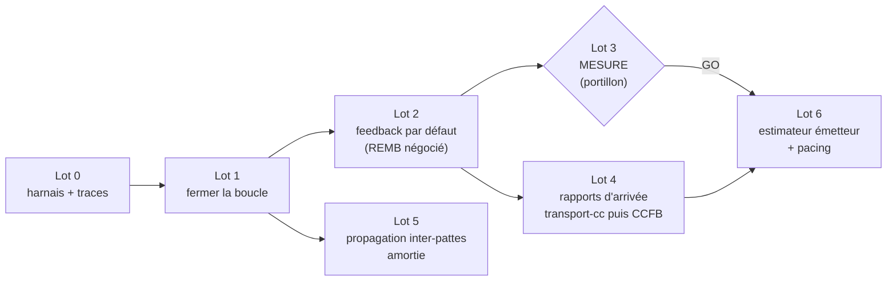

# Plan d'implémentation — remise en état du contrôle de débit

> Compagnon d'exécution de [`rate-control.md`](rate-control.md), qui porte le
> diagnostic et la prospective. Ce plan ne les répète pas : il découpe le travail
> en lots livrables un par un, dans l'ordre imposé par la §4 du diagnostic —
> **fermer la boucle, la rendre observable, mesurer, et seulement alors choisir
> l'algorithme**. Chaque lot a ses fichiers, ses tests et son critère de sortie.
>
> Témoin de référence : `../webrtc` (commit `9f30e83`, stamp 2026-08-14). Les
> renvois « témoin : … » pointent dans cet arbre.

## Textes normatifs implémentés par ce plan

| texte | statut | ce qu'on en implémente | lot |
|---|---|---|---|
| [RFC 4585](https://www.rfc-editor.org/rfc/rfc4585) — AVPF | RFC (profil de retour) | le socle de tout feedback ci-dessous ; déjà en place, l'émission conditionnée à la négociation (arbitrage A2) en respecte la portée | 2, 4 |
| [RFC 5104](https://www.rfc-editor.org/rfc/rfc5104) — `ccm`, dont **TMMBR/TMMBN** | RFC | l'émission TMMBR existe (verrouillée `tmmbr`) ; ce plan la débloque, l'amortit et la fait porter une estimation enfin vraie | 1, 2, 5 |
| `draft-alvestrand-rmcat-remb-03` — **REMB** | draft expiré, jamais RFC — mais le de facto des navigateurs (`goog-remb`) | émission du paquet REMB seule, sous la nouvelle propriété `remb`, à travers le throttler | 2, 5 |
| `draft-holmer-rmcat-transport-wide-cc-extensions-01` — **transport-cc** | draft expiré, de facto universel (Chrome/Firefox/Safari) | lecture de l'extension d'en-tête *transport-wide sequence number* + génération du RTCP RTPFB **fmt 15** | 4 |
| [RFC 8888](https://www.rfc-editor.org/rfc/rfc8888) — **CCFB** | RFC (la cible normalisée) | génération du RTCP **fmt 11** (arrivées par SSRC/seq + ECN), derrière la même interface que transport-cc | 4 |
| `draft-ietf-rmcat-gcc-02` — **Google Congestion Control** | draft expiré, jamais RFC | côté réception : les correctifs du lot 1 ramènent notre copie à cet algorithme ; côté émission : le cœur du lot 6 (trendline + AIMD) en dérive | 1, 6 |

Référence de cadrage, non implémentée : [RFC 8836](https://www.rfc-editor.org/rfc/rfc8836)
(exigences RMCAT). Explicitement **hors plan** : [RFC 8627](https://www.rfc-editor.org/rfc/rfc8627)
(FlexFEC — le témoin lui-même ne l'émet pas), [RFC 4588](https://www.rfc-editor.org/rfc/rfc4588)
(RTX) ; le décodage [RFC 5109](https://www.rfc-editor.org/rfc/rfc5109) (ULPFEC)
existe déjà et n'est pas touché.

## Principes (non négociables, ils découlent du diagnostic)

1. **Caractériser avant de corriger.** Chaque défaut de la §3 reçoit d'abord un
   test qui l'exhibe (rouge sur le code actuel), puis le correctif le fait passer
   au vert. C'est la méthode déjà appliquée aux mixeurs et aux parseurs réseau.
2. **Le chemin REMB se répare, il ne se raffine pas.** Les correctifs du lot 1
   sont ceux que le témoin tranche ligne à ligne (§3.1, §3.4). Aucun réglage,
   aucune modernisation de l'AIMD sur ce chemin : il devient le dernier barreau
   (§5.1), pas le futur.

   > **Pourquoi réparer un algorithme qu'on va remplacer.** Il y a deux
   > estimateurs dans ce plan, pas un. Le neuf (lot 6, côté émission) sera un
   > **trendline** — aucune ligne de Kalman ne sera écrite dans du code neuf.
   > L'ancien (Kalman côté réception, celui du lot 1) ne meurt pas pour
   > autant : il devient le **dernier barreau de l'échelle**, exactement comme
   > chez libwebrtc 2026, où `overuse_estimator.cc` est toujours compilé et
   > instancié par défaut pour les pairs sans transport-cc — un pair SIP qui
   > n'offre que `ccm tmmbr` n'aura jamais que ce chemin, chez nous comme chez
   > Google. Et il fallait le réparer *avant* tout le reste, pour trois
   > dépendances concrètes : le **lot 2** va émettre le feedback par défaut,
   > or émettre l'estimation d'avant-lot-1 — 1,28 Gb/s constant — en TMMBR
   > serait dire « fonce » à un pair qui sature le lien, activement nuisible ;
   > le **lot 3** doit mesurer une boucle, et on ne mesure pas des NaN ; le
   > **lot 5** propage cette estimation entre pattes. La frontière tenue au
   > lot 1 : corrections **mécaniques** tranchées par le témoin et constantes
   > recopiées telles quelles (~50 lignes, chacune gardée par un test) — mais
   > ni trendline en réception, ni `LinkCapacityEstimator` à la place des
   > régions, ni réglage au jugé : investir dans ce côté-là du problème serait
   > précisément l'erreur que la §5.1 du diagnostic nomme.
3. **La mesure (lot 3) est un portillon.** Le lot 6 (estimateur émetteur) ne se
   conçoit pas avant d'avoir vu le chemin réparé réagir à un vrai `tc netem`.
   Les lots 4 et 5, eux, n'en dépendent pas : rapporter des arrivées et amortir
   une propagation ne présupposent aucune estimation locale.
4. **Pas de copier-coller de fichiers libwebrtc sans instruction licence**
   (arbitrage A5). Les correctifs du lot 1 sont des alignements ligne à ligne sur
   un algorithme public (`draft-ietf-rmcat-gcc`), pas des recopies de fichiers.

## Vue d'ensemble et dépendances



| lot | contenu | taille | dépend de |
|---|---|---|---|
| 0 | tests de caractérisation + traces lisibles | S–M | — |
| 1 | échanges d'arguments, §3.4, constantes, verrou, listeners | M | 0 |
| 2 | REMB/TMMBR émis selon la négociation + throttler | M | 1 (+ elixip) |
| 3 | protocole de mesure netem, critères, décision | S | 2 |
| 4 | génération transport-cc, puis CCFB RFC 8888 | L | 2 (+ elixip) |
| 5 | propagation inter-pattes via le throttler | S–M | 1, 2 |
| 6 | estimateur côté émetteur + pacing (conception dédiée) | L | 3 GO, 4 |

Branche proposée : `feat/rate-control`, un commit par étape testable.

---

## Lot 0 — Harnais de caractérisation et observabilité

Les deux classes sont pures (pas de socket, pas de thread à elles) : elles se
testent en leur donnant des paquets synthétiques par l'overload 5 arguments
`Update(ssrc, now, ts, size, mark)` et un `Listener` de capture.

**Nouveau fichier `mcu/tests/test_rate_control.cpp`** (convention `mcu/tests/`,
joué par `make check`) :

- une fixture `FeedFrames(fps, taille, durée)` qui simule un flux régulier, et un
  `Listener` qui enregistre chaque `onTargetBitrateRequested` ;
- tests de caractérisation, **rouges sur le code actuel**, chacun adossé à un
  défaut précis :

| test | défaut exhibé | attendu après lot 1 |
|---|---|---|
| `LEstimationSuitLeDebitEntrant` | §3.1 : via l'overload 3 args (`packet` + `getTimeMS()` en taille), `GetEstimatedBitrate()` rend 1 280 000 000 constant | suit un flux de 500 kb/s à ±25 % |
| `UnePerteNeDéclencheAucunDébordement` | §3.1 bis : `UpdateLost(ssrc, lost, size)` → soustraction non signée ~1,8·10¹⁹ | réestimation throttlée normale |
| `LeKalmanSurvitAUneImagePlusPetite` | §3.2 : I de 20 Ko puis P de 1 Ko → `GetNoise()` NaN, hypothèse figée `Normal` | `varNoise` finie ≥ 1, détecteur vivant |
| `LeFiltreDeResiduEcreteLAberrant` | §3.4 a : branches inversées | résidu normal conservé, aberrant écrêté ±3σ |
| `LaCovarianceResteDefiniePositive` | §3.4 c : `E[1][0]`/`E[1][1]` lisent des valeurs déjà réécrites | `E[0][0]·E[1][1] − E[0][1]·E[1][0] ≥ 0` après N itérations |
| `LeBruitNEstPasMesuréEnSurutilisation` | §3.4 d : condition en commentaire | `varNoise` stable pendant un épisode `OverUsing` forcé |
| `UnDetecteurVoitUneCongestionSimulée` | test d'ensemble : délais inter-images croissants (file qui se remplit) | hypothèse `OverUsing`, puis `Decrease` au niveau estimateur |
| `LesLimitesAcceptentUnRéseauLent` | plancher 128 000 : `SetTemporalMaxLimit(64000)` ignoré silencieusement | accepté |

**Traces réparées** (nécessaires au lot 3, et à tout diagnostic manuel) :
- `remoterateestimator.cpp:347` : le `Debug("BWE: estimation …")` mélange `%d`
  sur `DWORD`, `%f`, et `%llf` qui n'existe pas — les valeurs affichées sont
  fausses. Réécrire les formats (les `double` passent en `%f` après promotion
  varargs ; les `DWORD` en `%u`).
- même vérification sur l'événement `"rre"` (`eventSource->SendEvent`, l.350-360)
  et sur les `Debug` de `remoteratecontrol.cpp`.

**Sortie du lot** : `make check` vert (les tests de caractérisation documentent
l'état défectueux en attendant le lot 1 — convention `DISABLED_`+levée, comme
pour `:ipv6`).

> **FAIT (2026-08-15).** `mcu/tests/test_rate_control.cpp` : 11 tests, classés
> par exécution — **7 `DISABLED_`** (rouges : chemin de production §3.1, plancher
> 128 k, dérive linéaire §3.4 e, retour au calme, variance §3.2, gel du bruit
> §3.4 d, pertes rares §3.3) et **4 gardes-fous verts** (zéro sans trafic, flux
> régulier bien nourri, throttle après perte, covariance SDP). Tableau de bord :
> `make check-ratecontrol`. Traces réparées (`%llf`→cast double, arguments
> décalés du `Debug` Overusing, `rrc.lost` envoyait le RTT). Suite complète :
> 386 verts. Deux mesures ont **corrigé le diagnostic** (notes « Mesuré lot 0 »
> dans rate-control.md) : la dérive de délai *linéaire* est invisible du
> détecteur (§3.4 e, pire qu'annoncé) ; le throttle percuté par `UpdateLost` se
> réarme seul (§3.1 bis, moins grave qu'annoncé — dégâts réels :
> `avgChangePeriod` ~100 s + conversion UB).

---

## Lot 1 — Fermer la boucle

### 1.1 Les deux échanges d'arguments (§3.1)

- `mcu/src/rtpsession.cpp:3792` — supprimer le piège plutôt que le corriger :
  l'overload `Update(DWORD ssrc, RTPTimedPacket*, DWORD size)` devient
  `Update(DWORD ssrc, RTPTimedPacket* packet)` et prend la taille **dans le
  paquet** (`packet->GetSize()`, `rtp.h:244` — la vue transport, en-tête compris,
  comme le témoin). Plus personne ne peut repasser un horodatage en taille.
- `mcu/src/rtpsession.cpp:3823` — `UpdateLost(recSSRC, lost, getTimeMS())`.
- `mcu/include/remoterateestimator.h:55` — signature mise à jour.

### 1.2 Les cinq divergences contre le témoin (§3.4)

Toutes dans `mcu/src/remoteratecontrol.cpp`, `UpdateKalman`, alignées sur
`overuse_estimator.cc` :

| # | correctif | témoin |
|---|---|---|
| a | filtre de résidu remis à l'endroit : cas normal conservé, aberrant écrêté à `±3·sqrt(varNoise)` **avec son signe** | l.64-72 |
| b | plancher `if (varNoise < 1) varNoise = 1;` après la mise à jour | l.136-138 |
| c | temporaires `e00`/`e01` avant la mise à jour de `E` ; ajouter l'assertion semi-définie positive en `Debug` | l.80-98 |
| d | mise à jour du bruit conditionnée à `hypothesis == Normal` (réactiver la condition commentée l.114, sous sa forme simple) | l.62-68, 120-122 |
| e | passer la **première différence** au filtre : `UpdateKalman(curDelta, curSize - prevSize)` (le `curDelta` accumulé EST le `t_ts_delta` du groupe), et l'exposant de `beta` redevient un **temps** — la période inter-images en ms (`curTS - prevFrameTS`), pas `deltaSize` | l.31-37, 132 |
| f | constantes ramenées au témoin : `processNoise = {1e-13, 1e-3}` sans mise à l'échelle `30/fps` ; seuil de bascule d'`alpha` à 300 images | `overuse_estimator.h:59`, `.cc:126-128` |

Le point (e) est le plus profond : il change ce que le filtre mesure. C'est
volontaire — c'est l'algorithme spécifié — et le lot 0 l'a promu de « divergence »
à **défaut majeur mesuré** : `DISABLED_UneDeriveDeDelaiConstanteEstDetectee`
prouve qu'une file qui se remplit linéairement est invisible (dérivée seconde
nulle). C'est ce test qui valide (e), pas une relecture.

**g) (ajouté au vu du lot 0) — le critère de perte.** `RemoteRateControl::UpdateLost`
mélange deux horloges (`lostCalc` en µs réelles via `getTime()`, `packetCalc` en
ms de flux) et compare des fenêtres de 100 « unités » qui n'ont pas la même
durée : 6 pertes isolées sur 300 paquets (2 %) basculent en `OverUsing` au 5ᵉ
rapport. Le contrat est fixé par
`DISABLED_QuelquesPertesRaresNeSontPasUneCongestion` : même horloge (celle de
l'appelant), et un ratio calculé sur des pertes et des paquets **comptés sur la
même période** — le plus simple étant d'accumuler sur la période du throttle
(~1 s) plutôt que sur 100 ms glissantes.

**Non inclus, volontairement** (lot 1bis, après mesure seulement, si le lot 3
montre que la version réparée diverge encore) : la descente sur le débit
*acquitté* plutôt que sur l'estimation (`aimd_rate_control.cc:277`), et le `beta`
unique 0,85. Ce sont des alignements de la machine AIMD, pas du détecteur — on ne
les fait que si la mesure les réclame.

### 1.3 Constantes et limites (`mcu/src/remoterateestimator.cpp`)

- `maxConfiguredBitRate` : 1 280 000 000 → **30 000 000** (témoin
  `aimd_rate_control.cc:67`) — y compris la valeur de reset de
  `SetTemporalMaxLimit(0)` (l.534).
- `minConfiguredBitRate` : 128 000 → **16 000** (arbitrage A1 ; le témoin dit
  5 000, mais 16 kb/s est le plancher utile d'une vidéo H.264/AV1 minimale — en
  dessous, mieux vaut geler l'image). Le garde de `SetTemporalMaxLimit`
  (`limit > minConfiguredBitRate`) devient sain de lui-même : on peut enfin
  annoncer un réseau lent.

### 1.4 Sûreté d'exécution

- Couvrir `GetEstimatedBitrate()` et `GetSSRCs()` par le verrou existant
  (`Use lock`, lecteur) — aujourd'hui trois threads les lisent sans rien.
- **Listeners multiples** : `RTPParticipant` partage UN `estimator` entre toutes
  ses sessions vidéo (`rtpparticipant.cpp:123`), et chaque
  `SetRemoteRateEstimator` écrase le listener précédent
  (`rtpsession.cpp:1523`) — la dernière session enregistrée gagne. Remplacer
  `Listener* listener` par `std::set<Listener*>` +
  `AddListener`/`RemoveListener` (le dtor de `RTPSession` se désinscrit,
  l.374-376), et diffuser `onTargetBitrateRequested` à tous.

**Sortie du lot** : tous les tests du lot 0 verts dans leur forme « après » ;
`make check` vert ; `git grep 'Update(recSSRC,packet'` ne montre plus de
troisième argument.

> **FAIT (2026-08-15).** Les 7 `DISABLED_` du lot 0 sont **levés et verts du
> premier coup** (11/11 à `make check-ratecontrol`, 393 au `make check`
> complet, binaire lié). Réalisé : 1.1 (l'overload piège a disparu — la taille
> sort de `packet->GetSize()` ; `UpdateLost` reçoit `getTimeMS()`) ; 1.2 a–f
> (filtre de résidu à l'endroit avec signe, plancher `varNoise ≥ 1`,
> temporaires de covariance + contrôle SDP en `Debug`, bruit gelé hors état
> `Normal`, **première différence** `curDelta` passée au filtre + exposant de
> β = période inter-images minimale sur 60 (déque, comme
> `UpdateMinFramePeriod`), constantes témoin `processNoise {1e-13, 1e-3}` sans
> échelle 30/fps et bascule d'α à 300 images) ; 1.2 g (UpdateLost reçoit
> l'horloge de l'appelant, fenêtres `packetCalc`/`lostCalc` alignées à 1 s) ;
> 1.3 (min 16 000 / max 30 000 000, resets compris) ; 1.4 (getters sous verrou
> lecteur + `GetEstimatedBitrateUnlocked` pour le chemin sous verrou écrivain ;
> `SetListener` remplacé par `AddListener`/`RemoveListener` sur un
> `std::set` — plus de « dernier gagne », désinscription au dtor devenue
> inconditionnelle). Blindage ajouté : `now < lastChange` clampé dans l'AIMD
> (plus de soustraction non signée). Le scénario du test de pertes a été rendu
> réaliste en le levant (10 paquets/image, rapports étalés) — le contrat est
> inchangé.

---

## Lot 2 — Le feedback sortant existe par défaut (négocié)

État : une seule porte, `sendBitrateFeedback = false // test`
(`rtpsession.cpp:347`), posée uniquement par la propriété `tmmbr`
(`rtpsession.cpp:550-553`), qui émet TMMBR **et** REMB. Chrome/Firefox offrent
`goog-remb` et pas `ccm tmmbr` → rien ne part jamais vers eux (§2).

1. **`sendBitrateFeedback` devient un mode** : `{Aucun, REMB, TMMBR}` (le mode
   TMMBR garde l'émission conjointe TMMBR+REMB actuelle). Nouvelle propriété RTP
   `remb` à côté de `tmmbr` ; `tmmbr` prime si les deux sont posées.
2. **Un amortisseur, écrit une fois** : nouveau `mcu/include/rembthrottler.h`
   (~40 lignes, forme du témoin `remb_throttler.cc`) — une **baisse part tout de
   suite**, une hausse attend 200 ms et 3 % ; compose par `min()` une mesure
   locale et un plafond externe. Le chemin spontané
   (`onTargetBitrateRequested` → `SendTempMaxMediaStreamBitrateRequest`) passe à
   travers lui. Il resservira tel quel au lot 5.
3. **Émission REMB seule** en mode `remb` : le paquet
   `RTCPPayloadFeedback::ApplicationLayerFeeedbackMessage` existe déjà (chemin
   `ReSendPacket`/SR) — le factoriser en `SendReceiverEstimatedMaxBitrate(DWORD)`
   à côté de `SendTempMaxMediaStreamBitrateRequest`.
4. **Côté contrôleur (elixip)** : poser `remb` quand l'offre du pair contient
   `a=rtcp-fb:* goog-remb`, comme il pose déjà `tmmbr`. Aucun changement de
   schéma XML-RPC ni moteli : ce sont les maps de propriétés existantes
   (vérifier tout de même que moteli les transporte à l'identique).

Arbitrage A2 (défaut sans propriété) : recommandation **piloté par propriétés**,
pas d'émission spontanée non négociée — un pair AVP strict ne doit pas recevoir
de l'AVPF. « Par défaut » (§4) signifie : elixip pose systématiquement la bonne
propriété d'après le SDP, pas que le mcu émette à l'aveugle.

**Tests** : unitaires sur le throttler (fake clock : baisse immédiate, hausse
retenue, seuil 3 %, composition `min`) ; construction du paquet REMB (la suite
`test_rtcp_hardening.cpp` donne le modèle).

**Sortie du lot** : sur un appel Chrome réel, un pcap montre des REMB qui partent
et **varient** avec les conditions ; sur un appel SIP `ccm tmmbr`, le
comportement actuel est inchangé.

> **FAIT (2026-08-15), sauf la recette pcap.** Réalisé : (1) `sendBitrateFeedback`
> est devenu `bitrateFeedbackMode` — `{None, REMB, TMMBR}` — résolu **hors de la
> boucle** de `SetProperties` (l'ordre d'itération d'un `Properties` ne se
> présume pas ; TMMBR prime, et une renégociation muette sur le sujet ne retire
> pas le mode acquis) ; (2) `mcu/include/rembthrottler.h`, pur, horloge donnée
> par l'appelant, `Compose()` sans effet de bord pour la redite périodique ;
> (3) `SendReceiverEstimatedMaxBitrate(DWORD)` + le constructeur de champ
> partagé `CreateReceiverEstimatedMaxBitrateFeedback` — le chemin SR n'émet plus
> le TMMBR qu'en mode TMMBR, et il annonce la valeur **composée**, sinon la
> répétition défaisait le plafond que le lot 5 vient de poser ;
> (4) côté elixip, `"goog-remb" => "remb"` dans les DEUX contrôleurs
> (`Kelix.Mod.Mcu.Adapter.Conn` pour la conférence, `MediaServer.Mendooze.Conn`
> pour JSR-309) — la propriété voyage dans les maps existantes, rien à changer
> dans moteli. Tests : 7 sur le throttler + 2 sur le paquet REMB
> (`make check-ratecontrol` 20/20, `make check` 402 verts) ; côté elixip
> 841+10+360+510 verts.
>
> **Deux défauts du paquet REMB trouvés en le factorisant** — il n'était émis
> que dans le mode qui n'a jamais servi, ils n'avaient donc jamais mordu :
> `Num SSRC` était écrit **en dur à 1** alors que la boucle sérialise toute la
> liste (un REMB à deux flux se lisait amputé du second, et le champ était plus
> long qu'il ne le déclarait) ; et la recherche d'exposant décalait `0x3FFFF`
> en `int`, débordement signé dès `i=14`. Corrigés, chacun sous son test.
>
> **Anticipé du lot 5 (5.1, partie dialecte seulement)** : `RTPEndpoint::SetREMB`
> passe par le nouveau `SetMaxReceiveBitrate` — amorti et dans le dialecte
> négocié — au lieu d'un `SendTempMaxMediaStreamBitrateRequest` cru. Sans cela le
> lot 2 aurait livré « le dialecte est négocié » avec un chemin d'émission qui
> l'ignore : un navigateur relayé recevait toujours du TMMBR qu'il ne comprend
> pas. Ce chemin reste **non verrouillé** par la négociation (c'est une
> contrainte venue de l'aval, pas une initiative de l'estimateur) et garde TMMBR
> par défaut quand rien n'est négocié — le comportement validé en trafic le
> 2026-08-14. Le reste du 5.1 (retirer `SetTemporalMaxLimit` du véhicule de
> propagation) est inchangé, au lot 5.

---

## Lot 3 — Mesurer (le portillon)

Un appel réel via elixip, la machine de test en coupure avec `tc netem` sur
l'interface média, trois scénarios :

| scénario | injection | ce qu'on regarde |
|---|---|---|
| marche d'escalier | `rate 2mbit` → `rate 500kbit` à t+60 s → retour | temps de réaction à la baisse, temps de re-montée |
| pertes | `loss 2%` puis `loss 10%` | l'estimation baisse-t-elle proportionnellement, sans s'effondrer ? |
| gigue | `delay 50ms 30ms` | faux positifs du détecteur de délai |

Instrumentation : les traces `BWE:` réparées (lot 0) + le débit entrant réel
(compteurs `bitrateAcu` déjà tracés), collectés dans `/var/log/mcu.log`, mis en
regard par un petit script de dépouillement (gnuplot ou python, dans
`mcu/tests/tools/`).

> **Outillage FAIT (2026-08-17), séance non tenue.** `mcu/tests/tools/` :
> `netem_scenario.sh` (les trois scénarios, marqueurs horodatés, restauration
> des qdisc à la sortie même sur Ctrl-C, option `--ingress` par interface `ifb`
> quand on n'a pas de machine en coupure — netem ne façonne que l'émission, or
> c'est la **réception** qu'on mesure) ; `bwe_report.py` (bibliothèque standard
> seule : la machine de mesure n'a ni gnuplot ni matplotlib — CSV, graphe SVG
> écrit à la main, et **verdict prononcé critère par critère**, avec sortie
> `--markdown` à coller en annexe D) ; `exemple/` porte un journal synthétique
> pour vérifier la chaîne à froid ; `README.md` porte le protocole et le
> montage. Annexe D créée en gabarit dans `rate-control.md`.
>
> Une trace de production a été complétée pour rendre le dépouillement
> possible : `BWE: estimation` porte désormais `stream=<nom de la patte>` (tag
> du participant / nom de l'endpoint). Sans elle, un appel à deux pattes mêle
> deux séries dans le même journal — le regroupement se fait par identifiant de
> thread, mais rien ne les nommait. Les seuils que le plan ne chiffre pas
> (oscillation, gel d'hypothèse, écrêtage) sont **posés dans l'outil et
> documentés** : ils se discutent en annexe D, ils ne se déplacent pas après
> coup pour faire passer une mesure.
>
> **Correctif arraché par la première tentative de séance (2026-08-17).** Deux
> appels record de 50 s n'ont produit **aucune** trace `BWE: estimation`, alors
> que l'estimateur était bien branché (`RemoteRateEstimator adding stream`) et
> alimenté (deux `Overusing candidate` sur le premier). Cause : le retard
> initial de `500 + 60 000` ms (annexe B) combiné à la garde
> `lastChange + 1000 < now` — **rien avant 61,5 s de vidéo continue**. Ramené à
> 5 s, la valeur du témoin (`kInitializationTime`) ; les 60 s étaient un
> « TMMBR skipping delay » devenu sans objet depuis que l'émission est
> verrouillée par la négociation et amortie par le throttler (lot 2). Sous
> test (`LEstimationArriveDansLesPremieresSecondes`, rouge sur l'ancienne
> constante, 21/21 et 403 verts après). Ce n'est pas du réglage : c'est une
> constante recopiée du témoin, exactement la frontière du lot 1 — et sans elle
> le premier palier de chaque scénario serait aveugle.

**Critères d'acceptation du chemin réparé** (comme dernier barreau, pas comme
solution) :
- régime établi : estimation à ±25 % du débit effectif ;
- marche descendante : réaction < 3 s, pas d'oscillation entretenue ;
- re-montée : ≥ 80 % du lien en < 30 s ;
- 10 minutes sans NaN, sans gel d'hypothèse, sans écrêtage permanent au max.

**Livrable** : les mesures et la décision, consignées en annexe D de
`rate-control.md`. La décision du portillon : GO/NO-GO du lot 6, et liste des
éventuels alignements « lot 1bis » que la mesure réclame.

---

## Lot 4 — Rapports d'arrivée en réception (transport-cc, puis CCFB)

Le premier livrable de la modernisation (§5.1) : rapporter les arrivées, sans
filtre ni machine à états. Deux formats derrière une même mécanique de cadence,
transport-cc d'abord (c'est ce que les navigateurs consomment aujourd'hui),
CCFB RFC 8888 ensuite (la cible normalisée).

1. **Extension d'en-tête `transport-wide-cc`** : lire le numéro de séquence
   transport-wide sur les paquets entrants (même mécanique que l'abs-send-time
   déjà lu, `HasAbsSentTime`) ; extmap négocié → propriété RTP posée par elixip,
   comme les autres extensions.
2. **Générateur** — nouveau `mcu/src/transportfeedback.{h,cpp}` : accumule
   `(seq transport-wide, temps d'arrivée)`, produit le RTCP RTPFB **fmt 15**
   (encodage delta/chunks du draft transport-wide-cc-extensions). Cadence copiée
   du témoin (`congestion_control_feedback_generator.cc:37-49, 82-102`) : on
   attend le bit marqueur au plus 25 ms, jamais deux rapports à moins de 25 ms,
   jamais plus de 250 ms sans rapport, débit de feedback plafonné par compteur de
   dette (500 kb/s).
3. **CCFB RFC 8888** (fmt 11, par SSRC/numéro de séquence RTP, offsets 16 bits +
   ECN) derrière la même interface, activé si le pair a négocié
   `a=rtcp-fb:* ack ccfb`. Peut suivre dans un second temps sans bloquer le
   reste.
4. **Côté elixip** : offrir/accepter l'extmap et `a=rtcp-fb:* transport-cc`,
   poser les propriétés. C'est la moitié du lot ; à planifier avec le chantier
   SDP côté contrôleur.

**Tests** : aller-retour de construction/parsing du paquet fmt 15 (cas adverses :
trous de séquence, wrap 16 bits, deltas négatifs, rapport plein) ; cadence sous
fake clock ; suite de hardening sur le parseur (modèle `test_rtcp_hardening.cpp`,
technique page de garde si parsing de l'extension).

**Sortie du lot** : face à un Chrome émetteur, `webrtc-internals` montre une BWE
send-side active (le débit d'émission de Chrome monte au-delà du départ et réagit
à un netem sur notre lien) ; pcap de nos rapports conforme.

---

## Lot 5 — Propagation inter-pattes amortie (§6, le cas relais)

Le cas courant (`:avoid` relaie dès accord de codec) : la congestion vers B n'a
qu'un levier, demander à A de ralentir. L'amorce existe (`RTPEndpoint::SetREMB`,
`RTPEndpoint.cpp:497` — chantier transcodeur 2026-08-14) mais elle écrase la
limite et n'est pas amortie.

1. `RTPEndpoint::SetREMB` passe par le **`RembThrottler` du lot 2** au lieu du
   couple `SetTemporalMaxLimit` + envoi direct : le plafond externe (venu de la
   patte opposée) compose par `min()` avec l'estimation locale de la patte, la
   baisse part immédiatement, la hausse est retenue 200 ms.
2. Le plancher de 128 000 a disparu au lot 1 : un réseau lent s'annonce enfin.
3. `SetTemporalMaxLimit` retrouve son rôle d'origine — borner l'estimateur —
   et n'est plus le véhicule de la propagation.
4. Cohérence avec le chantier transcodeur (P1-P5 faits) : la limite TMMBR
   persistante et stricte posée par ce chantier reste la source du plafond côté
   encodeur.
5. **La contrainte amont existe AUSSI en transcodage** (arbitrage mainteneur,
   2026-08-15 — révision : ce lot ne couvre plus seulement le relais).
   Aujourd'hui `VideoTranscoder::SetREMB` en mode transcodage (state 1)
   **absorbe** la demande dans l'encodeur et rien ne remonte ; seule la
   consigne *négociée* est poussée une fois à la source
   (`PushSourceBitrateLimit`). Deux gaspillages en découlent : on décode un
   flux inutilement fort quand l'aval est contraint bas, et — sémantique TMMBR
   collante oblige — rien ne fait jamais **remonter** la source quand la
   contrainte se relâche. Le signal amont devient dynamique et bidirectionnel :

   ```
   TMMBR vers la source = min( estimation de réception du leg amont,
                               max sur les consommateurs (besoin_i) × marge )
   ```

   ré-évalué à chaque changement de besoin, passé par le throttler (baisse
   immédiate, hausse amortie et EXPLICITE — un TMMBR ne se libère que par un
   TMMBR plus haut). En 1:1 le besoin est la cible effective de l'encodeur
   aval ; l'**agrégation en conférence** (consommateurs = pattes sortantes via
   le mixeur, besoin fonction du slot de mosaïque) est hors lot 5, notée comme
   chantier de suite.

**Tests** : scénario scripté « B se congestionne » (séquence de REMB décroissants
puis croissants injectée) → vérifier que la suite de TMMBR émis vers A descend
vite, remonte par paliers ≥ 200 ms, et ne dépasse jamais le `min()` des deux
sources.

**Recette live** : appel relayé A↔B, netem sur la patte B, vérifier à la fois que
A réduit et que ça n'oscille pas (le critère d'oscillation du lot 3 s'applique).

---

## Lot 6 — Estimateur côté émetteur + pacing (développement, gated lot 3)

C'est le seul lot qui soit un développement et non une correction, et il mérite
sa propre conception avant tout code (`sender_bwe_plan.md`, à écrire au moment
GO). Le présent plan fige seulement le périmètre v1 et les interfaces :

- **Entrée** : le feedback transport-cc/CCFB reçu de nos pairs sur nos flux
  sortants (le lot 4 nous a appris les formats ; ici on les *consomme*).
- **Cœur v1** : trendline (fenêtre 20 paquets, lissage 0,9, seuil adaptatif
  [6, 600] ms, gains 0,0087/0,039) + AIMD avec `LinkCapacityEstimator` (±3σ) ;
  étage de perte = la logique historique 2 %/10 % (LossBasedBweV2 explicitement
  hors v1). Sondage et ALR **hors v1** : montée multiplicative ×1,08/s seulement.
- **Sortie** : le débit cible par patte sortante, appliqué par le chemin
  existant `SetTemporalBitrateLimit` (chantier transcodeur). Budget **par patte** :
  une patte lente ne dégrade pas les autres (§5.4).
- **Prérequis pacing** : le témoin passe de 2,5× à 1,1× dès que l'estimation
  dépend des temps d'arrivée — nos rafales d'images fausseraient nos propres
  mesures. Évaluer `RTPSmoother` (déjà dans `videostream.h:107` et
  `mediabridgesession.h:159`) comme base du lissage d'émission avant d'écrire
  quoi que ce soit d'autre.

---

## Hors périmètre de ce plan (chantiers ultérieurs, dans cet ordre)

- **Arbitrage NACK/FEC et budget de protection** (§5.3) : n'a de sens qu'avec une
  mesure de perte fiable, donc après le lot 4. Seuil témoin : RTT 20 ms, mode
  hybride au-delà, budget soustrait du débit encodeur plafonné à 50 %. Côté
  formats, **deux mondes disjoints** (analyse [`flexfec-linphone.md`](flexfec-linphone.md),
  2026-08-15) : les navigateurs émettent ULPFEC (notre décodeur couvre), et
  **Linphone 6 émet FlexFEC RFC 8627** (mode lignes/colonnes, activée par
  défaut, incompatible au fil ET en SDP avec le flexfec-03 de WebRTC). Quand ce
  chantier s'ouvrira : d'abord laisser *traverser* la FEC sur le chemin relayé
  Linphone↔Linphone (négociation elixip), ensuite un décodeur RFC 8627 en
  réception pour le chemin transcodé (l'association est in-band via CSRC —
  pas besoin de bundle pour décoder).
- **Dégradation résolution/cadence — conception ACTÉE (discussion mainteneur,
  2026-08-15), implémentation ultérieure.** Constat : aujourd'hui résolution et
  cadence sont figées par la signalisation (la boucle suit seulement la taille
  native de l'entrée, `VideoEncoderWorker.cpp:386-399`), la bande passante
  n'ajuste que le débit, et la boucle à cadence fixe **sur-échantillonne** une
  entrée plus lente (entrée 15 fps × encodeur 30 fps = chaque image encodée
  deux fois). Conception, calquée sur le partage amont codec/politique :
  1. **le codec publie ses bornes, il ne décide pas** — table
     `pixels → [débit min, cible, max]` par encodeur dans libmedikit (formule
     bits/pixel × facteur d'efficacité : AV1 ≈ 0,55 × H.264), homologue de
     `EncoderInfo::resolution_bitrate_limits` et conforme à la doctrine
     `codec_capabilities_plan.md` ;
  2. **une politique commune, DEUX PROFILS** (= `DegradationPreference` amont) :
     « fluidité » pour la **langue des signes** — plancher ≥ 20 im/s, on
     descend la résolution d'abord — et « netteté » pour le **partage de
     document** — plancher de résolution, la cadence descend jusqu'à ~2-5
     im/s. Ratio d'image conservé, paliers discrets (÷1,33, dimensions paires
     4:2:0), hystérésis (un changement de résolution coûte une image clé :
     pas en pleine congestion) ; l'échelle du §5.4 reste : débit d'abord ;
  3. **cadence encodeur asservie à la cadence CONSTATÉE en sortie de
     décodeur** (fin du sur-échantillonnage) — symétrique du suivi de taille
     native déjà en place ; mesure lissée, paliers, `SetFrameRate` à chaud ;
     le plancher LS contraint nos choix de dégradation, pas la source (si
     elle signe à 12 fps, on encode à 12) ; valable en 1:1 — en conférence la
     sortie est cadencée par la composition mosaïque.
  Le déclencheur QP (`QualityScaler`) demande une remontée du QP encodeur —
  chantier libmedikit, complémentaire (le QP dit « le débit ne suffit plus »,
  les profils disent « quoi sacrifier »).
- **Abandon de couche** : sans simulcast/SVC dans le mcu, sans objet aujourd'hui.

## Arbitrages à trancher (avec recommandation)

| # | question | recommandation |
|---|---|---|
| A1 | `minConfiguredBitRate` : 5 000 (témoin) ou 16 000 ? | **16 000** — plancher utile d'une vidéo minimale ; 5 000 n'a de sens que pour de l'audio, que ce chemin ne gère pas |
| A2 | feedback spontané sans propriété posée ? | **non** — piloté par `remb`/`tmmbr` posées par elixip d'après le SDP ; pas d'AVPF non négocié |
| A3 | lot 1bis (descente sur débit acquitté, `beta` unique 0,85) | **après le lot 3 seulement**, si la mesure le réclame |
| A4 | CCFB (fmt 11) dans le lot 4 ou différé ? | dans le lot 4 mais **en second**, derrière la même interface ; transport-cc débloque l'interop seul |
| A5 | licence : recopier des fichiers BSD-3 libwebrtc dans ce projet GPL ? | BSD-3 est compatible GPL (sens BSD→GPL, en conservant les en-têtes) ; recommandation néanmoins : **réécrire en style maison** — tout ce qui est listé ici tient en modules courts, et la dette de vendoring coûterait plus que la réécriture. Instruction formelle avec le mainteneur avant toute recopie. |
| A6 | signal amont en transcodage : marge d'entrée au-dessus de la cible de l'encodeur ? | **×1,25** — ré-encoder à X depuis un flux reçu à X cumule deux générations de pertes ; l'entrée doit respirer au-dessus de la cible. **TRANCHÉ sur le principe** (mainteneur, 2026-08-15) : le signal amont existe en transcodage, dans les deux sens ; seule la valeur de la marge reste ajustable au lot 3/5. |

## Suivi

- [x] Lot 0 — harnais + traces (2026-08-15 : 11 tests, 7 DISABLED_/4 gardes-fous, `make check-ratecontrol`, 386 verts au total)
- [x] Lot 1 — boucle fermée (2026-08-15 : échanges, §3.4 a-g, constantes 16k/30M, verrou, listeners multiples ; 7 DISABLED_ levés, 393 verts, binaire lié)
- [x] Lot 2 — feedback négocié + `RembThrottler` (2026-08-15 : mode `{None,REMB,TMMBR}`, throttler, `SendReceiverEstimatedMaxBitrate`, propriété `remb` posée par les deux contrôleurs elixip ; 2 défauts du paquet REMB corrigés ; 20/20 et 402 verts. **Reste la recette pcap sur appel Chrome réel**)
- [ ] Lot 3 — mesures netem + annexe D + décision GO/NO-GO (**outillage fait**
      2026-08-17 : `mcu/tests/tools/` + gabarit d'annexe D ; reste la séance de
      mesure, qui demande un appel réel et une machine en coupure)
- [ ] Lot 4 — transport-cc (extmap, générateur, elixip), puis CCFB
- [ ] Lot 5 — propagation inter-pattes via throttler + recette live
- [ ] Lot 6 — `sender_bwe_plan.md` puis implémentation v1
